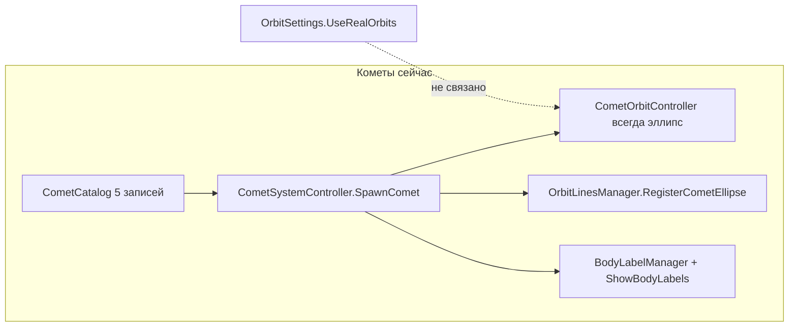
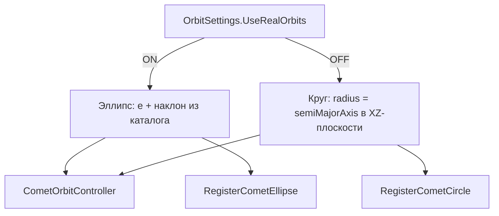

# План: 10 реальных комет, подписи и орбиты

## Текущее состояние

- **Данные:** [`Assets/Scripts/SolarSystemGraphics/CometCatalog.cs`](Assets/Scripts/SolarSystemGraphics/CometCatalog.cs) — 5 комет (Encke, Honda, TGK, Wild 2, Kopff).
- **Графика:** отдельных спрайтов/материалов комет в проекте **нет**. Реальные кометы создаются процедурно в [`CometSystemController.cs`](Assets/Scripts/SolarSystemGraphics/CometSystemController.cs): сфера + `TrailRenderer`, материалы через `CreateDefaultCometMaterial()` (URP/Lit) и `CreateTrailMaterial()` (URP/Particles/Unlit). Prefab [`Assets/Prefabs/Comet.prefab`](Assets/Prefabs/Comet.prefab) — игровой снаряд (`Projectile`), его **не использовать**.
- **Подписи:** [`BodyLabelManager.cs`](Assets/Scripts/SolarSystemGraphics/BodyLabelManager.cs) — скрываются вместе с планетами при выключенном «Подписи» (`SimulationViewSettings.ShowBodyLabels`).
- **Орбиты:** кометы **всегда** эллиптические; планеты переключаются между кругом и эллипсом в [`BodyOrbitSystemController.cs`](Assets/Scripts/SolarSystemGraphics/BodyOrbitSystemController.cs) по [`OrbitSettings.cs`](Assets/Scripts/OrbitSettings.cs).

Кометы видны только в clean view ([`CleanViewController.cs`](Assets/Scripts/CleanViewController.cs) — `CometsRoot` активен при скрытом UI).

---

## 1. Расширить каталог до 10 комет

**Файл:** [`CometCatalog.cs`](Assets/Scripts/SolarSystemGraphics/CometCatalog.cs)

Добавить 5 короткопериодических комет с реальными орбитальными параметрами (подобраны по масштабу существующих 5):

| Комета | objectName | labelKey | a (AU) | e | i (°) | simPeriodSec | phaseOffsetRad |
|--------|------------|----------|--------|---|-------|--------------|----------------|
| 26P/Grigg–Skjellerup | `Comet_GriggSkjellerup` | `CometGriggSkjellerupLabel` | 2.54 | 0.65 | 22.2 | 22 | 5.5 |
| 6P/d'Arrest | `Comet_DArrest` | `CometDArrestLabel` | 3.49 | 0.61 | 10.5 | 28 | 0.8 |
| 46P/Wirtanen | `Comet_Wirtanen` | `CometWirtanenLabel` | 3.09 | 0.41 | 11.4 | 30 | 2.0 |
| 19P/Borrelly | `Comet_Borrelly` | `CometBorrellyLabel` | 3.61 | 0.62 | 30.3 | 33 | 3.2 |
| 88P/Howell | `Comet_Howell` | `CometHowellLabel` | 3.54 | 0.49 | 4.8 | 31 | 4.1 |

`semiMajorAxis` (simulation scale) задать в диапазоне 105–155, не пересекаясь с существующими 115–150, чтобы орбиты не слипались в режиме без «Реальные расстояния».

**Локализация:** добавить 5 ключей во все файлы:
- [`Assets/Resources/Languages/russian.json`](Assets/Resources/Languages/russian.json)
- [`english.json`](Assets/Resources/Languages/english.json), [`chinese.json`](Assets/Resources/Languages/chinese.json), [`vietnamese.json`](Assets/Resources/Languages/vietnamese.json), [`uzbek.json`](Assets/Resources/Languages/uzbek.json)

---

## 2. Графика: те же шейдеры реальных комет

**Файл:** [`CometSystemController.cs`](Assets/Scripts/SolarSystemGraphics/CometSystemController.cs)

Без изменений логики материалов — новые 5 комет автоматически получат тот же вид через существующий `SpawnComet()`:
- ядро: URP/Lit, серый цвет
- хвост: URP/Particles/Unlit, жёлто-зелёный градиент

Опционально: вынести создание материалов один раз в `Initialize()`, чтобы 10 комет не пересоздавали shared material в цикле (мелкий рефакторинг, не меняет внешний вид).

Обновить комментарии «five» → «ten».

---

## 3. Подписи комет — всегда и заметно

**Файл:** [`BodyLabelManager.cs`](Assets/Scripts/SolarSystemGraphics/BodyLabelManager.cs)

| Изменение | Детали |
|-----------|--------|
| Флаг `alwaysVisible` | В `LabelEntry` — для комет `true` |
| Независимость от «Подписи» | `ApplyVisibility`: кометные метки активны всегда; `LateUpdate` обновляет позицию для `alwaysVisible \|\| _visible` |
| Заметность | Для комет: `fontSize` ~3.2 (планеты 2.4), цвет ярче (напр. `(1, 0.95, 0.7, 1)`), `fontStyle = Bold`, `verticalOffset` ~1.6 |

Планетные подписи остаются под переключателем «Подписи».

---

## 4. Орбиты комет ↔ «Реальные орбиты»

Поведение как у планет в [`BodyOrbitSystemController.ApplyOrbitMode()`](Assets/Scripts/SolarSystemGraphics/BodyOrbitSystemController.cs):

### 4.1 [`CometOrbitController.cs`](Assets/Scripts/SolarSystemGraphics/CometOrbitController.cs)

- Добавить `SetUseRealOrbits(bool)` и ветку в `UpdatePosition()`:
  - **ON:** текущая эллиптическая формула (eccentricity, inclinationDeg)
  - **OFF:** круг `x = cos(θ)·r`, `z = sin(θ)·r`, `y = 0` вокруг Солнца (аналог `RotateAround` планет)
- При переключении сохранять текущий угол `_angle`, не сбрасывать позицию.

### 4.2 [`OrbitLinesManager.cs`](Assets/Scripts/SolarSystemGraphics/OrbitLinesManager.cs)

- Добавить `RegisterCometCircle(float radius, float phaseOffsetRad)` — `OrbitLineUtility.BuildCircle()` вокруг Солнца (как для планет, `Vector3.up`).
- `ClearCometOrbitLines()` без изменений (имя `CometOrbitLine`).

### 4.3 [`CometSystemController.cs`](Assets/Scripts/SolarSystemGraphics/CometSystemController.cs)

- Подписаться на `OrbitSettings.UseRealOrbitsChanged` в `Initialize` / `OnDestroy`.
- `ApplyOrbitMode()`: для каждого `CometOrbitController` вызвать `SetUseRealOrbits(OrbitSettings.UseRealOrbits)`.
- `RebuildCometOrbitLines()`: учитывать **оба** флага:
  - радиус/semiMajorAxis — из `ScaleSettings.UseRealDistances` (как сейчас)
  - форма линии — ellipse при `UseRealOrbits`, circle иначе
- Вызывать `ApplyOrbitMode()` при старте и при смене Real Orbits; при `RescaleCometOrbits*` — перестраивать линии с актуальным режимом.

**Real Distances** остаётся отдельной настройкой (масштаб орбит) — без изменений в [`SolarSystemScaleController.RescaleComets()`](Assets/Scripts/SolarSystemGraphics/SolarSystemScaleController.cs).

---

## Затрагиваемые файлы

| Файл | Действие |
|------|----------|
| `CometCatalog.cs` | +5 комет |
| 5× `Languages/*.json` | +5 ключей |
| `CometOrbitController.cs` | круг/эллипс по toggle |
| `CometSystemController.cs` | подписка на OrbitSettings, rebuild линий |
| `OrbitLinesManager.cs` | `RegisterCometCircle` |
| `BodyLabelManager.cs` | always-visible comet labels |

---

## Проверка в Unity (Level1)

1. Включить clean view (скрыть UI) — видны 10 комет с хвостами.
2. Подписи комет видны при **выключенных** «Подписи»; планетные — скрыты.
3. «Реальные орбиты» **OFF** — кометы и их линии орбит круговые; **ON** — вытянутые эллипсы с наклоном.
4. «Реальные расстояния» — орбиты комет масштабируются по AU в обоих режимах орбит.
5. Смена языка — все 10 названий локализованы.
