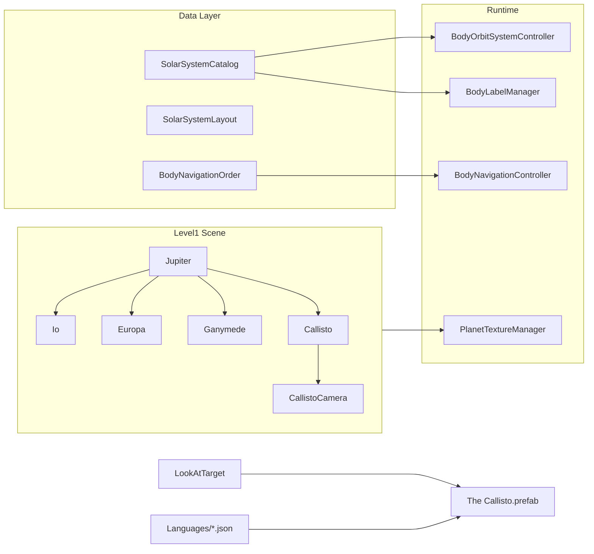

# Добавление спутника Каллисто вокруг Юпитера

## Контекст

В проекте уже реализованы **Ио**, **Европа** и **Ганимед** как 3D-спутники Юпитера. **Каллисто** упоминается только в тексте `JupiterContent` в JSON локализации — без собственных ключей, текстур, сцены и каталога.

Эталон: планы [add_europa_moon_8d01b507.plan.md](.cursor/plans/add_europa_moon_8d01b507.plan.md) и [add_ganymede_moon_4bae4107.plan.md](.cursor/plans/add_ganymede_moon_4bae4107.plan.md), а также существующий код галилеевых спутников.

`SimulationSidePanelController` **не требует изменений** — все режимы работают через общие системы и каталог [`SolarSystemCatalog.cs`](Assets/Scripts/SolarSystemGraphics/SolarSystemCatalog.cs).



---

## 1. HD-текстура (скачивание и импорт)

**Источник (официальный, public domain):**
- [USGS Astropedia — Callisto Galileo/Voyager Simple Cylindrical Global Map](https://astrogeology.usgs.gov/search/map/callisto_galileo_voyager_simple_cylindrical_global_map) — equirectangular, ~1 km/px, NASA Galileo + Voyager
- Прямая ссылка на JPG (~34 MB): `http://astropedia.astrogeology.usgs.gov/download/Callisto/Voyager-Galileo/callisto_simp_1km.jpg`
- Резерв: [Callisto Galileo/Voyager Global Mosaic 1km](https://astrogeology.usgs.gov/search/map/callisto_galileo_voyager_global_mosaic_1km) (GeoTIFF, конвертация через Python/PIL)

**Примечание:** в отличие от Европы, у Каллисто нет глобальной 500m-мозаики USGS — лучший доступный источник ~1 km/px; для 8k upscaling используем Lanczos (как у Ганимеда).

**Шаги обработки:**
1. Скачать `callisto_simp_1km.jpg` с USGS (PowerShell `Invoke-WebRequest`)
2. При необходимости конвертировать/масштабировать до **8192×4096** (конвенция проекта: `*_8k.jpg`)
3. Разместить в **оба** пути (критично для Editor и APK):
   - `Assets/Textures/HD/CallistoTexture_8k.jpg`
   - `Assets/Resources/PlanetTexturesHD/CallistoTexture_8k.jpg`
4. Создать материалы по образцу [`GanymedeTexture.mat`](Assets/Materials/GanymedeTexture.mat):
   - `Assets/Materials/CallistoTexture.mat` — URP Lit (`guid: 933532a4fcc9baf4fa0491de14d08ed7`), `_BaseMap` + `_MainTex` на одну текстуру, нейтральный серо-коричневый оттенок `_BaseColor: (0.88, 0.86, 0.84)` — без агрессивного tint (поверхность Каллисто тёмнее Ганимеда)
   - `Assets/Resources/PlanetGraphicsHD/CallistoTexture_HD.mat` — ссылка на 8k-текстуру из Resources
5. Зарегистрировать HD-swap в [`PlanetTextureManager.cs`](Assets/Scripts/SolarSystemGraphics/PlanetTextureManager.cs):

```csharp
RegisterBodySwap("Callisto", "PlanetGraphicsHD/CallistoTexture_HD");
```

6. Добавить атрибуцию в [`TEXTURE_ATTRIBUTION.txt`](Assets/Textures/HD/TEXTURE_ATTRIBUTION.txt): USGS Astrogeology / NASA Galileo-Voyager, public domain

**Атмосферный оверлей не нужен** — у Каллисто нет плотной атмосферы.

### Защита от розовых текстур (Editor + APK)

Розовый/magenta = missing shader или missing `_BaseMap`. Чеклист по образцу [`IoTexture_8k.jpg.meta`](Assets/Textures/HD/IoTexture_8k.jpg.meta):

| Проверка | Значение |
|---|---|
| Shader | URP Lit (`933532a4fcc9baf4fa0491de14d08ed7`) |
| `_BaseMap` и `_MainTex` | Оба назначены на текстуру с валидным GUID |
| Дублирование текстуры | `Assets/Textures/HD/` + `Assets/Resources/PlanetTexturesHD/` |
| HD-материал | `Assets/Resources/PlanetGraphicsHD/CallistoTexture_HD.mat` |
| Android platform override | `maxTextureSize: 4096`, `overridden: 1` в `.meta` |
| Runtime validation | `PlanetTextureManager.MaterialHasAlbedo()` — warning при отсутствии albedo |
| Extra Graphics toggle | Проверить swap standard → HD в Editor и после сборки APK |

---

## 2. Астрономические данные

Добавить в [`SolarSystemCatalog.cs`](Assets/Scripts/SolarSystemGraphics/SolarSystemCatalog.cs):

```csharp
public const float CallistoOrbitKm = 1882700f;

new BodyDefinition
{
    objectName = "Callisto",
    orbitalRadiusAu = 0f,
    equatorialRadiusKm = 2410.3f,
    orbitCenterName = "Jupiter",
    satelliteOrbitKm = CallistoOrbitKm,
    orbitalEccentricity = 0.0074f,
    orbitalInclinationDeg = 0.19f
}
```

| Параметр | Значение | Сравнение |
|---|---|---|
| Орбита | 1 882 700 км | Ганимед: 1 070 400 (самый внешний галилеев) |
| Радиус | 2410.3 км | Меньше Ганимеда (2634.1), больше Европы (1560.8) |
| Период | ~16.7 суток | Медленнее всех галилеевых |

---

## 3. Учебный layout (видимость и пропорции)

Добавить в [`SolarSystemLayout.cs`](Assets/Scripts/SolarSystemGraphics/SolarSystemLayout.cs):

```csharp
"Callisto", new EducationalEntry
{
    Scale = new Vector3(0.26f, 0.26f, 0.26f),
    OrbitDistance = 3.5f,
    SatelliteLocalPosition = new Vector3(0f, 0f, 3.5f),
    PickColliderRadius = 1f
}
```

**Обоснование** (пропорционально Ганимеду):
- Scale: `0.28 × (2410.3 / 2634.1) ≈ 0.26`
- Orbit: `2.0 × (1882700 / 1070400) ≈ 3.5`

Каллисто будет **самым внешним** из четырёх галилеевых — орбита 3.5 vs Ganymede 2.0, хорошо отделена визуально.

---

## 4. 3D-объект в сцене Level1

Создать GameObject **`Callisto`** как дочерний объект **`Jupiter`** (дублировать структуру Ganymede):

| Компонент | Значение |
|---|---|
| Parent | `Jupiter` |
| Mesh | Unity Sphere |
| Material | `CallistoTexture.mat` |
| SphereCollider | radius = 0.5 |
| `localScale` | `(0.26, 0.26, 0.26)` |
| `localPosition` | `(0, 0, 3.5)` |
| `RotateAround.target` | Jupiter Transform |
| `RotateAround.speed` | **~4** (`40 × 1.77/16.69 ≈ 4`) |

**Дочерний `CallistoCamera`:**
- `localPosition`: `(0, 0, -3.4)` — чуть дальше от камеры, чем Ganymede (-3.2)
- `RotateAround` вокруг Callisto, speed = 5
- Camera component, `m_IsActive: 0`

**Prefab описания:** дублировать [`The Ganymede.prefab`](Assets/Prefabs/Descriptions/The%20Ganymede.prefab) → `Assets/Prefabs/Descriptions/The Callisto.prefab`:
- Root: `The Callisto`, tag `Callisto`
- Children: `CallistoHeader`, `CallistoContent` (имена = JSON-ключи для `LocalizedText`)

Разместить экземпляр `The Callisto` на Canvas и привязать в `LookAtTarget`.

---

## 5. Описание и локализация (стиль Titan/Ganymede)

Добавить ключи **`CallistoHeader`** и **`CallistoContent`** во все 5 файлов:
- [`english.json`](Assets/Resources/Languages/english.json)
- [`russian.json`](Assets/Resources/Languages/russian.json)
- [`chinese.json`](Assets/Resources/Languages/chinese.json)
- [`vietnamese.json`](Assets/Resources/Languages/vietnamese.json)
- [`uzbek.json`](Assets/Resources/Languages/uzbek.json)

**Стиль:** короткий абзац (4–6 предложений), как `GanymedeContent` / `TitanContent`.

**English `CallistoContent` (черновик):**
> Callisto is Jupiter's outermost Galilean moon and the most heavily cratered object in the Solar System. Its ancient, geologically dead surface preserves billions of years of impact history, including vast multi-ring basins such as Valhalla and Asgard. Unlike Io and Europa, Callisto shows no signs of recent volcanic or tectonic activity. Beneath its icy crust may lie a subsurface ocean, though it is less likely to be in contact with the rocky interior than on Europa. NASA's Galileo mission mapped Callisto in detail; Juno has continued flybys, and ESA's JUICE mission may visit the Jovian system in the 2030s.

**Заголовки:**

| Язык | CallistoHeader |
|---|---|
| EN | Callisto |
| RU | Каллисто |
| ZH | 木卫四 |
| VI | Callisto |
| UZ | Kallisto |

---

## 6. Интеграция UI, камер и NavigationBar

Обновить по шаблону Io/Europa/Ganymede (null-safe `if`):

| Файл | Изменения |
|---|---|
| [`LookAtTarget.cs`](Assets/Scripts/LookAtTarget.cs) | `theCallistoGameObject`, `callistoCamera`; wiring в `MakeAllDescriptionsInvisible`, `ShowDescriptionForPlanet`, `TurnOnDetailCameraForPlanet`, `GetActiveDetailCamera`, `TurnOffAllDetailCameras`, `TurnOn/OffCallistoCamera` |
| [`MobileOrbitCamera.cs`](Assets/Scripts/MobileOrbitCamera.cs) | `TriggerDescription` и `TriggerCameraSwitch` для `"Callisto"` |
| [`VisualsInitializer.cs`](Assets/Scripts/VisualsInitializer.cs) | `if (camLower.Contains("callisto")) return "Callisto";` |
| [`BodyLabelManager.cs`](Assets/Scripts/SolarSystemGraphics/BodyLabelManager.cs) | `"Callisto"` в `BodyNames` (после `"Ganymede"`) |
| [`SpacetimeGridController.cs`](Assets/Scripts/SolarSystemGraphics/SpacetimeGridController.cs) | `"Callisto"` в оба массива `BodyNames` (основной + satellites) |
| [`BodyNavigationOrder.cs`](Assets/Scripts/SolarSystemGraphics/BodyNavigationOrder.cs) | Вставить `"Callisto"` **после `"Ganymede"`, перед `"Saturn"`** |

**NavigationBar** ([`BodyNavigationController.cs`](Assets/Scripts/BodyNavigationController.cs)): изменений в коде не требуется — список строится из `BodyNavigationOrder.BuildNavigationList()` через `GameObject.Find("Callisto")`.

Новый порядок: `... Jupiter → Io → Europa → Ganymede → Callisto → Saturn → Titan ...`

---

## 7. Совместимость с режимами SimulationSidePanel

| Режим | Что обеспечивает совместимость |
|---|---|
| Орбиты | `SolarSystemCatalog` + `OrbitLinesManager` (авто) |
| Сетка гравитации | `SpacetimeGridController.BodyNames` |
| Метки | `BodyLabelManager` + ключ `CallistoHeader` |
| Миникарта | Без изменений (рендерит сцену) |
| Реальные расстояния | `satelliteOrbitKm = 1882700` |
| Реальные размеры | `equatorialRadiusKm = 2410.3` |
| Реальные орбиты | e=0.0074, наклон 0.19° вокруг Юпитера |
| Свободное наблюдение | `SolarSystemCatalog.TryGetBody("Callisto")` |
| Extra Graphics | `PlanetTextureManager.RegisterBodySwap` |

---

## 8. Визуальная проверка (test plan)

1. Запустить Level1 — Каллисто видна на орбите за Ганимедом; вращается медленнее остальных галилеевых
2. Тап по Каллисто → описание + камера `CallistoCamera`; тёмно-серая кратерная текстура — **не розовая**
3. NavigationBar Prev/Next — Каллисто между Ганимедом и Сатурном; клик по имени показывает описание
4. Переключить все 5 языков — обновляются `CallistoHeader` / `CallistoContent`
5. Все тогглы SimulationSidePanel — орбита, метка, реальные размеры/расстояния/орбиты, Extra Graphics HD
6. Четыре галилеевых спутника не пересекаются визуально (орбиты 0.79 / 1.25 / 2.0 / 3.5)
7. **APK-тест:** собрать Android build, включить Extra Graphics — текстура Каллисто корректная (не magenta), HD-swap работает

---

## Затрагиваемые файлы (~16)

**Новые:** `CallistoTexture_8k.jpg` (×2 пути), 2 материала, `The Callisto.prefab`, `.meta`

**Изменяемые:** `SolarSystemCatalog.cs`, `SolarSystemLayout.cs`, `PlanetTextureManager.cs`, `LookAtTarget.cs`, `MobileOrbitCamera.cs`, `VisualsInitializer.cs`, `BodyLabelManager.cs`, `SpacetimeGridController.cs`, `BodyNavigationOrder.cs`, `TEXTURE_ATTRIBUTION.txt`, 5× language JSON, `Level1.unity`
