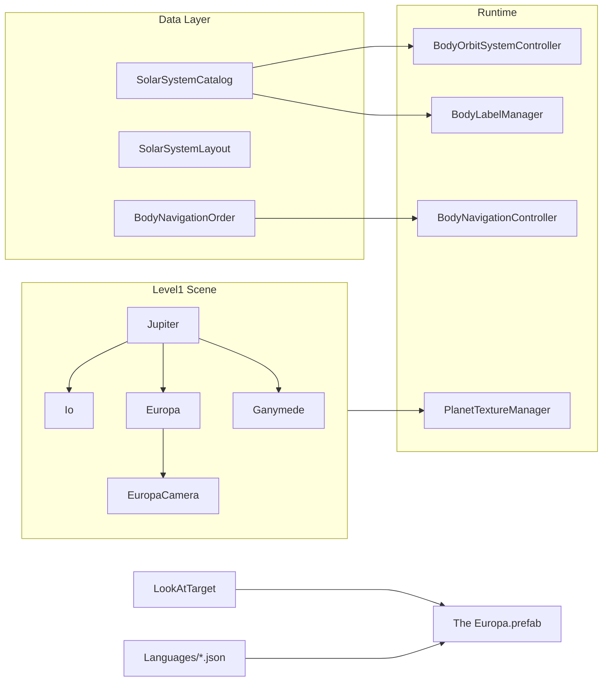

# Добавление спутника Европа вокруг Юпитера

## Контекст

В проекте уже реализованы **Ио** и **Ганимед** как 3D-спутники Юпитера. **Европа** упоминается только в тексте `JupiterContent` в JSON локализации — без собственных ключей, текстур, сцены и каталога.

Эталон для копирования: планы [add_io_moon_32961925.plan.md](.cursor/plans/add_io_moon_32961925.plan.md) и [add_ganymede_moon_4bae4107.plan.md](.cursor/plans/add_ganymede_moon_4bae4107.plan.md), а также существующий код Ио/Ганимеда в [Level1.unity](Assets/_Scenes/Level1.unity).

`SimulationSidePanelController` **не требует изменений** — все режимы работают через общие системы и каталог [`SolarSystemCatalog.cs`](Assets/Scripts/SolarSystemGraphics/SolarSystemCatalog.cs).



---

## 1. HD-текстура (скачивание и импорт)

**Источник (официальный, public domain / CC0):**
- [USGS Astropedia — Europa Voyager-Galileo SSI Global Mosaic 500m](https://astrogeology.usgs.gov/search/map/europa_voyager_galileo_ssi_global_mosaic_500m)
- Прямая ссылка на GeoTIFF (~184 MB): `https://planetarymaps.usgs.gov/mosaic/Europa_Voyager_GalileoSSI_global_mosaic_500m.tif`
- Резерв (выше точность, regional mosaics): [Photogrammetrically Controlled Galileo Image Mosaics of Europa](https://astrogeology.usgs.gov/search/map/photogrammetrically_controlled_galileo_image_mosaics_of_europa) — ZIP с equirectangular mosaics

**Шаги обработки:**
1. Скачать GeoTIFF с USGS (PowerShell `Invoke-WebRequest` или Python)
2. Конвертировать в equirectangular JPG (Python PIL / ImageMagick)
3. Масштабировать до **8192×4096** (конвенция проекта: `*_8k.jpg`, как [`IoTexture_8k.jpg`](Assets/Textures/HD/IoTexture_8k.jpg))
4. Разместить в **оба** пути (критично для Editor и APK):
   - `Assets/Textures/HD/EuropaTexture_8k.jpg`
   - `Assets/Resources/PlanetTexturesHD/EuropaTexture_8k.jpg`
5. Создать материалы по образцу Ганимеда:
   - `Assets/Materials/EuropaTexture.mat` — URP Lit (`guid: 933532a4fcc9baf4fa0491de14d08ed7`), `_BaseMap` + `_MainTex` на одну текстуру, лёгкий холодный оттенок льда `_BaseColor: (0.94, 0.95, 0.98)` — **без** агрессивного tint
   - `Assets/Resources/PlanetGraphicsHD/EuropaTexture_HD.mat` — ссылка на 8k-текстуру из Resources
6. Зарегистрировать HD-swap в [`PlanetTextureManager.cs`](Assets/Scripts/SolarSystemGraphics/PlanetTextureManager.cs):

```csharp
RegisterBodySwap("Europa", "PlanetGraphicsHD/EuropaTexture_HD");
```

7. Добавить атрибуцию в [`TEXTURE_ATTRIBUTION.txt`](Assets/Textures/HD/TEXTURE_ATTRIBUTION.txt): USGS Astrogeology / NASA Galileo-Voyager, public domain

**Атмосферный оверлей не нужен** — у Европы нет плотной атмосферы (в отличие от Титана).

### Защита от розовых текстур (Editor + APK)

Розовый/magenta = missing shader или missing `_BaseMap`. Чеклист по образцу [`IoTexture_8k.jpg.meta`](Assets/Textures/HD/IoTexture_8k.jpg.meta):

| Проверка | Значение |
|---|---|
| Shader | URP Lit (`933532a4fcc9baf4fa0491de14d08ed7`) |
| `_BaseMap` и `_MainTex` | Оба назначены на текстуру с валидным GUID |
| Дублирование текстуры | `Assets/Textures/HD/` + `Assets/Resources/PlanetTexturesHD/` |
| HD-материал | `Assets/Resources/PlanetGraphicsHD/EuropaTexture_HD.mat` |
| Android platform override | `maxTextureSize: 4096`, `overridden: 1` в `.meta` |
| Runtime validation | `PlanetTextureManager.MaterialHasAlbedo()` — warning при отсутствии albedo |
| Extra Graphics toggle | Проверить swap standard → HD в Editor и после сборки APK |

---

## 2. Астрономические данные

Добавить в [`SolarSystemCatalog.cs`](Assets/Scripts/SolarSystemGraphics/SolarSystemCatalog.cs):

```csharp
public const float EuropaOrbitKm = 671100f;

new BodyDefinition
{
    objectName = "Europa",
    orbitalRadiusAu = 0f,
    equatorialRadiusKm = 1560.8f,
    orbitCenterName = "Jupiter",
    satelliteOrbitKm = EuropaOrbitKm,
    orbitalEccentricity = 0.009f,
    orbitalInclinationDeg = 0.47f
}
```

| Параметр | Значение | Сравнение |
|---|---|---|
| Орбита | 671 100 км | Ио: 421 700; Ганимед: 1 070 400 (между ними) |
| Радиус | 1560.8 км | Ио: 1821.6; Ганимед: 2634.1 (самый маленький из галилеевых) |
| Период | ~3.55 суток | Между Ио (~1.77) и Ганимедом (~7.15) |

---

## 3. Учебный layout (видимость и пропорции)

Добавить в [`SolarSystemLayout.cs`](Assets/Scripts/SolarSystemGraphics/SolarSystemLayout.cs):

```csharp
"Europa", new EducationalEntry
{
    Scale = new Vector3(0.17f, 0.17f, 0.17f),
    OrbitDistance = 1.25f,
    SatelliteLocalPosition = new Vector3(0f, 0f, 1.25f),
    PickColliderRadius = 1f
}
```

**Обоснование** (пропорционально Ио и Ганимеду):
- Scale: `0.28 × (1560.8 / 2634.1) ≈ 0.17`
- Orbit: `2.0 × (671100 / 1070400) ≈ 1.25`

Европа будет **между Ио и Ганимедом** по орбите и размеру — ледяная белая поверхность с тёмными линиями трещин, хорошо видна и кликабельна.

---

## 4. 3D-объект в сцене Level1

Создать GameObject **`Europa`** как дочерний объект **`Jupiter`** (дублировать структуру Io/Ganymede):

| Компонент | Значение |
|---|---|
| Parent | `Jupiter` |
| Mesh | Unity Sphere |
| Material | `EuropaTexture.mat` |
| SphereCollider | radius = 0.5 |
| `localScale` | `(0.17, 0.17, 0.17)` |
| `localPosition` | `(0, 0, 1.25)` |
| `RotateAround.target` | Jupiter Transform |
| `RotateAround.speed` | **~20** (`10 × 7.15/3.55 ≈ 20`) |

**Дочерний `EuropaCamera`:**
- `localPosition`: `(0, 0, -3.0)` — между Io (-2.8) и Ganymede (-3.2)
- `RotateAround` вокруг Europa, speed = 5
- Camera component, `m_IsActive: 0`

**Prefab описания:** дублировать [`The Ganymede.prefab`](Assets/Prefabs/Descriptions/The%20Ganymede.prefab) → `Assets/Prefabs/Descriptions/The Europa.prefab`:
- Root: `The Europa`, tag `Europa`
- Children: `EuropaHeader`, `EuropaContent` (имена = JSON-ключи для `LocalizedText`)

Разместить экземпляр `The Europa` на Canvas и привязать в `LookAtTarget`.

---

## 5. Описание и локализация (стиль Titan/Ganymede)

Добавить ключи **`EuropaHeader`** и **`EuropaContent`** во все 5 файлов:
- [`english.json`](Assets/Resources/Languages/english.json)
- [`russian.json`](Assets/Resources/Languages/russian.json)
- [`chinese.json`](Assets/Resources/Languages/chinese.json)
- [`vietnamese.json`](Assets/Resources/Languages/vietnamese.json)
- [`uzbek.json`](Assets/Resources/Languages/uzbek.json)

**Стиль:** короткий абзац (4–6 предложений), как `GanymedeContent` / `TitanContent`.

**English `EuropaContent` (черновик):**
> Europa is Jupiter's second Galilean moon and one of the most promising places to search for life beyond Earth. Its bright, icy surface is crisscrossed by dark fracture lines and shows relatively few impact craters, suggesting a young crust that may hide a global ocean of liquid water beneath kilometers of ice. Tidal heating from Jupiter keeps this subsurface ocean warm enough to remain liquid. NASA's Galileo mission revealed Europa's ocean world in the 1990s; the Europa Clipper mission launched in 2024 to study the moon in detail.

**Заголовки:**

| Язык | EuropaHeader |
|---|---|
| EN | Europa |
| RU | Европа |
| ZH | 木卫二 |
| VI | Europa |
| UZ | Yevropa |

---

## 6. Интеграция UI, камер и NavigationBar

Обновить по шаблону Io/Ganymede (null-safe `if`):

| Файл | Изменения |
|---|---|
| [`LookAtTarget.cs`](Assets/Scripts/LookAtTarget.cs) | `theEuropaGameObject`, `europaCamera`; wiring в `MakeAllDescriptionsInvisible`, `ShowDescriptionForPlanet`, `TurnOnDetailCameraForPlanet`, `GetActiveDetailCamera`, `TurnOffAllDetailCameras`, `TurnOn/OffEuropaCamera` |
| [`MobileOrbitCamera.cs`](Assets/Scripts/MobileOrbitCamera.cs) | `TriggerDescription` и `TriggerCameraSwitch` для `"Europa"` |
| [`VisualsInitializer.cs`](Assets/Scripts/VisualsInitializer.cs) | `if (camLower.Contains("europa")) return "Europa";` |
| [`BodyLabelManager.cs`](Assets/Scripts/SolarSystemGraphics/BodyLabelManager.cs) | `"Europa"` в `BodyNames[]` (после `"Io"`) |
| [`SpacetimeGridController.cs`](Assets/Scripts/SolarSystemGraphics/SpacetimeGridController.cs) | `"Europa"` в оба массива `BodyNames` (основной + satellites) |
| [`BodyNavigationOrder.cs`](Assets/Scripts/SolarSystemGraphics/BodyNavigationOrder.cs) | Вставить `"Europa"` **после `"Io"`, перед `"Ganymede"`** — порядок галилеевых спутников |

**NavigationBar** ([`BodyNavigationController.cs`](Assets/Scripts/BodyNavigationController.cs)): изменений в коде не требуется — список строится из `BodyNavigationOrder.BuildNavigationList()` через `GameObject.Find("Europa")`.

Новый порядок: `... Jupiter → Io → Europa → Ganymede → Saturn → Titan ...`

---

## 7. Совместимость с режимами SimulationSidePanel

| Режим | Что обеспечивает совместимость |
|---|---|
| Орбиты | `SolarSystemCatalog` + `OrbitLinesManager` (авто) |
| Сетка гравитации | `SpacetimeGridController.BodyNames` |
| Метки | `BodyLabelManager` + ключ `EuropaHeader` |
| Миникарта | Без изменений (рендерит сцену) |
| Реальные расстояния | `satelliteOrbitKm = 671100` |
| Реальные размеры | `equatorialRadiusKm = 1560.8` |
| Реальные орбиты | e=0.009, наклон 0.47° вокруг Юпитера |
| Свободное наблюдение | `SolarSystemCatalog.TryGetBody("Europa")` |
| Extra Graphics | `PlanetTextureManager.RegisterBodySwap` |

---

## 8. Визуальная проверка (test plan)

1. Запустить Level1 — Европа видна на орбите между Ио и Ганимедом; вращается с промежуточной скоростью
2. Тап по Европе → описание + камера `EuropaCamera`; ледяная белая текстура с тёмными линиями трещин — **не розовая**
3. NavigationBar Prev/Next — Европа между Ио и Ганимедом; клик по имени показывает описание
4. Переключить все 5 языков — обновляются `EuropaHeader` / `EuropaContent`
5. Все тогглы SimulationSidePanel — орбита, метка, реальные размеры/расстояния/орбиты, Extra Graphics HD
6. Три галилеевых спутника не пересекаются визуально (орбиты 0.79 / 1.25 / 2.0)
7. **APK-тест:** собрать Android build, включить Extra Graphics — текстура Европы корректная (не magenta), HD-swap работает

---

## Затрагиваемые файлы (~16)

**Новые:** `EuropaTexture_8k.jpg` (×2 пути), 2 материала, `The Europa.prefab`, `.meta`

**Изменяемые:** `SolarSystemCatalog.cs`, `SolarSystemLayout.cs`, `PlanetTextureManager.cs`, `LookAtTarget.cs`, `MobileOrbitCamera.cs`, `VisualsInitializer.cs`, `BodyLabelManager.cs`, `SpacetimeGridController.cs`, `BodyNavigationOrder.cs`, `TEXTURE_ATTRIBUTION.txt`, 5× language JSON, `Level1.unity`
