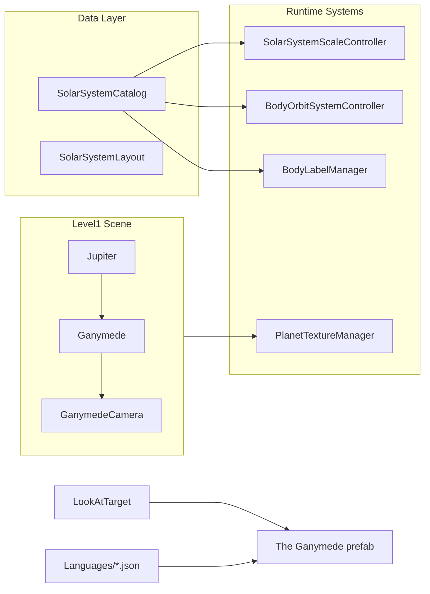

# Добавление спутника Ганимед

## Контекст

В проекте реализованы только **2 спутника как 3D-объекты**: Moon (Земля) и Titan (Сатурн). Ганимед, Ио, Европа и Каллисто упоминаются лишь в тексте `JupiterContent` в JSON локализации.

`SimulationSidePanel` — это панель **режимов симуляции** (орбиты, сетка гравитации, метки, миникарта, реальные расстояния/размеры/орбиты, свободное наблюдение). Описание тела показывается через prefab `The Ganymede` и [`LookAtTarget.cs`](Assets/Scripts/LookAtTarget.cs), как у Титана.



## 1. HD-текстура (скачивание и импорт)

**Источник (официальный, астрономический):**
- [DLR Janus — Controlled Global Ganymede Mosaic](https://janus.dlr.de/publications/ganymede/Ganymede_Mosaic_Juno.html) — мозаика Voyager + Galileo + JunoCam, equirectangular, preview PNG ~2 km/px
- Резерв: [USGS Astropedia — Ganymede Voyager-Galileo SSI Global Mosaic 1km](https://astrogeology.usgs.gov/search/map/ganymede_voyager_galileo_ssi_global_mosaic_1km)

**Шаги:**
1. Скачать preview PNG (0° longitude) с DLR Janus
2. При необходимости масштабировать до **8192×4096** (как [`TitanTexture_8k.jpg`](Assets/Textures/HD/TitanTexture_8k.jpg))
3. Положить в:
   - `Assets/Textures/HD/GanymedeTexture_8k.jpg`
   - `Assets/Resources/PlanetTexturesHD/GanymedeTexture_8k.jpg` (для HD-материала)
4. Создать материалы по образцу Титана:
   - [`Assets/Materials/GanymedeTexture.mat`](Assets/Materials/TitanTexture.mat) — стандартный URP Lit, серая поверхность (без оранжевого tint Титана)
   - `Assets/Resources/PlanetGraphicsHD/GanymedeTexture_HD.mat` — ссылка на 8k-текстуру
5. Зарегистрировать HD-своп в [`PlanetTextureManager.cs`](Assets/Scripts/SolarSystemGraphics/PlanetTextureManager.cs):

```csharp
RegisterBodySwap("Ganymede", "PlanetGraphicsHD/GanymedeTexture_HD");
```

Оверлей атмосферы (как `ExtraGraphicsTitanHaze`) **не нужен** — у Ганимеда нет плотной атмосферы.

## 2. 3D-объект в сцене Level1

Дублировать структуру **Titan** в [`Level1.unity`](Assets/_Scenes/Level1.unity):

| Компонент | Значение |
|-----------|----------|
| Имя | `Ganymede` (строго!) |
| Parent | `Jupiter` |
| Mesh | Unity Sphere (как у Titan) |
| Material | `GanymedeTexture.mat` |
| SphereCollider | radius = 0.5 |
| RotateAround | target = Jupiter, speed ≈ **10** (быстрее Титана: период ~7.15 суток vs ~16 суток) |
| localScale | **0.28** (почти как Титан: R ≈ 2634 km) |
| localPosition | **(0, 0, 2.0)** — чуть ближе к Юпитеру, чем Титан к Сатурну (2.5), пропорционально орбите |
| Child camera | `GanymedeCamera` at local (0, 0, -3.2), RotateAround target = Ganymede, speed = 5 |

## 3. Астрономические данные

Добавить в [`SolarSystemCatalog.cs`](Assets/Scripts/SolarSystemGraphics/SolarSystemCatalog.cs):

```csharp
public const float GanymedeOrbitKm = 1070400f;

new BodyDefinition
{
    objectName = "Ganymede",
    orbitalRadiusAu = 0f,
    equatorialRadiusKm = 2634.1f,
    orbitCenterName = "Jupiter",
    satelliteOrbitKm = GanymedeOrbitKm,
    orbitalEccentricity = 0.0013f,
    orbitalInclinationDeg = 0.2f
}
```

Добавить educational layout в [`SolarSystemLayout.cs`](Assets/Scripts/SolarSystemGraphics/SolarSystemLayout.cs):

```csharp
"Ganymede", new EducationalEntry
{
    Scale = new Vector3(0.28f, 0.28f, 0.28f),
    OrbitDistance = 2.0f,
    SatelliteLocalPosition = new Vector3(0f, 0f, 2.0f),
    PickColliderRadius = 1f
}
```

После добавления в каталог системы **автоматически** подхватят:
- `SolarSystemScaleController` — реальные/учебные расстояния и размеры
- `BodyOrbitSystemController` — эллиптические орбиты (режим «Реальные орбиты»)
- `OrbitLinesManager` — линии орбиты вокруг Юпитера
- `LookAtTarget.IsCatalogBody` — свободное наблюдение

## 4. Описание и локализация (по образцу Титана)

Добавить ключи **`GanymedeHeader`** и **`GanymedeContent`** во все 5 файлов:
- [`english.json`](Assets/Resources/Languages/english.json)
- [`russian.json`](Assets/Resources/Languages/russian.json)
- [`chinese.json`](Assets/Resources/Languages/chinese.json)
- [`vietnamese.json`](Assets/Resources/Languages/vietnamese.json)
- [`uzbek.json`](Assets/Resources/Languages/uzbek.json)

**Стиль:** короткий абзац как у `TitanContent` (не длинная wiki-статья как у планет).

**Пример EN `GanymedeContent`:**
> Ganymede is Jupiter's largest moon and the largest moon in the Solar System. It is larger than Mercury and the only moon known to generate its own magnetic field. Its interior has a metallic core, rock mantle, and thick icy crust. The surface combines ancient dark cratered terrain with younger bright grooved regions shaped by tectonic forces. NASA's Galileo and Juno missions imaged Ganymede in detail; ESA's JUICE mission is planned to orbit it in the 2030s.

**Заголовки:**

| Язык | GanymedeHeader |
|------|----------------|
| EN | Ganymede |
| RU | Ганимед |
| ZH | 木卫三 |
| VI | Ganymede |
| UZ | Ganimed |

Создать prefab **`Assets/Prefabs/Descriptions/The Ganymede.prefab`** — дубликат [`The Titan.prefab`](Assets/Prefabs/Descriptions/The Titan.prefab):
- Root: `The Ganymede`, tag `Ganymede`
- Children: `GanymedeHeader`, `GanymedeContent` (имена = JSON-ключи для `LocalizedText`)

## 5. Интеграция UI и камер

Обновить по шаблону Titan/Moon:

| Файл | Изменения |
|------|-----------|
| [`LookAtTarget.cs`](Assets/Scripts/LookAtTarget.cs) | `theGanymedeGameObject`, `ganymedeCamera`; ветки в `MakeAllDescriptionsInvisible`, `ShowDescriptionForPlanet`, `TurnOnDetailCameraForPlanet`, `GetActiveDetailCamera`, `TurnOffAllDetailCameras`, `TurnOn/OffGanymedeCamera` |
| [`MobileOrbitCamera.cs`](Assets/Scripts/MobileOrbitCamera.cs) | `TriggerDescription` и `TriggerCameraSwitch` для `"Ganymede"` |
| [`VisualsInitializer.cs`](Assets/Scripts/VisualsInitializer.cs) | `camLower.Contains("ganymede")` → `"Ganymede"` |
| [`BodyLabelManager.cs`](Assets/Scripts/SolarSystemGraphics/BodyLabelManager.cs) | `"Ganymede"` в `BodyNames` (после Jupiter) |
| [`SpacetimeGridController.cs`](Assets/Scripts/SolarSystemGraphics/SpacetimeGridController.cs) | `"Ganymede"` в `BodyNames` |
| [`Level1.unity`](Assets/_Scenes/Level1.unity) | Инстанс `The Ganymede` на canvas; привязка в `LookAtTarget` |

## 6. Совместимость с режимами SimulationSidePanel

| Режим | Что обеспечивает совместимость |
|-------|-------------------------------|
| Орбиты | `SolarSystemCatalog` + `OrbitLinesManager` (авто) |
| Сетка гравитации | `SpacetimeGridController.BodyNames` |
| Метки | `BodyLabelManager` + `GanymedeHeader` |
| Миникарта | Без изменений (рендерит сцену) |
| Реальные расстояния | `satelliteOrbitKm` + scene baseline |
| Реальные размеры | `equatorialRadiusKm` + scene `localScale` |
| Реальные орбиты | `orbitalEccentricity`, `orbitalInclinationDeg` |
| Свободное наблюдение | `SolarSystemCatalog.TryGetBody("Ganymede")` |
| Extra Graphics (меню) | `PlanetTextureManager.RegisterBodySwap` |

## 7. Визуальная проверка

После реализации проверить в Unity Editor:
1. Ганимед виден на орбите вокруг Юпитера, не пересекается с диском планеты
2. Тап по спутнику → описание + камера `GanymedeCamera`
3. Переключение всех 10 тогглов боковой панели — орбита, метка, масштаб, HD-текстура
4. Смена языка — обновляются заголовок и текст описания
5. Режим «Реальные орбиты» — эллиптическая орбита вокруг Юпитера

## Затрагиваемые файлы (итого ~15)

**Новые:** текстуры, 2 материала, prefab описания, `.meta` файлы

**Изменяемые:** `SolarSystemCatalog.cs`, `SolarSystemLayout.cs`, `PlanetTextureManager.cs`, `LookAtTarget.cs`, `MobileOrbitCamera.cs`, `VisualsInitializer.cs`, `BodyLabelManager.cs`, `SpacetimeGridController.cs`, 5× language JSON, `Level1.unity`
