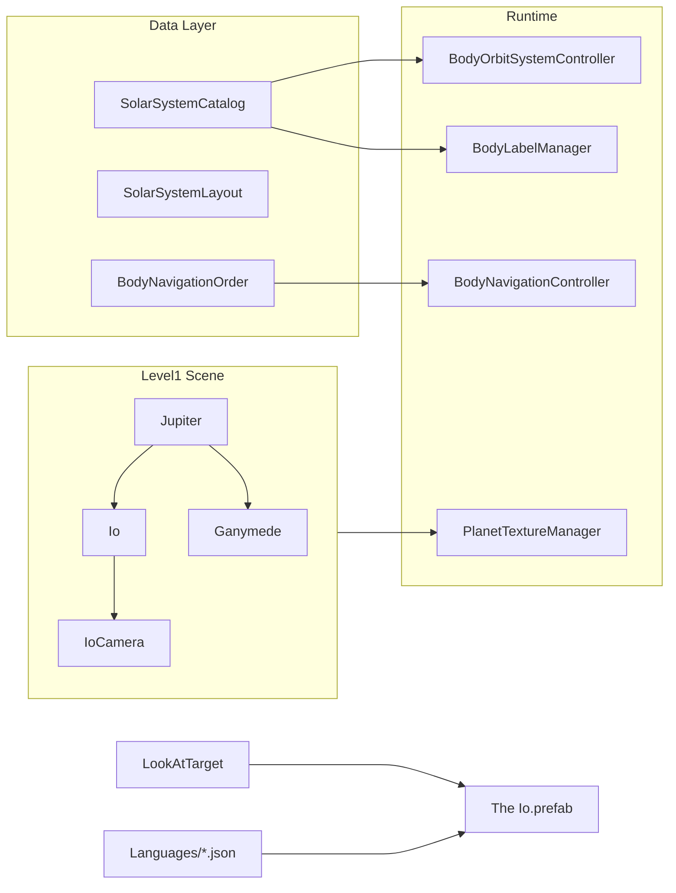

# Добавление спутника Ио вокруг Юпитера

## Контекст

В проекте уже реализован **Ганимед** — единственный спутник Юпитера как 3D-объект. Ио упоминается только в тексте `JupiterContent` в JSON локализации, без собственных ключей, текстур и сцены.

Эталон для копирования: [add_ganymede_moon_4bae4107.plan.md](.cursor/plans/add_ganymede_moon_4bae4107.plan.md) и существующий код Ганимеда в [Level1.unity](Assets/_Scenes/Level1.unity) (строки ~11281–11440).

`SimulationSidePanelController` **не требует изменений** — все режимы (орбиты, метки, реальные размеры/расстояния/орбиты, Extra Graphics, свободное наблюдение) работают через общие системы и каталог [`SolarSystemCatalog.cs`](Assets/Scripts/SolarSystemGraphics/SolarSystemCatalog.cs).



---

## 1. HD-текстура (скачивание и импорт)

**Источник (официальный, public domain):**
- [USGS Astropedia — Io Galileo SSI / Voyager Color Merged Global Mosaic 1km](https://astrogeology.usgs.gov/search/map/io_galileo_ssi_voyager_color_merged_global_mosaic_1km)
- Прямая ссылка на GeoTIFF (~189 MB): `https://planetarymaps.usgs.gov/mosaic/Io_GalileoSSI-Voyager_Global_Mosaic_ClrMerge_1km.tif`
- Резерв (монохром, выше детализация): [Io Voyager-Galileo SSI Global Mosaic 1km](https://astrogeology.usgs.gov/search/map/io_voyager_galileo_ssi_global_mosaic_1km)

**Шаги обработки:**
1. Скачать color-merged GeoTIFF с USGS
2. Конвертировать в equirectangular JPG (Python PIL / ImageMagick)
3. Масштабировать до **8192×4096** (конвенция проекта: `*_8k.jpg`, как [`TitanTexture_8k.jpg`](Assets/Textures/HD/TitanTexture_8k.jpg))
4. Разместить:
   - `Assets/Textures/HD/IoTexture_8k.jpg`
   - `Assets/Resources/PlanetTexturesHD/IoTexture_8k.jpg`
5. Создать материалы по образцу Ганимеда:
   - `Assets/Materials/IoTexture.mat` — URP Lit, **без tint** (естественные жёлто-оранжево-красные цвета серы на текстуре)
   - `Assets/Resources/PlanetGraphicsHD/IoTexture_HD.mat` — ссылка на 8k-текстуру
6. Зарегистрировать HD-swap в [`PlanetTextureManager.cs`](Assets/Scripts/SolarSystemGraphics/PlanetTextureManager.cs):

```csharp
RegisterBodySwap("Io", "PlanetGraphicsHD/IoTexture_HD");
```

**Атмосферный оверлей не нужен** — у Ио нет плотной атмосферы (в отличие от Титана с `ExtraGraphicsTitanHaze`).

---

## 2. Астрономические данные

Добавить в [`SolarSystemCatalog.cs`](Assets/Scripts/SolarSystemGraphics/SolarSystemCatalog.cs):

```csharp
public const float IoOrbitKm = 421700f;

new BodyDefinition
{
    objectName = "Io",
    orbitalRadiusAu = 0f,
    equatorialRadiusKm = 1821.6f,
    orbitCenterName = "Jupiter",
    satelliteOrbitKm = IoOrbitKm,
    orbitalEccentricity = 0.0041f,
    orbitalInclinationDeg = 0.05f
}
```

| Параметр | Значение | Сравнение с Ганимедом |
|---|---|---|
| Орбита | 421 700 км | Ганимед: 1 070 400 км (Ио ближе к Юпитеру в ~2.5×) |
| Радиус | 1821.6 км | Ганимед: 2634.1 км |
| Период | ~1.77 суток | Ганимед: ~7.15 суток (Ио облетает быстрее в ~4×) |

---

## 3. Учебный layout (видимость и пропорции)

Добавить в [`SolarSystemLayout.cs`](Assets/Scripts/SolarSystemGraphics/SolarSystemLayout.cs):

```csharp
"Io", new EducationalEntry
{
    Scale = new Vector3(0.19f, 0.19f, 0.19f),
    OrbitDistance = 0.79f,
    SatelliteLocalPosition = new Vector3(0f, 0f, 0.79f),
    PickColliderRadius = 1f
}
```

**Обоснование пропорций** (относительно Ганимеда: scale 0.28, orbit 2.0):
- Scale: `0.28 × (1821.6 / 2634.1) ≈ 0.19`
- Orbit: `2.0 × (421700 / 1070400) ≈ 0.79`

Ио будет **ближе к Юпитеру и меньше Ганимеда**, но хорошо виден и кликабелен. В режиме «реальные размеры» Ио (~1822 км) остаётся заметным рядом с Юпитером (~69911 км), в отличие от крошечного Фобоса.

---

## 4. 3D-объект в сцене Level1

Создать GameObject **`Io`** как дочерний объект **`Jupiter`** (дублировать структуру Ganymede, строки ~11281–11440):

| Компонент | Значение |
|---|---|
| Parent | `Jupiter` |
| Mesh | Unity Sphere |
| Material | `IoTexture.mat` |
| SphereCollider | radius = 0.5 |
| `localScale` | `(0.19, 0.19, 0.19)` |
| `localPosition` | `(0, 0, 0.79)` |
| `RotateAround.target` | Jupiter Transform |
| `RotateAround.speed` | **~40** (пропорционально периоду: `10 × 7.15/1.77 ≈ 40`) |

**Дочерний `IoCamera`:**
- `localPosition`: `(0, 0, -2.8)` — ближе, чем у Ганимеда (-3.2), т.к. Ио меньше
- `RotateAround` вокруг Io, speed = 5
- Camera component, `m_IsActive: 0`

**Prefab описания:** дублировать [`The Ganymede.prefab`](Assets/Prefabs/Descriptions/The%20Ganymede.prefab) → `Assets/Prefabs/Descriptions/The Io.prefab`:
- Root: `The Io`, tag `Io`
- Children: `IoHeader`, `IoContent` (имена = JSON-ключи для `LocalizedText`)

Разместить экземпляр `The Io` на Canvas и привязать в `LookAtTarget`.

---

## 5. Описание и локализация (стиль Titan/Ganymede)

Добавить ключи **`IoHeader`** и **`IoContent`** во все 5 файлов:
- [`english.json`](Assets/Resources/Languages/english.json)
- [`russian.json`](Assets/Resources/Languages/russian.json)
- [`chinese.json`](Assets/Resources/Languages/chinese.json)
- [`vietnamese.json`](Assets/Resources/Languages/vietnamese.json)
- [`uzbek.json`](Assets/Resources/Languages/uzbek.json)

**Стиль:** короткий абзац (4–6 предложений), как `GanymedeContent` / `TitanContent`.

**English `IoContent` (черновик):**
> Io is Jupiter's innermost Galilean moon and the most volcanically active body in the Solar System. Its surface is covered with sulfur-rich lava flows, vast calderas, and colorful deposits from hundreds of active volcanoes driven by tidal heating from Jupiter's gravity. Io has no impact craters because volcanic activity constantly resurfaces the moon. NASA's Voyager and Galileo missions discovered the first active extraterrestrial volcanoes on Io; Juno has continued close flybys in the 2020s.

**Заголовки:**

| Язык | IoHeader |
|---|---|
| EN | Io |
| RU | Ио |
| ZH | 木卫一 |
| VI | Io |
| UZ | Io |

---

## 6. Интеграция UI, камер и NavigationBar

Обновить по шаблону Ganymede (null-safe `if`):

| Файл | Изменения |
|---|---|
| [`LookAtTarget.cs`](Assets/Scripts/LookAtTarget.cs) | `theIoGameObject`, `ioCamera`; wiring в `MakeAllDescriptionsInvisible`, `ShowDescriptionForPlanet`, `TurnOnDetailCameraForPlanet`, `GetActiveDetailCamera`, `TurnOffAllDetailCameras`, `TurnOn/OffIoCamera` |
| [`MobileOrbitCamera.cs`](Assets/Scripts/MobileOrbitCamera.cs) | `TriggerDescription` и `TriggerCameraSwitch` для `"Io"` |
| [`VisualsInitializer.cs`](Assets/Scripts/VisualsInitializer.cs) | `if (camLower.Contains("io")) return "Io";` |
| [`BodyLabelManager.cs`](Assets/Scripts/SolarSystemGraphics/BodyLabelManager.cs) | `"Io"` в `BodyNames[]` (после `"Jupiter"`) |
| [`SpacetimeGridController.cs`](Assets/Scripts/SolarSystemGraphics/SpacetimeGridController.cs) | `"Io"` в оба массива `BodyNames` (основной + satellites) |
| [`BodyNavigationOrder.cs`](Assets/Scripts/SolarSystemGraphics/BodyNavigationOrder.cs) | Вставить `"Io"` **после `"Jupiter"`, перед `"Ganymede"`** — внутренний галилеев спутник перед внешним |

**NavigationBar** ([`BodyNavigationController.cs`](Assets/Scripts/BodyNavigationController.cs)): изменений в коде не требуется — список строится из `BodyNavigationOrder.BuildNavigationList()` через `GameObject.Find("Io")`. После добавления в `BaseBodyNames` Ио появится в перелистывании Prev/Next и по клику на имя тела.

Новый порядок: `... Jupiter → Io → Ganymede → Saturn → Titan ...`

---

## 7. Совместимость с режимами SimulationSidePanel

| Режим | Что обеспечивает совместимость |
|---|---|
| Орбиты | `SolarSystemCatalog` + `OrbitLinesManager` (авто) |
| Сетка гравитации | `SpacetimeGridController.BodyNames` |
| Метки | `BodyLabelManager` + ключ `IoHeader` |
| Миникарта | Без изменений (рендерит сцену) |
| Реальные расстояния | `satelliteOrbitKm = 421700` |
| Реальные размеры | `equatorialRadiusKm = 1821.6` |
| Реальные орбиты | e=0.0041, наклон 0.05° вокруг Юпитера |
| Свободное наблюдение | `SolarSystemCatalog.TryGetBody("Io")` |
| Extra Graphics | `PlanetTextureManager.RegisterBodySwap` |

---

## 8. Визуальная проверка (test plan)

1. Запустить Level1 — Ио виден на орбите ближе к Юпитеру, чем Ганимед; вращается быстрее
2. Тап по Ио → описание + камера `IoCamera`; жёлто-оранжевая вулканическая текстура
3. NavigationBar Prev/Next — Ио между Юпитером и Ганимедом; клик по имени показывает описание
4. Переключить все 5 языков — обновляются `IoHeader` / `IoContent`
5. Все тогглы SimulationSidePanel — орбита, метка, реальные размеры/расстояния/орбиты, Extra Graphics HD
6. Ио и Ганимед не пересекаются визуально (орбиты 0.79 vs 2.0)

---

## Затрагиваемые файлы (~15)

**Новые:** `IoTexture_8k.jpg` (×2 пути), 2 материала, `The Io.prefab`, `.meta`

**Изменяемые:** `SolarSystemCatalog.cs`, `SolarSystemLayout.cs`, `PlanetTextureManager.cs`, `LookAtTarget.cs`, `MobileOrbitCamera.cs`, `VisualsInitializer.cs`, `BodyLabelManager.cs`, `SpacetimeGridController.cs`, `BodyNavigationOrder.cs`, 5× language JSON, `Level1.unity`
