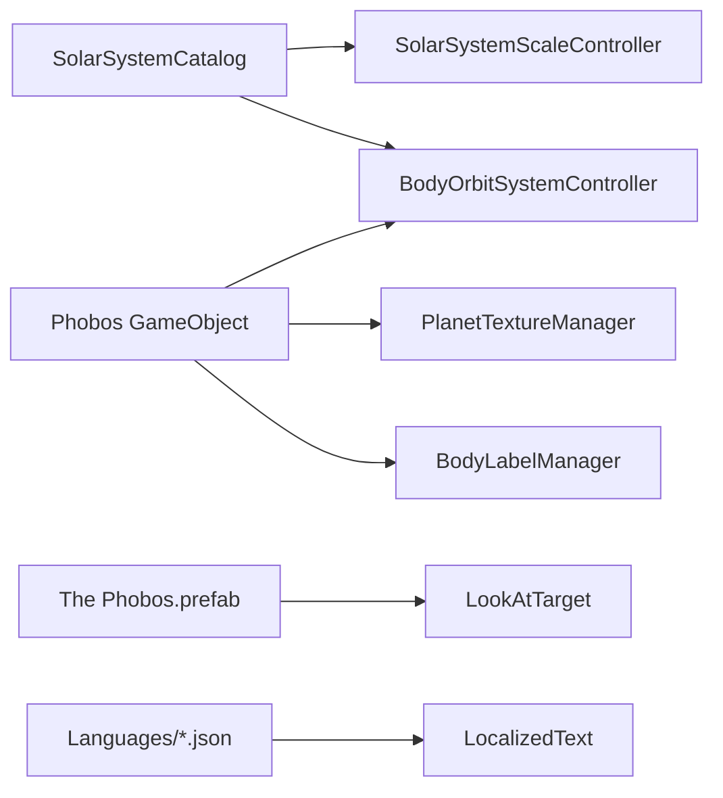

# Добавление спутника Фобос вокруг Марса

## Архитектура (существующий паттерн)

Спутники — это обычные `GameObject` в сцене + запись в каталоге. Орбита, масштаб, метки и сетка гравитации подключаются автоматически через общие менеджеры. `SimulationSidePanelController` не содержит per-body ссылок — изменения в нём **не требуются**.



Эталон для копирования: [Ganymede в Level1.unity](Assets/_Scenes/Level1.unity) (дочерний объект Юпитера, `RotateAround` → родитель, дочерняя `PhobosCamera`).

---

## 1. Астрономические данные

Добавить в [SolarSystemCatalog.cs](Assets/Scripts/SolarSystemGraphics/SolarSystemCatalog.cs):

```csharp
public const float PhobosOrbitKm = 9376f;

new BodyDefinition
{
    objectName = "Phobos",
    orbitalRadiusAu = 0f,
    equatorialRadiusKm = 11.27f,
    orbitCenterName = "Mars",
    satelliteOrbitKm = PhobosOrbitKm,
    orbitalEccentricity = 0.0151f,
    orbitalInclinationDeg = 1.08f
}
```

**Важно про размеры:** в режиме «реальные размеры/расстояния» Фобос (~11 км) будет почти невидим рядом с Марсом (~3390 км). Для учебного режима нужны увеличенные значения в layout (см. ниже).

---

## 2. Учебный layout (видимость и кликабельность)

Добавить в [SolarSystemLayout.cs](Assets/Scripts/SolarSystemGraphics/SolarSystemLayout.cs):

| Параметр | Рекомендуемое значение | Обоснование |
|---|---|---|
| `Scale` | `(0.14, 0.14, 0.14)` | Меньше Луны (0.2), но видим |
| `OrbitDistance` | `0.95f` | Фобос очень близко к Марсу (~2.8 радиуса Марса) |
| `SatelliteLocalPosition` | `(0, 0, 0.95)` | Стартовая позиция на орбите |
| `PickColliderRadius` | `2.5f` | Увеличенный коллайдер для клика (как у Луны — 3f) |

Сравнение: Луна — scale 0.2, orbit 1.39; Ганимед — scale 0.28, orbit 2.0.

---

## 3. HD-текстура (NASA/USGS, public domain)

**Источник:** USGS Astrogeology — [Phobos Mars Express HRSC Color Shaded Relief](https://astrogeology.usgs.gov/search/map/phobos_mars_express_hrsc_color_shaded_relief_100m)  
Прямая ссылка: `https://planetarymaps.usgs.gov/mosaic/Phobos_ME_HRSC_ClrShade_Global_2ppd.tif` (public domain, cite USGS/DLR).

**Альтернатива** (больше деталей): [Phobos Viking Global Mosaic 5m](https://planetarymaps.usgs.gov/mosaic/Phobos_Viking_Mosaic_40ppd_DLRcontrol.tif) (~99 MB).

**Шаги обработки:**
1. Скачать GeoTIFF с USGS
2. Конвертировать в equirectangular JPG (ImageMagick/Python PIL)
3. Апскейл до 8192×4096 (конвенция проекта: `*_8k.jpg`)
4. Разместить по паттерну Ганимеда:

| Файл | Путь |
|---|---|
| Исходник | `Assets/Textures/HD/PhobosTexture_8k.jpg` |
| Resources | `Assets/Resources/PlanetTexturesHD/PhobosTexture_8k.jpg` |
| Стандартный материал | `Assets/Materials/PhobosTexture.mat` |
| HD-материал | `Assets/Resources/PlanetGraphicsHD/PhobosTexture_HD.mat` |

5. Зарегистрировать в [PlanetTextureManager.cs](Assets/Scripts/SolarSystemGraphics/PlanetTextureManager.cs):
   ```csharp
   RegisterBodySwap("Phobos", "PlanetGraphicsHD/PhobosTexture_HD");
   ```

Цветовая гамма: серо-коричневый, кратер Стикни — характерная деталь на текстуре.

---

## 4. Сцена Level1.unity

Создать GameObject **`Phobos`** по образцу Ganymede (строки ~9075–9250 в [Level1.unity](Assets/_Scenes/Level1.unity)):

- **Родитель:** `Mars` (Transform fileID `1355480360`)
- **Компоненты:** `Transform`, `MeshFilter` (Sphere), `MeshRenderer`, `SphereCollider`, `RotateAround`
- **Параметры:**
  - `m_LocalScale`: `(0.14, 0.14, 0.14)`
  - `m_LocalPosition`: `(0, 0, 0.95)`
  - `RotateAround.target`: Mars Transform
  - `RotateAround.speed`: **35–45** (Фобос облетает Марс за ~7.6 ч vs ~27 сут у Луны; Луна в сцене speed=12)
- **Материал:** `PhobosTexture.mat`

**Дочерний объект `PhobosCamera`:**
- `m_LocalPosition`: `(0, 0, -2.5)` (ближе, чем у Ганимеда -3.2 — Фобос меньше)
- `RotateAround` вокруг Phobos (speed ~5)
- `Camera` компонент, `m_IsActive: 0`

**Префаб описания:** дублировать [The Ganymede.prefab](Assets/Prefabs/Descriptions/The%20Ganymede.prefab) → `The Phobos.prefab`, переименовать дочерние Text-объекты:
- `PhobosHeader`
- `PhobosContent`

Разместить экземпляр префаба в Canvas сцены и привязать к `LookAtTarget`.

---

## 5. Код: интеграция UI и камер

Обновить по паттерну Ganymede (null-safe `if`):

| Файл | Изменения |
|---|---|
| [LookAtTarget.cs](Assets/Scripts/LookAtTarget.cs) | `thePhobosGameObject`, `phobosCamera`; wiring в `MakeAllDescriptionsInvisible`, `ShowDescriptionForPlanet`, `TurnOnDetailCameraForPlanet`, `GetActiveDetailCamera`, `TurnOffAllDetailCameras`, `TurnOn/OffPhobosCamera` |
| [MobileOrbitCamera.cs](Assets/Scripts/MobileOrbitCamera.cs) | `TriggerDescription` и `SetCameraActive` для `"Phobos"` |
| [VisualsInitializer.cs](Assets/Scripts/VisualsInitializer.cs) | `if (camLower.Contains("phobos")) return "Phobos";` |
| [BodyLabelManager.cs](Assets/Scripts/SolarSystemGraphics/BodyLabelManager.cs) | Добавить `"Phobos"` в `BodyNames[]` (после `"Mars"`) |
| [SpacetimeGridController.cs](Assets/Scripts/SolarSystemGraphics/SpacetimeGridController.cs) | Добавить `"Phobos"` в `BodyNames[]` |

---

## 6. Локализация (5 языков)

Добавить ключи `PhobosHeader` и `PhobosContent` во все файлы:
- [english.json](Assets/Resources/Languages/english.json)
- [russian.json](Assets/Resources/Languages/russian.json)
- [chinese.json](Assets/Resources/Languages/chinese.json)
- [uzbek.json](Assets/Resources/Languages/uzbek.json)
- [vietnamese.json](Assets/Resources/Languages/vietnamese.json)

**Стиль:** краткий абзац как у Ganymede/Titan (4–6 предложений, факты + миссии).

**English (PhobosContent):**
> Phobos is the larger and innermost of Mars's two moons. It is a small, irregularly shaped body dominated by the giant Stickney crater and a network of grooves. Phobos orbits Mars in just 7 hours 39 minutes — faster than Mars rotates — and is slowly spiraling inward, destined to break apart or collide with the planet within tens of millions of years. NASA's Viking orbiters, Mars Global Surveyor, and ESA's Mars Express have mapped its surface in detail.

**Russian (PhobosHeader / PhobosContent):**
- Header: `Фобос`
- Content: аналогичный перевод с упоминанием кратера Стикни, орбитального периода, спирального сближения, миссий Viking / Mars Express

Аналогичные переводы для китайского, узбекского и вьетнамского.

---

## 7. Совместимость с SimulationSidePanel

Все режимы боковой панели работают через глобальные настройки и автоматически затрагивают новое тело:

| Режим | Поведение для Фобоса |
|---|---|
| Орбиты вкл/выкл | `BodyOrbitSystemController` найдёт Phobos по каталогу |
| Реальные орбиты | Эллипс с e=0.0151, наклон 1.08° вокруг Марса |
| Реальные расстояния/размеры | Орбита 9376 км, радиус 11.27 км (почти точка) |
| Метки | `BodyLabelManager` — ключ `PhobosHeader` |
| Сетка гравитации | `SpacetimeGridController` — минимальный эффект (масса мала) |
| Extra Graphics | HD-swap через `PlanetTextureManager` |
| Свободное наблюдение | Клик → `LookAtTarget.FocusPlanet("Phobos")` |

---

## 8. Проверка (test plan)

1. Запустить Level1 — Фобос виден рядом с Марсом, вращается по орбите
2. Клик по Фобосу — открывается описание, включается `PhobosCamera`
3. Переключить языки — заголовок и текст меняются
4. Включить «Реальные орбиты» — эллиптическая орбита вокруг Марса
5. Включить «Реальные размеры» — Фобос становится крошечной точкой (ожидаемо)
6. Включить «Extra Graphics» — подгружается HD-текстура
7. Включить метки — появляется «Фобос» / «Phobos»
8. Сброс настроек (`SettingsResetController`) — Фобос остаётся в сцене

---

## Порядок реализации

Рекомендуемая последовательность: сначала скачать и подготовить текстуру → код каталога/layout → сцена → префаб описания → локализация → wiring UI/камер → тест в Unity Editor.
