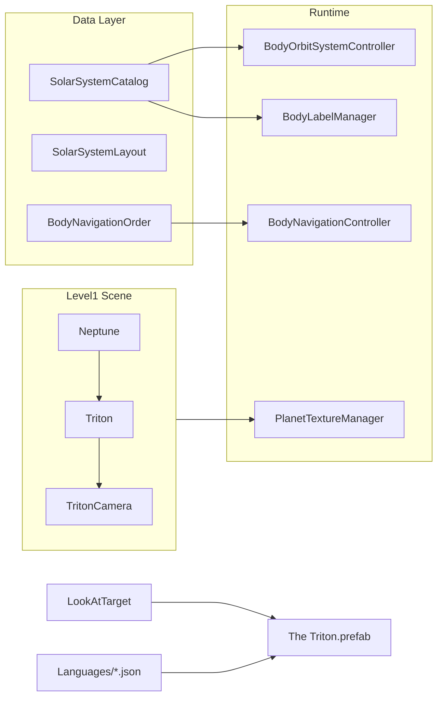

# Добавление спутника Тритон вокруг Нептуна

## Контекст

В проекте уже реализованы **Титан** (вокруг Сатурна) и галилеевы спутники (вокруг Юпитера) как полноценные 3D-тела. **Тритон** сейчас упоминается только внутри длинного текста `NeptuneContent` в JSON — без собственных ключей, текстур, сцены и каталога.

Эталон: планы [add_callisto_moon_e6ffe74f.plan.md](.cursor/plans/add_callisto_moon_e6ffe74f.plan.md) и [add_europa_moon_8d01b507.plan.md](.cursor/plans/add_europa_moon_8d01b507.plan.md), а также код Титана в [SolarSystemCatalog.cs](Assets/Scripts/SolarSystemGraphics/SolarSystemCatalog.cs) и сцене [Level1.unity](Assets/_Scenes/Level1.unity).

[`SimulationSidePanelController.cs`](Assets/Scripts/SimulationSidePanelController.cs) **не требует изменений** — все режимы работают через общие системы и каталог.



---

## 1. HD-текстура (скачивание и импорт)

**Источник (официальный, public domain):**
- [USGS Astropedia — Triton Voyager 2 Global Color Mosaic 600m](https://astrogeology.usgs.gov/search/map/triton_voyager_2_global_color_mosaic_600m) (PIA18668, Lunar and Planetary Institute / NASA Voyager 2)
- Прямая ссылка на GeoTIFF (~287 MB): `https://planetarymaps.usgs.gov/mosaic/Triton_Voyager2_ClrMosaic_GlobalFill_600m.tif`
- Резерв (частичное покрытие): [Triton Voyager 2 Global Color Orthomosaic 600m](https://astrogeology.usgs.gov/search/map/triton_voyager_2_global_color_orthomosaic_600m) (PIA00317, USGS)
- NASA Photojournal: [PIA18668](https://photojournal.jpl.nasa.gov/catalog/PIA18668)

**Шаги обработки:**
1. Скачать GeoTIFF в `Temp/triton_download/` (PowerShell `Invoke-WebRequest`)
2. Конвертировать equirectangular RGB → JPG (Python PIL / ImageMagick); исходник ~14138×7069 px
3. Масштабировать до **8192×4096** (конвенция проекта: `*_8k.jpg`, Lanczos — как у Каллисто/Европы)
4. Разместить в **оба** пути (критично для Editor и APK):
   - `Assets/Textures/HD/TritonTexture_8k.jpg`
   - `Assets/Resources/PlanetTexturesHD/TritonTexture_8k.jpg`
5. Создать материалы по образцу [`CallistoTexture.mat`](Assets/Materials/CallistoTexture.mat):
   - `Assets/Materials/TritonTexture.mat` — URP Lit (`guid: 933532a4fcc9baf4fa0491de14d08ed7`), `_BaseMap` + `_MainTex` на одну текстуру, лёгкий розовато-кремовый tint `_BaseColor: (0.92, 0.88, 0.86)` — соответствует ледяной поверхности Тритона
   - `Assets/Resources/PlanetGraphicsHD/TritonTexture_HD.mat` — ссылка на 8k-текстуру из Resources
6. Зарегистрировать HD-swap в [`PlanetTextureManager.cs`](Assets/Scripts/SolarSystemGraphics/PlanetTextureManager.cs):

```csharp
RegisterBodySwap("Triton", "PlanetGraphicsHD/TritonTexture_HD");
```

7. Добавить атрибуцию в [`TEXTURE_ATTRIBUTION.txt`](Assets/Textures/HD/TEXTURE_ATTRIBUTION.txt): USGS / LPI / NASA Voyager 2 PIA18668, public domain

**Атмосферный оверлей не нужен** — у Тритона тонкая атмосфера, визуально не сравнима с туманом Титана (`EnsureTitanHazeOverlay`).

### Защита от розовых текстур (Editor + APK)

| Проверка | Значение |
|---|---|
| Shader | URP Lit (`933532a4fcc9baf4fa0491de14d08ed7`) |
| `_BaseMap` и `_MainTex` | Оба назначены на текстуру с валидным GUID |
| Дублирование текстуры | `Assets/Textures/HD/` + `Assets/Resources/PlanetTexturesHD/` |
| HD-материал | `Assets/Resources/PlanetGraphicsHD/TritonTexture_HD.mat` |
| Android platform override | `maxTextureSize: 4096`, `overridden: 1` в `.meta` (копировать шаблон с [`IoTexture_8k.jpg.meta`](Assets/Textures/HD/IoTexture_8k.jpg.meta)) |
| Runtime validation | `PlanetTextureManager.MaterialHasAlbedo()` — warning при отсутствии albedo |
| Extra Graphics toggle | Проверить swap standard → HD в Editor и после сборки APK |

---

## 2. Астрономические данные

Добавить в [`SolarSystemCatalog.cs`](Assets/Scripts/SolarSystemGraphics/SolarSystemCatalog.cs):

```csharp
public const float TritonOrbitKm = 354759f;

new BodyDefinition
{
    objectName = "Triton",
    orbitalRadiusAu = 0f,
    equatorialRadiusKm = 1353.4f,
    orbitCenterName = "Neptune",
    satelliteOrbitKm = TritonOrbitKm,
    orbitalEccentricity = 0.000016f,
    orbitalInclinationDeg = 0.67f   // к экватору Нептуна
}
```

| Параметр | Значение | Сравнение |
|---|---|---|
| Орбита | 354 759 км | Ближе к Нептуну, чем Титан к Сатурну (1 221 870 км) |
| Радиус | 1353.4 км | ~52% от Титана (2574.7), крупнейший спутник Нептуна |
| Период | ~5.88 суток | Быстрее Титана (~15.9 суток) |
| Особенность | **ретроградная** орбита | Единственный крупный ретроградный спутник |

---

## 3. Учебный layout (видимость и пропорции)

Добавить в [`SolarSystemLayout.cs`](Assets/Scripts/SolarSystemGraphics/SolarSystemLayout.cs):

```csharp
"Triton", new EducationalEntry
{
    Scale = new Vector3(0.15f, 0.15f, 0.15f),
    OrbitDistance = 2.2f,
    SatelliteLocalPosition = new Vector3(0f, 0f, 2.2f),
    PickColliderRadius = 1f
}
```

**Обоснование:**
- Scale: `0.28 × (1353.4 / 2574.7) ≈ 0.15` — пропорционально Титану
- Orbit: **2.2** (не 0.73 по чистому km-отношению) — Нептун имеет `Scale = 4` (радиус сферы ~2.0), орбита должна быть **вне** диска планеты; 2.2 даёт органичный зазор, аналогичный Титану у Сатурна (orbit 2.5 при scale 5)

**Ретроградное вращение (схематический режим):** `RotateAround.speed = **-22**` (отрицательное значение; Титан = 8, период Тритона в ~2.7× короче → `8 × 15.9/5.88 ≈ 22`). Отрицательный speed также передаётся в `BodyOrbitController` при режиме Real orbits.

---

## 4. 3D-объект в сцене Level1

Создать GameObject **`Triton`** как дочерний объект **`Neptune`** (дублировать структуру Titan):

| Компонент | Значение |
|---|---|
| Parent | `Neptune` |
| Mesh | Unity Sphere |
| Material | `TritonTexture.mat` |
| SphereCollider | radius = 0.5 |
| `localScale` | `(0.15, 0.15, 0.15)` |
| `localPosition` | `(0, 0, 2.2)` |
| `RotateAround.target` | Neptune Transform |
| `RotateAround.speed` | **-22** (ретроградно) |

**Дочерний `TritonCamera`:**
- `localPosition`: `(0, 0, -3.0)` — по аналогии с Titan (-3.2) с учётом меньшего размера
- `RotateAround` вокруг Triton, speed = 5
- Camera component, `m_IsActive: 0`

**Prefab описания:** дублировать [`The Titan.prefab`](Assets/Prefabs/Descriptions/The%20Titan.prefab) → `Assets/Prefabs/Descriptions/The Triton.prefab`:
- Root: `The Triton`, tag `Triton`
- Children: `TritonHeader`, `TritonContent` (имена = JSON-ключи для `LocalizedText`)

Разместить экземпляр `The Triton` на Canvas и привязать в `LookAtTarget` (поля `theTritonGameObject`, `tritonCamera`).

---

## 5. Описание и локализация (стиль Titan/Callisto)

Добавить ключи **`TritonHeader`** и **`TritonContent`** во все 5 файлов:
- [`english.json`](Assets/Resources/Languages/english.json)
- [`russian.json`](Assets/Resources/Languages/russian.json)
- [`chinese.json`](Assets/Resources/Languages/chinese.json)
- [`vietnamese.json`](Assets/Resources/Languages/vietnamese.json)
- [`uzbek.json`](Assets/Resources/Languages/uzbek.json)

**Стиль:** короткий абзац (4–6 предложений), как `TitanContent` / `CallistoContent`.

**English `TritonContent` (черновик):**
> Triton is Neptune's largest moon and the only large moon in the Solar System with a retrograde orbit, suggesting it was captured from the Kuiper belt. Its young, pinkish nitrogen-ice surface shows cantaloupe terrain, few impact craters, and active nitrogen geysers erupting from the south polar cap. Despite a thin nitrogen atmosphere, Triton remains one of the coldest known bodies at about −235 °C. NASA's Voyager 2 is the only spacecraft to visit Triton, imaging its surface during the 1989 Neptune flyby; proposed missions such as Trident aim to return.

**Заголовки:**

| Язык | TritonHeader |
|---|---|
| EN | Triton |
| RU | Тритон |
| ZH | 海卫一 |
| VI | Triton |
| UZ | Triton |

---

## 6. Интеграция UI, камер и NavigationBar

Обновить по шаблону Callisto (null-safe `if`):

| Файл | Изменения |
|---|---|
| [`LookAtTarget.cs`](Assets/Scripts/LookAtTarget.cs) | `theTritonGameObject`, `tritonCamera`; wiring в `MakeAllDescriptionsInvisible`, `ShowDescriptionForPlanet`, `TurnOnDetailCameraForPlanet`, `GetActiveDetailCamera`, `TurnOffAllDetailCameras`, `TurnOn/OffTritonCamera` |
| [`MobileOrbitCamera.cs`](Assets/Scripts/MobileOrbitCamera.cs) | `TriggerDescription` и `SetCameraActive` для `"Triton"` |
| [`VisualsInitializer.cs`](Assets/Scripts/VisualsInitializer.cs) | `if (camLower.Contains("triton")) return "Triton";` |
| [`BodyLabelManager.cs`](Assets/Scripts/SolarSystemGraphics/BodyLabelManager.cs) | `"Triton"` в `BodyNames` (после `"Neptune"`) |
| [`SpacetimeGridController.cs`](Assets/Scripts/SolarSystemGraphics/SpacetimeGridController.cs) | `"Triton"` в `BodyNames` и `MoonNames` |
| [`BodyNavigationOrder.cs`](Assets/Scripts/SolarSystemGraphics/BodyNavigationOrder.cs) | Вставить `"Triton"` **после `"Neptune"`**; изменить `CometInsertAfter` с `"Neptune"` на **`"Triton"`**, чтобы кометы шли после Тритона (иначе текущая логика вставит кометы между Нептуном и Тритоном) |
| [`PlanetTextureManager.cs`](Assets/Scripts/SolarSystemGraphics/PlanetTextureManager.cs) | `RegisterBodySwap("Triton", ...)` |

**NavigationBar** ([`BodyNavigationController.cs`](Assets/Scripts/BodyNavigationController.cs)): изменений в коде не требуется — список строится из `BodyNavigationOrder.BuildNavigationList()`.

**Итоговый порядок навигации:** `… Uranus → Neptune → Triton → [кометы]`

---

## 7. Совместимость с SimulationSidePanel

| Режим | Что обеспечивает работу Тритона |
|---|---|
| Orbits | `SolarSystemCatalog` + `RotateAround` на сцене |
| Real orbits | `orbitalEccentricity`, `orbitalInclinationDeg` + отрицательный `speed` |
| Schematic / Real scale | `SolarSystemLayout.EducationalEntry` + `equatorialRadiusKm` |
| Labels | `BodyLabelManager` + `TritonHeader` в JSON |
| Gravity grid | `SpacetimeGridController.BodyNames` + `MoonNames` |
| Extra Graphics | `PlanetTextureManager.RegisterBodySwap` + HD assets |
| Free observation | `SolarSystemCatalog.TryGetBody("Triton")` |
| Minimap / UI | Автоматически через scene object |

---

## 8. Верификация

1. **Editor Play Mode:** Тритон виден снаружи Нептуна, вращается ретроградно, текстура не розовая
2. **Extra Graphics ON:** HD-swap работает, `MaterialHasAlbedo` без warnings
3. **NavigationBar:** prev/next включает Тритон после Нептуна, до комет; заголовок локализован
4. **Tap / Focus:** описание `The Triton` + `TritonCamera` активируются
5. **SimulationSidePanel:** orbits, labels, schematic, real scale, real orbits, gravity grid, free observation
6. **APK build:** текстуры не magenta; Android override 4096 в `.meta`
