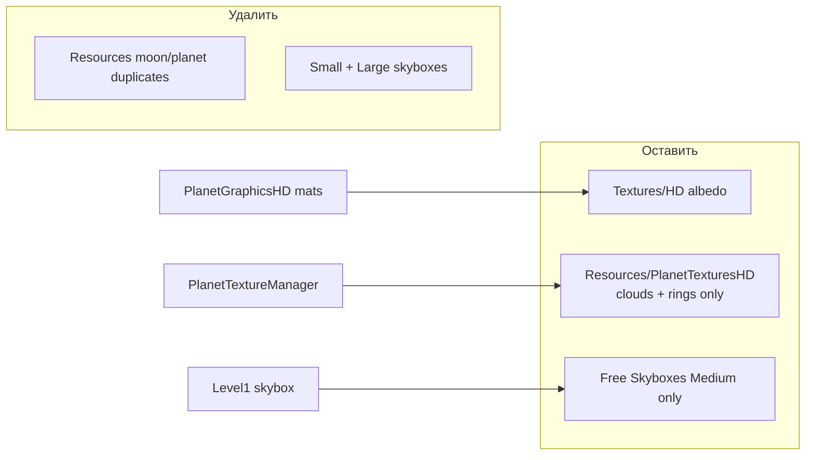

# Сокращение размера: HD-текстуры, дубликаты, isReadable, skyboxes Medium

## Контекст

- HD-материалы грузятся из [`PlanetTextureManager.cs`](Assets/Scripts/SolarSystemGraphics/PlanetTextureManager.cs) через `Resources/PlanetGraphicsHD/*`.
- Альбедо планет в основном в [`Assets/Textures/HD`](Assets/Textures/HD); облака/атмосфера/кольца — `Resources.Load("PlanetTexturesHD/...")`.
- Часть HD-материалов спутников ссылается на **копии** в Resources (другие GUID), а не на `Textures/HD`.
- [`Level1.unity`](Assets/_Scenes/Level1.unity) использует **Skybox_Space 5 Large** (`guid: 583f0d117f7056948943f87366c0f77b`).

**Решение по Max Size (по умолчанию):** Android `2048` для всех планетарных текстур; `4096` только для `Earth`, `Jupiter`, `Saturn`, `Sun`. Если нужен другой вариант — скажите до реализации.

---

## 1. HD-текстуры: Android Max Size

Правка `.meta` у всех карт в:
- [`Assets/Textures/HD/*.jpg|.png.meta`](Assets/Textures/HD)
- оставшихся [`Assets/Resources/PlanetTexturesHD/*.meta`](Assets/Resources/PlanetTexturesHD)

Для каждой:
- блок `buildTarget: Android`: `maxTextureSize` → **2048** (или **4096** для Earth/Jupiter/Saturn/Sun), `overridden: 1`
- `DefaultTexturePlatform` можно оставить 8192 для Editor (не влияет на APK)

Файлы на 4096: `EarthTexture_8k`, `JupiterTexture_8k`, `SaturnTexture_8k`, `SunTexture_8k`.

---

## 2. Дубликаты: один источник правды

**Канон альбедо:** `Assets/Textures/HD` (сохраняем существующие GUID).

**В Resources оставить только то, что реально грузит код:**
- `EarthClouds_8k`
- `VenusAtmosphere_8k`
- `SaturnRing_8k`, `JupiterRing_8k`, `UranusRing_8k`, `NeptuneRing_8k`

**Перепривязать материалы** с Resource-копий на `Textures/HD`:

В [`Assets/Resources/PlanetGraphicsHD`](Assets/Resources/PlanetGraphicsHD):

| Материал | Сейчас (Resources) | Цель (Textures/HD) |
|----------|--------------------|--------------------|
| IoTexture_HD | `8a6afcb8...` | `3cbda81c43d0440f8a2645ae6c544a44` |
| EuropaTexture_HD | `b4491e8c...` | `be9c50d74b36d674f981a0b512c87a4f` |
| GanymedeTexture_HD | `a1b2...6214a...` | `a1b2...6114a...` |
| CallistoTexture_HD | `c1a2...6214a...` | `c1a2...6114a...` |
| PhobosTexture_HD | `821f8d86...` | `f401385baf6ea7c469a2dc8a5cf6a09b` |
| DeimosTexture_HD | `c21f8d86...` | `c401385baf6ea7c469a2dc8a5cf6a10a` |
| TritonTexture_HD | `d1a2...7214a...` | `d1a2...7114a...` |
| TitanTexture_HD | `cacf...0011000f` | `bacf001100114a10b0cacafe0011000e` |

Также стандартный [`Assets/Materials/IoTexture.mat`](Assets/Materials/IoTexture.mat) ссылается на тот же Resource GUID `8a6afcb8...` — перепривязать на `Textures/HD/IoTexture_8k` (`3cbda81c...`) до удаления копии. Остальные standard moon mats уже на `Textures/HD`.

**Удалить из Resources/PlanetTexturesHD** (после ретаргета):
`Io`, `Europa`, `Ganymede`, `Callisto`, `Phobos`, `Deimos`, `Triton`, `Titan` (+ `.meta`).

**Удалить дубликаты из Textures/HD**, если на них нет ссылок материалов (проверка grep по GUID перед удалением):
- `EarthClouds_8k` (копия рядом с Resources)
- `VenusAtmosphere_8k`
- `SaturnRing_8k`
- плюс мусор `Textures/HD/_temp/` при отсутствии ссылок

Код `PlanetTextureManager` менять не нужно — пути Resources для колец/облаков сохраняются.

---

## 3. isReadable → 0

Во всех оставшихся [`Assets/Resources/PlanetTexturesHD/*.meta`](Assets/Resources/PlanetTexturesHD): `isReadable: 0`.

Код не использует `GetPixels` на этих текстурах (только `Resources.Load` + присвоение в материал).

---

## 4. Free Skyboxes: только Medium

1. В [`Assets/_Scenes/Level1.unity`](Assets/_Scenes/Level1.unity) заменить skybox GUID:
   - было: `583f0d117f7056948943f87366c0f77b` (Space 5 **Large**)
   - станет: `57a03e42a58e1e242b3b60b258a9229b` (Space 5 **Medium**)
2. Удалить папки `Small/` и `Large/` у `SBS Space 1`–`5` (текстуры + `.mat` + `.meta`).
3. Удалить [`Assets/Free Skyboxes - Space/Demo Scenes`](Assets/Free Skyboxes - Space/Demo Scenes) (ссылаются на Large/разные варианты, не в Build Settings).
4. Grep по проекту на `Skybox_Space .* Large|Small` / GUID Large — убедиться, что битых ссылок в игровых сценах нет. `MainMenu` использует дефолтный skybox — не трогаем.

---

## Проверка после правок

- Grep: нет ссылок на удалённые GUID.
- В Unity: открыть Level1, Extra Graphics on — планеты/кольца/облака без Missing; skybox Medium.
- Желательно Release Android build + Build Report (оценка: десятки–сотни MB за счёт 8k→2k/4k и удаления Large skyboxes + дублей).
