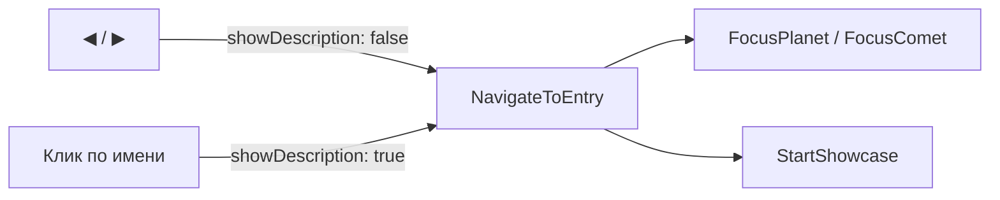

# Настройка камеры и панели описания

## 1. Камера: медленнее и больше оборотов

Файл: [`Assets/Scripts/BodyShowcaseCameraController.cs`](Assets/Scripts/BodyShowcaseCameraController.cs)

Текущие константы:

```csharp
const float OrbitDurationSec = 10f;   // длительность всей фазы облёта
const float OrbitRevolutions = 3f;    // число полных оборотов (yaw +1080°)
```

Изменить на:

| Параметр | Было | Станет |
|----------|------|--------|
| `OrbitDurationSec` | 10 с | **20 с** (в 2 раза медленнее) |
| `OrbitRevolutions` | 3 | **6** (в 2 раза больше оборотов) |

Обновить комментарий класса («three orbits» → «six orbits»).

В сцене [`Level1.unity`](Assets/_Scenes/Level1.unity) у `BodyShowcaseCameraController` на Main Camera сейчас сериализовано `orbitDurationSec: 10` — заменить на **20**, чтобы значение в Inspector совпадало с кодом (число оборотов задаётся только константой в коде).

Фаза follow после облёта не меняется.

---

## 2. Описание: только по клику на имя (или по телу в 3D)

Файл: [`Assets/Scripts/BodyNavigationController.cs`](Assets/Scripts/BodyNavigationController.cs)

Сейчас `NavigateRelative` (◀ / ▶) и `OnBodyNameClicked` оба вызывают `NavigateToEntry`, который всегда передаёт `showDescription: true`:

```csharp
_lookAtTarget.FocusPlanet(..., showDescription: true);
_lookAtTarget.FocusComet(..., showDescription: true);
```

### Изменение

Добавить параметр `bool showDescription` в `NavigateToEntry` и развести вызовы:



| Источник | Фокус | Showcase | Описание |
|----------|-------|----------|----------|
| ◀ / ▶ | да | да | **нет** |
| Клик по имени на панели | да | да | **да** |
| Тап/клик по телу в 3D | да | нет | **да** (без изменений в [`LookAtTarget.cs`](Assets/Scripts/LookAtTarget.cs)) |

При `showDescription: false` существующий механизм `FocusPlanet` / `FocusComet` уже вызывает `MakeAllDescriptionsInvisible()` и не открывает новую панель — открытое описание предыдущего тела закроется при перелистывании.

`NavigateRelative` → `NavigateToEntry(entry, showDescription: false)`  
`OnBodyNameClicked` → `NavigateToEntry(entry, showDescription: true)`

---

## 3. Проверка

1. ▶ от Земли к Луне — камера облетает 6 раз за ~20 с, панель описания **не** появляется
2. Клик по имени «Moon» — появляется описание Луны + showcase
3. Тап по планете в 3D — описание открывается, showcase **не** запускается (как сейчас)
4. После Neptune → комета через ▶ — фокус + медленный showcase, без описания; клик по имени кометы — с описанием
