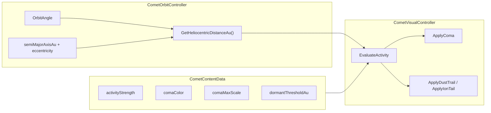

# Реалистичная кома комет с индивидуальностью

## Проблема

Сейчас в [`CometVisualController.cs`](Assets/Scripts/SolarSystemGraphics/CometVisualController.cs) визуальная активность почти не меняется:

- `minimumVisualActivity = 0.4` — пол кома всегда включена
- `EvaluateOrbitAngleActivity()` поднимает активность по углу орбиты, не по расстоянию
- `distanceAu = worldDistance / auToUnity` **некорректен в режиме симуляции** (орбита Encke = 115 unity → ~5.2 «а.е.» вместо реальных 2.21)
- Один цвет `(0.55, 0.92, 0.78)` и слабый масштаб (×1.0–1.8) для всех комет

## Архитектура решения



**Ключевое решение для «всех режимов»:** расстояние до Солнца в а.е. вычислять **только из орбитальных элементов каталога**, а не из world-позиции:

```csharp
// Kepler: r = a(1-e²) / (1 + e·cos(ν))
float r_au = a_au * (1f - e * e) / (1f + e * Mathf.Cos(angle));
```

Это даёт корректную смену перигелий/афелий при:
- реальных / симуляционных дистанциях (`ScaleSettings.UseRealDistances`)
- круговых / эллиптических орбитах (`OrbitSettings.UseRealOrbits`) — активность следует реальной эксцентрисности даже когда путь в сцене круговой
- переключении масштаба (уже вызывает `visual.Initialize(...)` из [`CometSystemController.RescaleCometOrbits`](Assets/Scripts/SolarSystemGraphics/CometSystemController.cs))

## 1. Профиль визуала для каждой кометы

Расширить [`CometContentData.ContentEntry`](Assets/Scripts/SolarSystemGraphics/CometContentData.cs) полями:

| Поле | Назначение |
|------|------------|
| `activityStrength` | Относительная активность (Encke 1.5, Grigg 0.55, Wild2 0.65…) |
| `comaColor` | Базовый оттенок комы (зелёный C₂/CN, беловатый для пылевых) |
| `comaMaxScale` | Максимальный множитель размера у перигелия (Wirtanen 2.2 — «гиперактивная») |
| `dormantThresholdAu` | Расстояние, за которым кома исчезает (обычно 3.5–5.0 а.е.) |

Значения подобрать по реальным перигелиям `q = a·(1−e)` и описаниям в том же файле:

- **Высокая активность:** Encke (1.5), Wirtanen (1.4), Honda (1.2)
- **Средняя:** TGK, Kopff, D'Arrest, Borrelly (~0.85–1.0)
- **Слабая:** Grigg-Skjellerup (0.55), Wild2 (0.65), Howell (0.6)
- **Цвет:** зеленоватый `(0.55, 0.92, 0.78)` для газовых; более серо-белый `(0.85, 0.88, 0.82)` для пылевых (Kopff, Borrelly, Grigg)
- **dormantThresholdAu:** ~4.0 для комет с `q < 1 AU`; ~3.2 для Wild2/Howell (перигелий > 1.5 а.е. — кома слабее и короче по дистанции)

Обновить хелпер `Entry(...)` с параметрами по умолчанию.

## 2. Гелиоцентрическое расстояние в а.е.

В [`CometOrbitController.cs`](Assets/Scripts/SolarSystemGraphics/CometOrbitController.cs) добавить:

```csharp
public float GetHeliocentricDistanceAu()
{
    float a = _definition.semiMajorAxisAu;
    float e = _definition.eccentricity;
    float nu = _angle;
    if (e < 0.001f) return a;
    return a * (1f - e * e) / (1f + e * Mathf.Cos(nu));
}

public float PerihelionAu => _definition.semiMajorAxisAu * (1f - _definition.eccentricity);
```

## 3. Переписать модель активности

В [`CometVisualController.cs`](Assets/Scripts/SolarSystemGraphics/CometVisualController.cs):

**Удалить / отключить:**
- `minimumVisualActivity` (или зафиксировать 0)
- `EvaluateOrbitAngleActivity()` и `Mathf.Max(distanceFactor, angleFactor)`

**Новая формула** (физически мотивированная, ~1/r²):

```csharp
float r = _orbit.GetHeliocentricDistanceAu();
float q = _orbit.PerihelionAu;
if (r >= _profile.dormantThresholdAu) return 0f;

// 1 на перигелии, падает с расстоянием
float flux = Mathf.Pow(q / Mathf.Max(r, q), 2f);
float activity = _profile.activityStrength * flux;

// Плавное затухание у порога спячки
float fade = 1f - Mathf.InverseLerp(_profile.dormantThresholdAu * 0.85f, _profile.dormantThresholdAu, r);
return Mathf.Clamp01(activity * fade);
```

**Стадии** (`Dormant` / `Developing` / `Active` / `Outburst`) привязать к `r` относительно `q` и `_profile.dormantThresholdAu`.

**ApplyComa** — заметный контраст:
- `visible` только при `activity > 0.03`
- масштаб: `Lerp(0.15, _baseComaScale * _profile.comaMaxScale * 2.5f, activity)`
- альфа: `Lerp(0, 0.7, activity)` с цветом из `_profile.comaColor`
- `_SunInfluence` пропорционален activity

**ApplyDustTrail / ApplyIonTail** — те же пороги; при `activity == 0` полностью выключать (`emitting = false`, `enabled = false`). Ion tail length уже зависит от `sunProximity` — перевести на `r_au` из орбиты.

**Initialize:** загружать профиль через `CometContentData.Get(definition.objectName)`, кэшировать `_perihelionAu`, создавать **инстанс** материала комы (уже есть через `.material`).

## 4. Префабы и editor

В 10 префабах [`Assets/Resources/Comets/`](Assets/Resources/Comets/) сбросить устаревшие сериализованные значения:
- `minimumVisualActivity: 0`
- убрать зависимость от prefab-defaults — всё задаётся в `Initialize`

Опционально: обновить [`CometPrefabBuilder.cs`](Assets/Editor/CometPrefabBuilder.cs) для согласованности при пересборке.

## 5. Проверка во всех режимах

Ручная проверка в Unity (Play Mode):

| Режим | Ожидание |
|-------|----------|
| Симуляция (без real distances) | У перигелия — яркая кома; у афелия — только ядро |
| Real distances | То же поведение, орбиты визуально больше |
| Real orbits ON/OFF | Активность меняется по фазе орбиты в обоих случаях |
| Comet movement OFF | CometsRoot скрыт (без изменений) |
| Clean view | Кометы видны, кома реагирует на фазу |

**Быстрый тест:** Encke у перигелия — крупная зелёная кома + хвосты; Wild2/Howell у афелия — только тёмное ядро; Wirtanen у перигелия — самая большая кома.

## Затрагиваемые файлы

- [`CometContentData.cs`](Assets/Scripts/SolarSystemGraphics/CometContentData.cs) — профили 10 комет
- [`CometOrbitController.cs`](Assets/Scripts/SolarSystemGraphics/CometOrbitController.cs) — `GetHeliocentricDistanceAu()`
- [`CometVisualController.cs`](Assets/Scripts/SolarSystemGraphics/CometVisualController.cs) — основная логика
- 10 × `Assets/Resources/Comets/Comet_*.prefab` — сброс `minimumVisualActivity`

Без изменений: `CometSystemController`, `SolarSystemScaleController`, шейдер `Custom/AtmosphereRim`.
