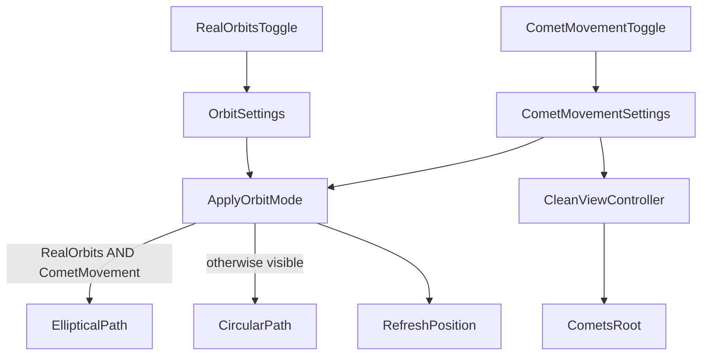

# Синхронизация реальных траекторий комет

## Текущее поведение

- [`CometMovementSettings`](Assets/Scripts/CometMovementSettings.cs) — только видимость (`CometsRoot.SetActive`) в [`CleanViewController`](Assets/Scripts/CleanViewController.cs).
- Форма траектории комет — только через [`OrbitSettings.UseRealOrbits`](Assets/Scripts/OrbitSettings.cs) в [`CometSystemController.ApplyOrbitMode()`](Assets/Scripts/SolarSystemGraphics/CometSystemController.cs).
- [`CometOrbitController.SetUseRealOrbits()`](Assets/Scripts/SolarSystemGraphics/CometOrbitController.cs) при совпадении значения **не вызывает** `UpdatePosition()` (early return на строке 30–31).

## Проблема

При сценарии «**Реальные орбиты** уже включены → включается **Движение комет**»:
- `CometsRoot` становится активным, но `CometSystemController` **не получает события** о включении движения комет.
- `SetUseRealOrbits(true)` не пересчитывает позиции, если флаг уже `true`.
- В результате кометы могут появиться на устаревших/упрощённых позициях, хотя «Реальные орбиты» активны.

## Решение

Явная матрица траекторий при **видимых** кометах:

| Реальные орбиты | Движение комет | Траектория комет |
|-----------------|----------------|------------------|
| OFF | ON | Круговая (упрощённая) |
| ON | ON | Эллиптическая (реальная) |
| * | OFF | Скрыты |

### 1. Вычисление режима в `CometSystemController`

В `ApplyOrbitMode()` заменить:

```csharp
bool useRealOrbits = OrbitSettings.UseRealOrbits;
```

на:

```csharp
bool useRealOrbits = OrbitSettings.UseRealOrbits && CometMovementSettings.UseCometMovement;
```

Логика: реальная траектория применяется только когда кометы **и видимы, и** включены реальные орбиты. При выключении «Движение комет» внутренний флаг сбрасывается в `false`; при повторном включении при активных «Реальных орбитах» `SetUseRealOrbits(true)` снова сработает и применит эллипсы.

### 2. Подписка на `CometMovementSettings`

В [`CometSystemController`](Assets/Scripts/SolarSystemGraphics/CometSystemController.cs):

- Подписаться на `CometMovementSettings.UseCometMovementChanged` в `Initialize()` / отписаться в `OnDestroy()`.
- Обработчик вызывает `ApplyOrbitMode()`.

### 3. Принудительное обновление позиций

В [`CometOrbitController`](Assets/Scripts/SolarSystemGraphics/CometOrbitController.cs) добавить:

```csharp
public void RefreshPosition() => UpdatePosition();
```

В `CometSystemController.ApplyOrbitMode()` после цикла `SetUseRealOrbits` вызывать `RefreshPosition()` на каждом контроллере — гарантирует корректные координаты при включении «Движение комет», даже если флаг не изменился.

### 4. Без изменений в UI

Toggle-ы и локализация уже реализованы. Меняется только логика траекторий.



## Файлы

| Файл | Изменение |
|------|-----------|
| [`CometSystemController.cs`](Assets/Scripts/SolarSystemGraphics/CometSystemController.cs) | AND-логика, подписка на `UseCometMovementChanged`, `RefreshPosition` |
| [`CometOrbitController.cs`](Assets/Scripts/SolarSystemGraphics/CometOrbitController.cs) | Метод `RefreshPosition()` |

## Проверка

1. **Реальные орбиты ON → Движение комет ON** — кометы на наклонных эллипсах, линии орбит — эллипсы.
2. **Движение комет ON → Реальные орбиты ON** — переход с кругов на эллипсы.
3. **Реальные орбиты ON → Движение комет OFF → ON** — после повторного включения снова эллипсы (не «застрявшие» круги).
4. **Движение комет ON, Реальные орбиты OFF** — круговые орбиты.
5. Комбинации с **Реальные расстояния** / **Орбиты (линии)** — без регрессий.
