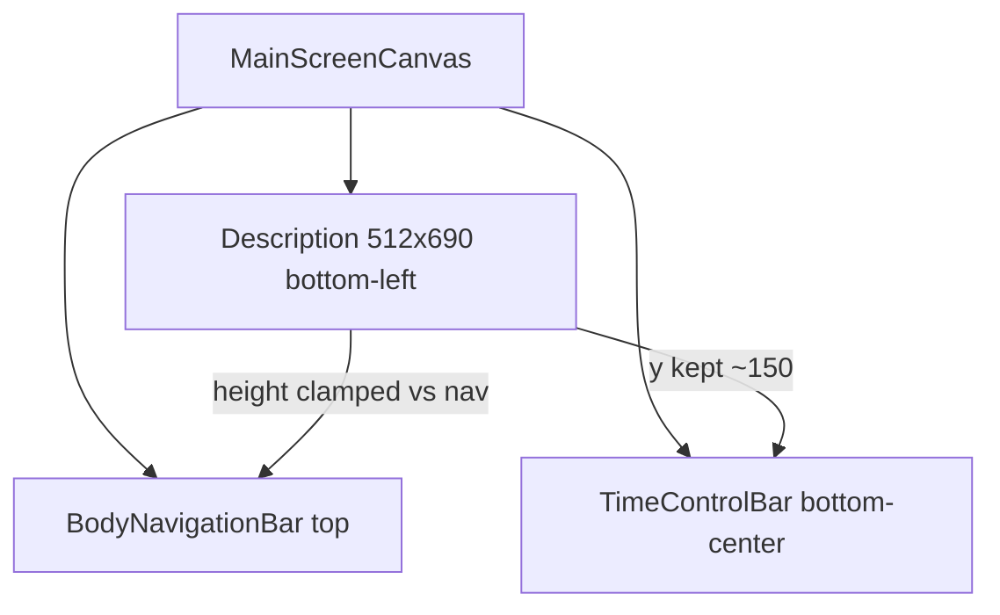

# Увеличение окна описания ×2 (portrait / landscape)

## Контекст

Окно — не C#-layout, а 18 одинаковых UI-prefab в [`Assets/Prefabs/Descriptions/`](Assets/Prefabs/Descriptions/) (Sun + планеты + спутники). Показ/скрытие — [`LookAtTarget.cs`](Assets/Scripts/LookAtTarget.cs). Отдельной ветки portrait/landscape **нет**: одни и те же значения работают в обоих режимах через `MainScreenCanvas` (`CanvasScaler` 1080×1920, match 0.5).

Текущие значения (пример [`The Earth.prefab`](Assets/Prefabs/Descriptions/The Earth.prefab)):

| Элемент | Сейчас | Цель ×2 |
|--------|--------|---------|
| Корень `sizeDelta` | 256×345 | **512×690** |
| Позиция | `(7, 150.24)`, anchor bottom-left | **оставить** (зазор над time bar) |
| Текст тела (TMP `*Content`) | 14 | **28** |
| Заголовок (UI `Text` `*Header`) | 20 | **40** |
| Scrollbar Vertical width | 20 | **40** |

Нижняя панель: `SimulationTimeControlBar` — 220×40, y=8 ([`TimeControlUiBootstrap`](Assets/Scripts/TimeControlUiBootstrap.cs)). Верхняя: `BodyNavigationBar` — h=56, margin 8 ([`SidePanelUiBootstrap`](Assets/Scripts/SidePanelUiBootstrap.cs)). Их **не трогаем**.

**Риск:** в landscape эффективная высота canvas ~900–1000 units; панель `150+690=840` почти упирается в навбар. Поэтому кроме prefab ×2 нужен **runtime clamp высоты**.

**Не в scope:** `CometDescriptionPanel`, `CanvasScaler`, ScaleBar, time/nav bootstrap.

## Подход

1. **Prefab ×2** — базовые размеры/шрифты/scrollbar во всех 18 файлах.
2. **Сопутствующий UI ×2** (чтобы выглядело цельно, не ломая ScrollRect):
   - Viewport `sizeDelta.x`: `-17` → **`-37`** (под scrollbar 40 и spacing −3)
   - Sliding Area: `-20,-20` → **`-40,-40`**
   - Handle: `20×20` → **`40×40`**
   - Close Button: `32×32` → **`64×64`**; текст «X» font **40**, `m_MaxSize` **80**
   - Header: font **40**, `m_MaxSize` **80**; высоту rect ~×2 (`22.25` → `~44.5`)
   - `VerticalLayoutGroup` padding/spacing: 20/10 → **40/20**
3. **Новый скрипт** [`Assets/Scripts/BodyDescriptionPanelLayout.cs`](Assets/Scripts/BodyDescriptionPanelLayout.cs) на корне каждого description-prefab:
   - Константы целевого размера 512×690, bottom offset ~150
   - При `OnEnable` / смене `Screen` / safe area:  
     `height = min(690, canvasHeight - bottomY - topReserve)`  
     где `topReserve ≈ SidePanelUiBootstrap.BarHeight + BarTopMargin + небольшой gap (~16)`
   - Ширину держать 512; позицию X/Y не смещать вниз (не залезать на time bar)
   - Не менять логику `LookAtTarget` / навигации / clean view

Глобальный `CanvasScaler` **не меняем** — иначе поедет весь HUD. «Показатели скейлинга» здесь = локальные inset/padding/scrollbar companion sizes панели.

## Файлы

- Правка YAML: все 18 prefab в `Assets/Prefabs/Descriptions/*.prefab`
- Новый: `Assets/Scripts/BodyDescriptionPanelLayout.cs` (+ `.meta` от Unity)
- Компонент добавить на root каждого description-prefab (рядом со ScrollRect)
- Сцена [`Level1.unity`](Assets/_Scenes/Level1.unity): экземпляры без override size — подтянутся с prefab; при необходимости только убедиться, что нет старых override `sizeDelta`

## Проверка

- Portrait: описание ~2× по площади, шрифты читаемее, scrollbar шире; time bar снизу и навбар сверху без наложений.
- Landscape: ширина/шрифты/scrollbar ×2; высота ×2 если места хватает, иначе урезана clamp’ом, без пересечения с навбаром.
- Открытие/закрытие описаний, ◀/▶ навигация, clean view, кометы — без регрессий.
- ScaleBar справа / minimap — без новых наложений слева снизу (ширина 512 при x=7 всё ещё слева от центрального time bar 220).
