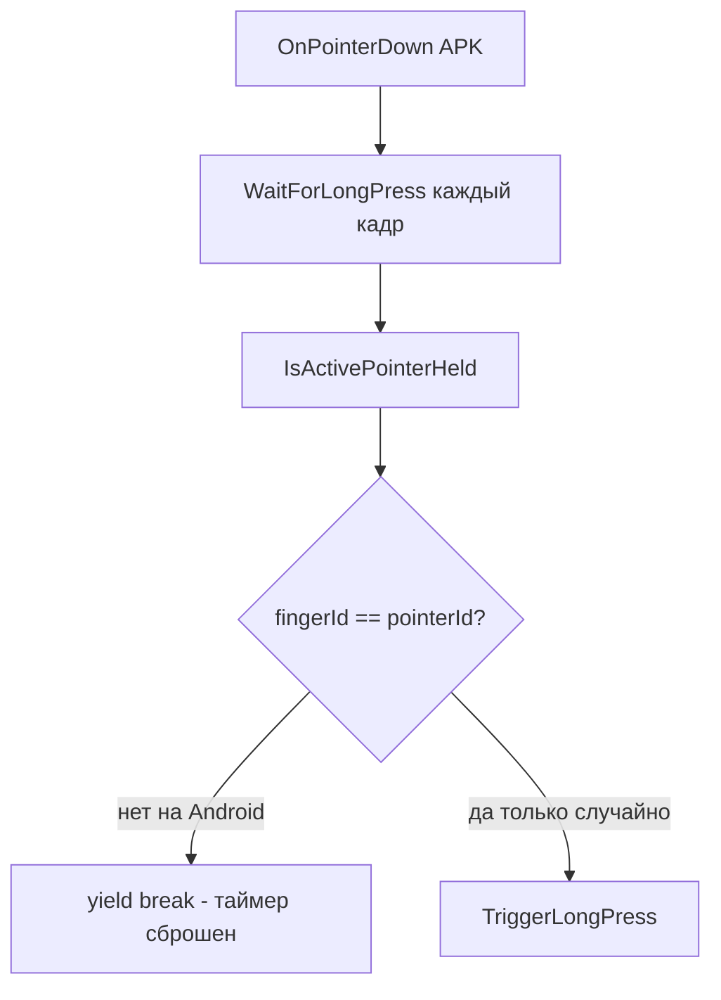

# Исправление long-press на Android APK

## Причина регрессии

После правки для Editor Windows в [`BodyNameLongPressHandler.cs`](Assets/Scripts/BodyNameLongPressHandler.cs) добавлен метод `IsActivePointerHeld()`, который вызывается **каждый кадр** внутри `WaitForLongPress()`:

```88:107:Assets/Scripts/BodyNameLongPressHandler.cs
bool IsActivePointerHeld()
{
    for (int i = 0; i < TouchInputBridge.touchCount; i++)
    {
        TouchInputBridge.TouchSample touch = TouchInputBridge.GetTouch(i);
        if (touch.fingerId != _activePointerId)  // <-- проблема
            continue;
        return touch.phase == TouchPhase.Began || ...
    }
    if (TouchInputBridge.touchCount == 0)
        return Input.GetMouseButton(0);
    return false;  // <-- Android всегда попадает сюда
}
```

На Android при удержании пальца:
- `eventData.pointerId` из UI EventSystem (Input System UI Module)
- `touch.fingerId` из [`TouchInputBridge`](Assets/Scripts/TouchInputBridge.cs) (`EnhancedTouch.touchId`)

**эти ID не совпадают**. Цикл не находит touch → `touchCount > 0` → возвращает `false` → корутина прерывается на **первом же кадре** → long-press никогда не срабатывает.

На Editor Windows всё работает, потому что `touchCount == 0` и срабатывает fallback `Input.GetMouseButton(0)`.

До правки Editor использовался `WaitForSecondsRealtime(0.45f)` без polling — на APK long-press работал.



## Решение

Изменить только [`BodyNameLongPressHandler.cs`](Assets/Scripts/BodyNameLongPressHandler.cs). Сцена и остальные файлы не трогать.

### 1. Упростить `WaitForLongPress()`

Полагаться на флаг `_pointerDown`, который сбрасывается **только** в `OnPointerUp` (как на Android, так и в Editor):

```csharp
IEnumerator WaitForLongPress()
{
    float elapsed = 0f;
    while (elapsed < LongPressThreshold)
    {
        if (!_pointerDown)
        {
            _holdRoutine = null;
            yield break;
        }
        elapsed += Time.unscaledDeltaTime;
        yield return null;
    }

    if (_pointerDown)
    {
        _longPressTriggered = true;
        TriggerLongPress();
    }
    _holdRoutine = null;
}
```

### 2. Удалить `IsActivePointerHeld()` и `_activePointerId`

Они больше не нужны. Editor по-прежнему не использует `OnPointerExit` (главная причина сбоя мыши), поэтому небольшой дрейф курсора не отменит удержание.

### 3. Опционально (не обязательно в первом фиксе)

Если после теста на Editor снова проявится редкий сбой при уходе курсора с кнопки **до** отпускания ЛКМ — добавить platform-safe polling **без** сопоставления ID:

```csharp
// touchCount > 0 и любой touch не Ended/Canceled, либо mouse held
```

Но для APK достаточно шага 1–2.

## Проверка

1. **Android APK** — long press на `BodyNameButton` ~0.5 с → список открывается
2. **Android APK** — short tap → описание тела (без списка)
3. **Android APK** — tap по строке списка → переход к телу
4. **Editor Windows** — long press ЛКМ → список открывается (регрессия Editor не допускается)
5. **Editor Windows** — short click → описание

## Затрагиваемые файлы

| Файл | Изменение |
|------|-----------|
| [`Assets/Scripts/BodyNameLongPressHandler.cs`](Assets/Scripts/BodyNameLongPressHandler.cs) | убрать ID-matching polling, вернуть таймер по `_pointerDown` |
