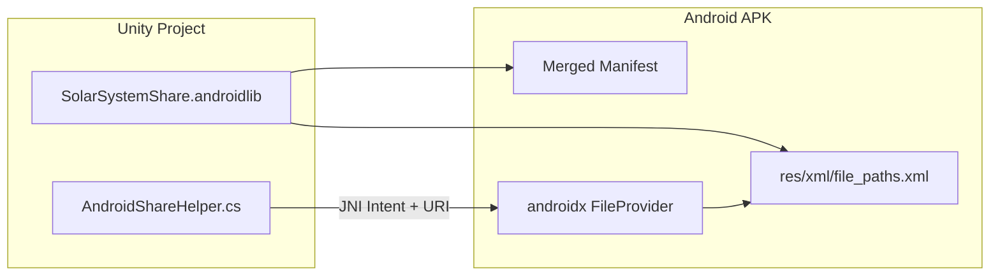

# Исправление Android Share и сборки

## Причина ошибки сборки

Unity 6 **запрещает** ресурсы в [`Assets/Plugins/Android/res/`](Assets/Plugins/Android/res/xml/file_paths.xml). Текущая структура:

```
Assets/Plugins/Android/
  AndroidManifest.xml          ← merge OK
  res/xml/file_paths.xml       ← OBSOLETE, ломает build
```

Нужно удалить `res/` и перенести manifest + resources в **Android Library** (`.androidlib`).

## Решение: миграция в `.androidlib`

### 1. Удалить устаревшие файлы

Удалить полностью:
- [`Assets/Plugins/Android/res/`](Assets/Plugins/Android/res/) (и все `.meta`)
- [`Assets/Plugins/Android/AndroidManifest.xml`](Assets/Plugins/Android/AndroidManifest.xml) (переносим в androidlib)

### 2. Создать Android Library

Новая папка: **`Assets/Plugins/Android/SolarSystemShare.androidlib/`**

Структура (Unity 6 совместимая):

```
SolarSystemShare.androidlib/
  AndroidManifest.xml
  res/
    xml/
      file_paths.xml
```

**AndroidManifest.xml** — тот же FileProvider, authority `${applicationId}.fileprovider`:

```xml
<provider
    android:name="androidx.core.content.FileProvider"
    android:authorities="${applicationId}.fileprovider"
    android:exported="false"
    android:grantUriPermissions="true">
    <meta-data
        android:name="android.support.FILE_PROVIDER_PATHS"
        android:resource="@xml/file_paths" />
</provider>
```

**file_paths.xml** — без изменений по смыслу (cache + external-cache для `Application.temporaryCachePath`):

```xml
<cache-path name="share_cache" path="." />
<external-cache-path name="external_share_cache" path="." />
```

Unity автоматически подхватит `.androidlib` и смержит manifest при сборке ([Unity Manual: Android Library plug-ins](https://docs.unity3d.com/6000.4/Documentation/Manual/android-library-project-and-aar-plugins-introducing.html)).

---

## Совместимость Android 7–15

### Текущий minSdk

В [`ProjectSettings/ProjectSettings.asset`](ProjectSettings/ProjectSettings.asset): **`AndroidMinSdkVersion: 25`** = Android **7.1+**.

Это покрывает требование «начиная с 7 версии (желательно)» — фактически 7.1+, не 7.0 (API 24). Понижение до API 24 возможно отдельно, но не обязательно для share.

### Что уже работает на API 25–35

- `Intent.ACTION_SEND` + `FileProvider` content:// URI — стандарт с Android 7 (API 24+)
- `androidx.core.content.FileProvider` — входит в Gradle-зависимости Unity 6
- PNG в `Application.temporaryCachePath` + `<cache-path>` — корректно для scoped storage (Android 10+)

### Усиление для Android 13–15

В [`AndroidShareHelper.cs`](Assets/Scripts/AndroidShareHelper.cs) добавить **`ClipData.newRawUri`** + `intent.setClipData(clip)` после `putExtra(EXTRA_STREAM, uri)`.

На Android 13+ это надёжнее передаёт read-permission получателям chooser, чем только `FLAG_GRANT_READ_URI_PERMISSION`.

```csharp
using (AndroidJavaClass clipData = new AndroidJavaClass("android.content.ClipData"))
using (AndroidJavaObject clip = clipData.CallStatic<AndroidJavaObject>("newRawUri", "", uri))
{
    intent.Call("setClipData", clip);
}
intent.Call<AndroidJavaObject>("addFlags", flagGrantRead);
```

Authority остаётся: `Application.identifier + ".fileprovider"` → `com.densappstudio.solar.system.v8.fileprovider`.

---

## Схема после миграции



---

## Файлы для изменения

| Действие | Файл |
|----------|------|
| Удалить | `Assets/Plugins/Android/res/**` |
| Удалить | `Assets/Plugins/Android/AndroidManifest.xml` |
| Создать | `Assets/Plugins/Android/SolarSystemShare.androidlib/AndroidManifest.xml` |
| Создать | `Assets/Plugins/Android/SolarSystemShare.androidlib/res/xml/file_paths.xml` |
| Обновить | [`Assets/Scripts/AndroidShareHelper.cs`](Assets/Scripts/AndroidShareHelper.cs) — ClipData для API 13+ |

Toast/share-flow из предыдущей реализации ([`SimulationShareController.cs`](Assets/Scripts/SimulationShareController.cs), [`TransientMessageController.cs`](Assets/Scripts/TransientMessageController.cs)) **не меняем**.

---

## Проверка после fix

1. **Unity Build Android** — ошибка `OBSOLETE - Providing Android resources...` исчезает
2. **Android 13/14/15 device/emulator:** Share → chooser открывается, PNG + текст `SolarSystem3D_...` передаются
3. **Android 7.1–12 (если доступен эмулятор):** share работает через FileProvider
4. **Без интернета:** toast `ShareNoInternetMessage`, chooser не открывается (существующее поведение)
5. **Logcat:** нет `FileUriExposedException`, `IllegalArgumentException` от FileProvider

## Риски

- Если `androidx.core.content.FileProvider` не резолвится на конкретном Gradle-шаблоне — добавить в Custom Main Gradle Template dependency `androidx.core:core:1.x` (маловероятно в Unity 6)
- Если понадобится именно Android 7.0 (API 24): снизить `AndroidMinSdkVersion` с 25 до 24 в Player Settings — share-код совместим
