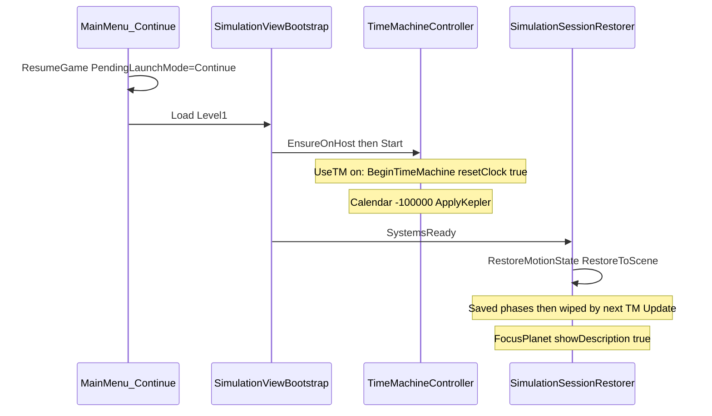

# Исправление «Продолжить» после описания и Машины времени

## Симптом

Main Menu → **Продолжить** ([`PauseAndResume.ResumeGame`](Assets/Scripts/PauseAndResume.cs) + `PlaySoundAndTransition("Level1")`) не возвращает ожидаемую симуляцию. Два независимых предшественника:

| Предшественник | Что ломается |
|---|---|
| Листание описания планеты | Continue всегда делает `FocusPlanet(..., showDescription: true)` — энциклопедия снова поверх симуляции; Close в префабах не возвращает main-камеру (`fileID: 0`) |
| Включение Машины времени | Календарь/фаза TM **не сохраняются**; при загрузке `BeginTimeMachine(resetClock: true)` сбрасывает год на −100000 и Kepler перезаписывает восстановленные орбиты |



## Выбранный подход

1. **TM Continuity** — персистить состояние `SimulationClock` в сессии; на Continue **не** ресетить календарь до restore; после restore возобновлять TM с сохранённым годом.
2. **Description on Continue** — не открывать описание при Continue (`showDescription: false`); закрытие описания в сессии починить через API `LookAtTarget`, без битых `fileID: 0` на Close.
3. **Паузу** оставить как в доке (восстанавливать `IsSimulationPaused`); если после Continue всё заморожено при `>` на time bar — это ожидаемо, Play снимает паузу.

## Изменения по файлам

### 1. Сохранение/восстановление календаря TM

[`Assets/Scripts/SimulationClock.cs`](Assets/Scripts/SimulationClock.cs)

- Добавить `CaptureState` / `RestoreState` для: `YearContinuous`, `ClockPhase`, `_crossedYearZero`, `_crossedCurrentDate`, `_useSlowSweepRate` (и порог current-date при необходимости).

[`Assets/Scripts/SimulationSessionState.cs`](Assets/Scripts/SimulationSessionState.cs)

- PlayerPrefs-ключи для clock state.
- В `CaptureFromScene` / `Save` / `Load` / `Clear` — писать/читать clock.
- В `RestoreMotionState` или отдельном шаге — `SimulationClock.RestoreState` **до** Kepler apply.

[`Assets/Scripts/TimeMachineController.cs`](Assets/Scripts/TimeMachineController.cs)

- В `Start`: если `PendingLaunchMode == Continue` и TM включена — **не** вызывать `BeginTimeMachine(resetClock: true)`; только подготовить ссылки / отложить старт.
- Публичный метод вроде `ResumeAfterSessionRestore()`: `BeginTimeMachine(resetClock: false)` + уже восстановленный clock + `ApplyMotionAndActivity()`.

[`Assets/Scripts/SimulationSessionRestorer.cs`](Assets/Scripts/SimulationSessionRestorer.cs)

- После `RestoreMotionState` + `RestoreToScene`: если `TimeMachineSettings.UseTimeMachine` — вызвать `ResumeAfterSessionRestore()` на хосте, затем сбросить `PendingLaunchMode`.

### 2. Описание планеты при Continue

[`Assets/Scripts/SimulationSessionState.cs`](Assets/Scripts/SimulationSessionState.cs) — `RestoreToScene`:

```csharp
// было
lookAt.FocusPlanet(SelectedPlanetName, useDetailCamera, showDescription: true);
// станет
lookAt.FocusPlanet(SelectedPlanetName, useDetailCamera, showDescription: false);
```

Continue = продолжить **симуляцию** (камера/фокус/орбиты), без принудительного оверлея энциклопедии. Описание снова открывается тапом по телу.

[`Assets/Scripts/LookAtTarget.cs`](Assets/Scripts/LookAtTarget.cs)

- Добавить `CloseActiveDescription()`: скрыть панели + при detail-камере вернуть main (или оставить detail, если фокус detail был частью сессии — камера уже восстанавливается через `FocusPlanet`/`ApplyOrbitState`).
- `MakeAllDescriptionsInvisible`: null-safe для всех GO, чтобы NRE не обрывал `RestoreToScene` до `RestoreState`.

Префабы [`Assets/Prefabs/Descriptions/*.prefab`](Assets/Prefabs/Descriptions): Close → вызов `LookAtTarget.CloseActiveDescription` (editor setup или один общий runtime bind), убрать мёртвые `TurnOff*Camera` с `fileID: 0`.

### 3. Защита перехода меню (низкий приоритет, тот же баг-класс)

[`Assets/Scripts/AudioManager.cs`](Assets/Scripts/AudioManager.cs): не блокировать загрузку сцены на `audioSource.isPlaying` без таймаута; грузить через realtime/`LoadScene` сразу после короткого SFX или с fallback, если клип не стартовал — чтобы «Продолжить» никогда не залипал на MainMenu.

## Проверка

1. Level1 → открыть описание, пролистать вниз → меню → **Продолжить**: фокус/камера на теле, **без** панели описания, орбиты с сохранённых фаз, симуляция идёт (или на паузе только если уходили на паузе).
2. Level1 → включить Машину времени, дать дате уйти с −100000 → меню → **Продолжить**: дата HUD ≈ сохранённая, планеты на соответствующих Kepler-позициях, не прыжок в −100000.
3. New Simulation по-прежнему принудительно выключает TM и стартует с дефолтов.
4. Continue при сохранённой паузе: time bar показывает `>`, Play снимает паузу.
