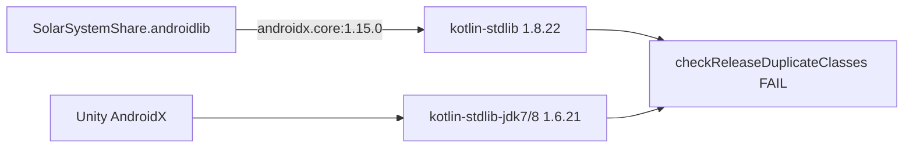

# Исправление Gradle: duplicate Kotlin classes

## Вердикт: Java обновлять не нужно

Unity уже использует свой OpenJDK (`JAVA_HOME` указывает на Unity OpenJDK). Ошибка не связана с версией Java.

Сообщения `Probably the SDK is read-only` — шум, не причина падения.

## Реальная причина

Задача `:launcher:checkReleaseDuplicateClasses` падает из‑за конфликта:

| Модуль | Версия | Откуда |
|--------|--------|--------|
| `kotlin-stdlib` | **1.8.22** | транзитивно от `androidx.core:core:1.15.0` (добавлено в share-fix) |
| `kotlin-stdlib-jdk7` / `jdk8` | **1.6.21** | зависимости Unity / других AndroidX |

С Kotlin 1.8+ классы из `jdk7`/`jdk8` уже внутри `kotlin-stdlib`, поэтому оба JAR дают **Duplicate class**.

Источник в проекте:

```3:6:Assets/Plugins/Android/SolarSystemShare.androidlib/build.gradle
dependencies {
    implementation 'androidx.core:core:1.15.0'
    implementation fileTree(dir: 'libs', include: ['*.jar'])
}
```



## Исправление (без обновления Java)

### 1. Убрать явную зависимость `androidx.core` из androidlib

В [`Assets/Plugins/Android/SolarSystemShare.androidlib/build.gradle`](Assets/Plugins/Android/SolarSystemShare.androidlib/build.gradle) вернуть dependencies к:

```gradle
dependencies {
    implementation fileTree(dir: 'libs', include: ['*.jar'])
}
```

**Почему этого достаточно:** `.androidlib` только объявляет `FileProvider` в manifest + `file_paths.xml`. Собственного Java-кода нет. Unity 6 уже подтягивает AndroidX (включая `androidx.core.content.FileProvider`) в `unityLibrary`. Явный `core:1.15.0` был страховкой и именно он ломает classpath.

### 2. Оставить ProGuard keep-rules

[`Assets/Plugins/Android/proguard-user.txt`](Assets/Plugins/Android/proguard-user.txt) и `useCustomProguardFile: 1` **не трогать** — они нужны для release minify, чтобы R8 не вырезал `FileProvider`.

### 3. Пересобрать Release APK

В Unity: Build Android Release. Ожидание: Gradle проходит `checkReleaseDuplicateClasses` без ошибки.

### 4. Fallback только если FileProvider исчезнет в runtime

Если после удаления зависимости в logcat появится `ClassNotFoundException: FileProvider` (маловероятно в Unity 6), тогда не ставить `core:1.15.0`, а выровнять Kotlin через Custom Main Gradle Template:

```gradle
constraints {
    implementation("org.jetbrains.kotlin:kotlin-stdlib-jdk7:1.8.22")
    implementation("org.jetbrains.kotlin:kotlin-stdlib-jdk8:1.8.22")
}
```

В рамках текущего fix fallback не внедряем — сначала простое удаление зависимости.

## Что делать программисту

| Действие | Нужно? |
|----------|--------|
| Обновить Java / JDK | **Нет** |
| Обновить Unity | Нет |
| Убрать `androidx.core:core:1.15.0` из androidlib `build.gradle` | **Да** |
| Оставить proguard-user.txt | Да |
| Пересобрать Release APK | Да |
| Проверить Share на Tecno | Да (после успешной сборки) |

## Файлы

- Изменить: [`Assets/Plugins/Android/SolarSystemShare.androidlib/build.gradle`](Assets/Plugins/Android/SolarSystemShare.androidlib/build.gradle)
- Не трогать: OpenJDK, Unity SDK, proguard, C# share-код
