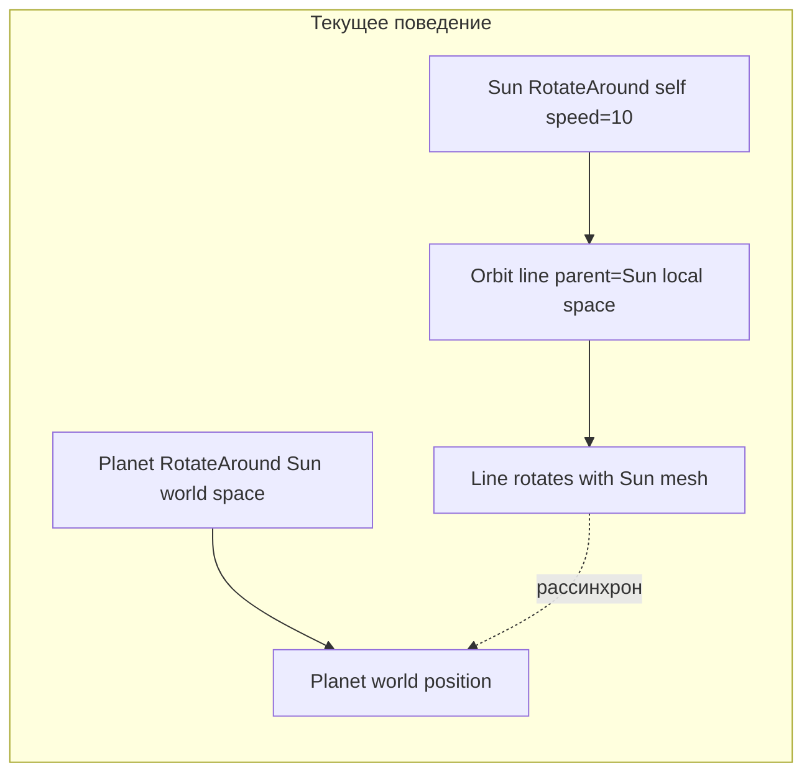
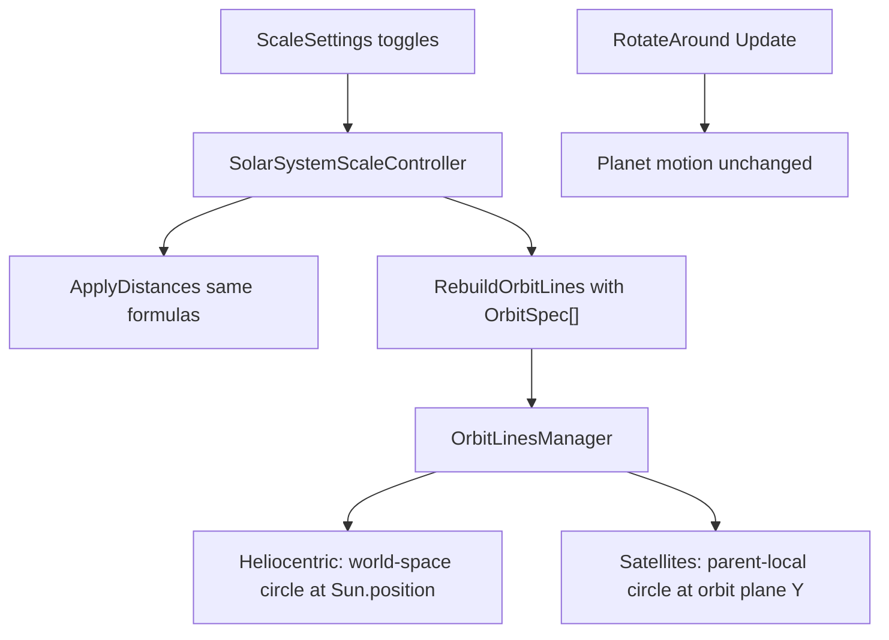

# Исправление орбит планет

## Диагностика: почему планеты «не на орбитах»



### Причина 1 (критическая): орбиты вращаются вместе с Солнцем

В [`OrbitLinesManager.cs`](Assets/Scripts/SolarSystemGraphics/OrbitLinesManager.cs) гелиоцентрические линии создаются как дочерние объекты **Sun** с `useWorldSpace = false`:

```129:135:Assets/Scripts/SolarSystemGraphics/OrbitLinesManager.cs
            var lineGo = new GameObject(bodyName + "_OrbitLine");
            lineGo.transform.SetParent(center, false);
            // ...
            line.useWorldSpace = false;
            line.SetPositions(OrbitLineUtility.BuildCircle(circleSegments, radius, Vector3.zero, Vector3.up));
```

Солнце в сцене имеет `RotateAround` вокруг самого себя (`speed: 10`). Планеты же вращаются через `RotateAround` в **мировом** пространстве вокруг `Sun.position`. Линия орбиты крутится вместе с mesh Солнца, а планета — нет. Это видно сразу после старта и усиливается со временем.

### Причина 2: радиус берётся из позиции тела, а не из формулы масштаба

Сейчас радиус = `|ProjectOnPlane(body - center)|` — снимок позиции в момент rebuild. Позиции задаёт [`SolarSystemScaleController`](Assets/Scripts/SolarSystemGraphics/SolarSystemScaleController.cs) по каталогу:

- Real distances ON: `orbitalRadiusAu × _auToUnity` / `satelliteOrbitKm × _auToUnity / AuKm`
- Real distances OFF: `baseline.OrbitDistance` / `baseline.LocalPosition.magnitude`

Кометы уже синхронизированы явно (`CometSystemController.RescaleCometOrbits`), планеты — нет. Это хрупко и даёт расхождения при несогласованных метриках.

### Причина 3: порог `radius < 0.5f` скрывает орбиты спутников в Real distances

При включённых реальных расстояниях:
- Луна ≈ **0.057** ед.
- Титан ≈ **0.18** ед.

Обе орбиты **не рисуются**, хотя тела продолжают двигаться.

### Причина 4: орбита в плоскости Y=0, планета — выше/ниже

`ApplyHeliocentricDistance` сохраняет `baseline.LocalPosition.y` (например, Earth y≈0.06), а круг рисуется в локальной плоскости центра на **y=0**. Горизонтальный радиус совпадает, но при виде сбоку планета «парит» над линией.

### Причина 5 (минор): спутники — 3D vs горизонтальное расстояние

`ApplySatelliteDistance` в sim-режиме восстанавливает `LocalPosition.magnitude` (3D), а `RotateAround` и линия орбиты используют **горизонтальный** радиус. Расхождение небольшое, но его стоит устранить для единообразия.

**Режим «Реальные размеры»** сам по себе расстояния не меняет — орбиты должны пересчитываться только при смене «Реальных расстояний» (можно оставить текущий `RebuildOrbits` в `ApplyAll`, это безвредно).

---

## Целевая архитектура



Единый источник радиуса для позиций и линий — общий расчёт в `SolarSystemScaleController`.

---

## План изменений

### 1. Добавить структуру `OrbitSpec` и общий расчёт радиуса

В [`SolarSystemScaleController.cs`](Assets/Scripts/SolarSystemGraphics/SolarSystemScaleController.cs):

- Новая структура (или nested struct):

```csharp
public struct OrbitSpec
{
    public string BodyName;
    public Transform Center;
    public float Radius;          // горизонтальный радиус орбиты
    public float PlaneHeight;     // смещение Y в локальном пространстве центра
    public bool UseWorldSpace;    // true для гелиоцентрических, false для спутников
}
```

- Метод `GetOrbitRadius(BodyBaseline, BodyDefinition, useRealDistances)`:
  - гелиоцентрические Real ON: `definition.orbitalRadiusAu * _auToUnity`
  - гелиоцентрические Real OFF: `baseline.OrbitDistance`
  - спутники Real ON: `definition.satelliteOrbitKm * _auToUnity / AuKm`
  - спутники Real OFF: `baseline.OrbitDistance` (горизонтальное, уже захваченное в `CaptureBaselines`)

- Метод `BuildOrbitSpecs()` — собирает список для всех тел из `BodyNames` / `_baselines`.

- `PlaneHeight`:
  - гелиоцентрические: `baseline.LocalPosition.y` (как в `ApplyHeliocentricDistance`)
  - спутники: `baseline.LocalPosition.y`

### 2. Выровнять `ApplySatelliteDistance` с горизонтальным радиусом

В [`SolarSystemScaleController.cs`](Assets/Scripts/SolarSystemGraphics/SolarSystemScaleController.cs) заменить sim-восстановление:

```csharp
// было: targetDistance = baseline.LocalPosition.magnitude;
// станет: targetDistance = baseline.OrbitDistance;
Vector3 flatDir = Vector3.ProjectOnPlane(baseline.LocalPosition, Vector3.up);
if (flatDir.sqrMagnitude < 0.0001f) flatDir = Vector3.forward;
baseline.Transform.localPosition = flatDir.normalized * targetDistance
    + Vector3.up * baseline.LocalPosition.y;
```

Тогда `RotateAround`, позиция и линия орбиты используют один и тот же горизонтальный радиус.

### 3. Переписать `OrbitLinesManager`

В [`OrbitLinesManager.cs`](Assets/Scripts/SolarSystemGraphics/OrbitLinesManager.cs):

- Убрать `BuildBodyOrbits()` из `Awake()` — первичная сборка только через `RebuildOrbits(specs)` из `SolarSystemScaleController.Start()`.
- Новая сигнатура: `public void RebuildOrbits(IReadOnlyList<SolarSystemScaleController.OrbitSpec> specs)`.
- **Удалить** фильтр `if (radius < 0.5f) continue` (оставить только защиту от `radius <= 0`).
- Для каждого `OrbitSpec`:
  - **Гелиоцентрические** (`UseWorldSpace = true`):
    - parent = `OrbitLinesManager.transform` (статичный корень, без вращения)
    - `line.useWorldSpace = true`
    - center = `Center.position + Vector3.up * spec.PlaneHeight`
    - `BuildCircle(..., center, Vector3.up)`
  - **Спутники** (`UseWorldSpace = false`):
    - parent = `Center` (Earth/Saturn — движется и вращается вместе с луной/титаном)
    - `line.useWorldSpace = false`
    - center = `Vector3(0, spec.PlaneHeight, 0)` в локальных координатах центра
    - `BuildCircle(..., center, Vector3.up)`

### 4. Обновить вызов rebuild

В [`SolarSystemScaleController.cs`](Assets/Scripts/SolarSystemGraphics/SolarSystemScaleController.cs):

```csharp
void RebuildOrbitLines()
{
    if (_orbitLinesManager == null) return;
    _orbitLinesManager.RebuildOrbits(BuildOrbitSpecs());
}
```

`ApplyAll()` порядок сохранить: сначала `ApplyDistances()`, затем `RebuildOrbitLines()`.

### 5. (Опционально, мелочь) Не пересобирать орбиты при смене только Real sizes

В `ApplyAll()` вызывать `RebuildOrbitLines()` только если изменились расстояния — не обязательно, но снижает лишнюю работу. Можно пропустить, если хотим минимальный diff.

---

## Файлы для изменения

| Файл | Изменение |
|------|-----------|
| [`SolarSystemScaleController.cs`](Assets/Scripts/SolarSystemGraphics/SolarSystemScaleController.cs) | `OrbitSpec`, `BuildOrbitSpecs()`, правка `ApplySatelliteDistance`, передача specs в rebuild |
| [`OrbitLinesManager.cs`](Assets/Scripts/SolarSystemGraphics/OrbitLinesManager.cs) | Переход на formula-driven rebuild, world-space для гелиоцентрических, убрать порог 0.5f |
| [`OrbitLineUtility.cs`](Assets/Scripts/SolarSystemGraphics/OrbitLineUtility.cs) | Без изменений (уже есть `BuildCircle`) |

Сцена, `RotateAround`, каталог и UI-тoggles **не требуют** правок.

---

## Проверка после реализации

Проверить все 4 комбинации toggles с включёнными «Линии орбит»:

1. **Sim / Sim** — все 8 планет + Moon + Titan на линиях; линии не «крутятся» относительно планет при вращении Солнца.
2. **Real distances ON** — Jupiter/Neptune на больших орбитах; Moon (~0.06) и Titan (~0.18) **видны** и на линиях.
3. **Real sizes ON** (distances OFF) — орбиты не меняют радиус, планеты остаются на линиях.
4. **Both ON** — совмещение п.2 и п.3.

Дополнительно: подождать 5–10 сек — гелиоцентрические орбиты не должны «уезжать» от планет (главный регрессионный тест для bug #1).
