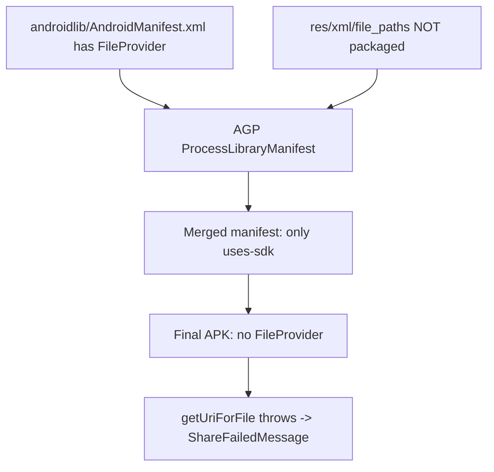

# Исправление Share: FileProvider отсутствует в APK

## Диагноз

Toast **«Unable to share. Please try again.»** (`ShareFailedMessage`) означает, что [`AndroidShareHelper.TryShareImageWithText()`](Assets/Scripts/AndroidShareHelper.cs) вернул `false` после успешного capture. C#-логика (bootstrap, grantUriPermission, proguard) уже на месте — проблема в **Android manifest/resources**.

Проверка собранного Release APK показала:

| Что проверяли | Результат |
|---------------|-----------|
| [`launcher/.../merged_manifests/.../AndroidManifest.xml`](Library/Bee/Android/Prj/IL2CPP/Gradle/launcher/build/intermediates/merged_manifests/release/processReleaseManifest/AndroidManifest.xml) | **Нет** `FileProvider`, **нет** authority `com.densappstudio.solar.system.v8.fileprovider` |
| [`SolarSystemShare.androidlib/.../merged_manifest/...`](Library/Bee/Android/Prj/IL2CPP/Gradle/unityLibrary/SolarSystemShare.androidlib/build/intermediates/merged_manifest/release/processReleaseManifest/AndroidManifest.xml) | Только `<uses-sdk>` — provider вырезан |
| `packaged_res` androidlib | **Пустой** — `file_paths.xml` не упакован |
| `R-def.txt` androidlib | **Пустой** — ресурсы модуля не компилируются |

Исходный manifest в androidlib содержит provider, но Gradle его отбрасывает, потому что `@xml/file_paths` не резолвится (ресурс не найден в модуле).



**Java обновлять не нужно.** `androidx.core:core:1.9.0` уже есть в [`unityLibrary/build.gradle`](Library/Bee/Android/Prj/IL2CPP/Gradle/unityLibrary/build.gradle) — класс `FileProvider` в APK есть, но **provider не зарегистрирован** в manifest.

## Исправление

### 1. Перестроить androidlib по структуре Unity 6

По [Unity 6 Manual](https://docs.unity3d.com/6000.4/Documentation/Manual/android-library-plugin-create.html) manifest и ресурсы должны быть в `src/main/`, а не в корне `.androidlib`.

**Новая структура** [`Assets/Plugins/Android/SolarSystemShare.androidlib/`](Assets/Plugins/Android/SolarSystemShare.androidlib/):

```
SolarSystemShare.androidlib/
  build.gradle
  src/main/
    AndroidManifest.xml
    res/xml/file_paths.xml
```

**Действия:**
- Переместить [`AndroidManifest.xml`](Assets/Plugins/Android/SolarSystemShare.androidlib/AndroidManifest.xml) → `src/main/AndroidManifest.xml`
- Переместить [`res/xml/file_paths.xml`](Assets/Plugins/Android/SolarSystemShare.androidlib/res/xml/file_paths.xml) → `src/main/res/xml/file_paths.xml`
- Удалить старые корневые `AndroidManifest.xml` и `res/` (и их `.meta`)
- Перенести/обновить `.meta` файлы для новых путей

### 2. Явно указать sourceSets в build.gradle

В [`build.gradle`](Assets/Plugins/Android/SolarSystemShare.androidlib/build.gradle) добавить внутрь блока `android { }`:

```gradle
sourceSets {
    main {
        manifest.srcFile 'src/main/AndroidManifest.xml'
        res.srcDirs = ['src/main/res']
    }
}
```

Зависимость `androidx.core:core` **не добавлять** (ломает сборку duplicate Kotlin).

### 3. Зафиксировать authority в manifest

В `src/main/AndroidManifest.xml` заменить `${applicationId}.fileprovider` на явный authority:

```xml
android:authorities="com.densappstudio.solar.system.v8.fileprovider"
```

Это совпадает с `Application.identifier` в [`AndroidShareHelper.cs`](Assets/Scripts/AndroidShareHelper.cs) и package ID в Project Settings.

### 4. Защитить grantUriPermission от сбоя

В [`AndroidShareHelper.cs`](Assets/Scripts/AndroidShareHelper.cs) обернуть вызов `GrantUriPermissionsToTargets` в отдельный try/catch — если `queryIntentActivities` упадёт на HiOS, share всё равно попытается открыть chooser (основной путь через `ClipData` + flags).

### 5. Проверка после сборки

1. Собрать **Release APK** в Unity
2. Убедиться, что в `Library/Bee/Android/.../launcher/build/intermediates/merged_manifests/release/.../AndroidManifest.xml` есть:

```xml
<provider
    android:name="androidx.core.content.FileProvider"
    android:authorities="com.densappstudio.solar.system.v8.fileprovider"
    ...>
```

3. Убедиться, что `SolarSystemShare.androidlib/build/intermediates/packaged_res/release/` содержит `xml/file_paths.xml`
4. Установить APK на Tecno → Share → должен открыться system chooser
5. При сбое: `adb logcat -s Unity` → искать `AndroidShareHelper:` (теперь с полным exception)

## Что не менять

- [`proguard-user.txt`](Assets/Plugins/Android/proguard-user.txt) и `useCustomProguardFile: 1` — оставить
- C# capture flow в [`SimulationShareController.cs`](Assets/Scripts/SimulationShareController.cs) — оставить
- Bootstrap/toast логику — оставить

## Файлы

| Файл | Действие |
|------|----------|
| `SolarSystemShare.androidlib/src/main/AndroidManifest.xml` | Создать (перенос + hardcoded authority) |
| `SolarSystemShare.androidlib/src/main/res/xml/file_paths.xml` | Создать (перенос) |
| [`SolarSystemShare.androidlib/build.gradle`](Assets/Plugins/Android/SolarSystemShare.androidlib/build.gradle) | Добавить `sourceSets` |
| [`AndroidShareHelper.cs`](Assets/Scripts/AndroidShareHelper.cs) | try/catch вокруг `GrantUriPermissionsToTargets` |
| Старые корневые `AndroidManifest.xml`, `res/` | Удалить |
