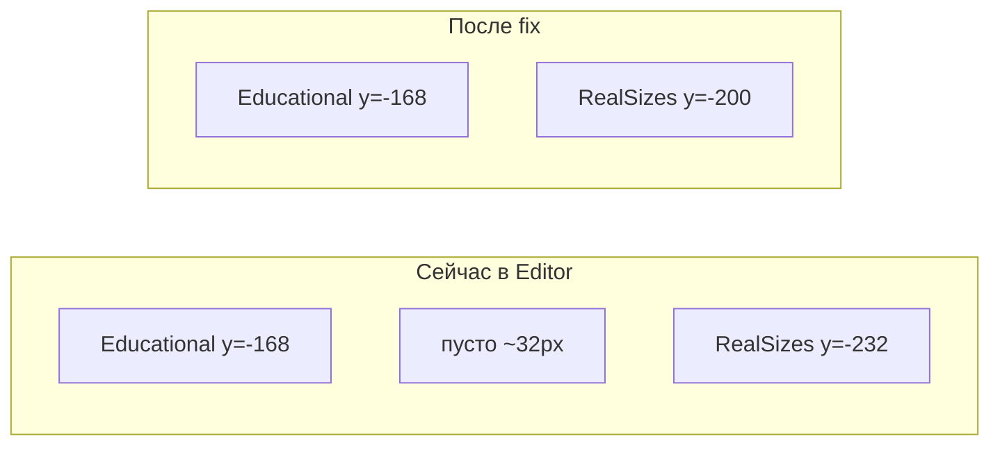

# Сжатие SidePanel после удаления Real distances

## Причина

Строка `SidePanelRealDistancesLabel_Row` удалена из [`Level1.unity`](Assets/_Scenes/Level1.unity), но **Y-позиции следующих строк не пересчитаны** — они остались со сдвигом на один ряд (+32 px = 28 height + 4 spacing):

| Row (index) | Сейчас в сцене | Должно быть |
|-------------|----------------|-------------|
| 0–5 (Orbits … Educational) | -8 … -168 | без изменений |
| 6 RealSizes | **-232** | **-200** |
| 7 RealOrbits | **-264** | **-232** |
| 8 CometMovement | **-296** | **-264** |
| 9 FreeObservation | **-328** | **-296** |
| 10 RealSun | **-360** | **-328** |

[`ApplyCompactLayout`](Assets/Scripts/SidePanelUiBootstrap.cs) уже умеет пересчитывать позиции и `sizeDelta` панели (364 px), но вызывается:
- в **Play Mode** — из `SimulationSidePanelController.Awake()`
- в **Editor** — только при **Solar System → Setup SidePanel UI**

При обычном открытии Level1 [`OnSceneOpened`](Assets/Editor/SidePanelSceneSetup.cs) **не** вызывает layout — только `MarkSceneDirty`, поэтому в Scene View остаётся дырка.



## Изменения

### 1. Авто-layout при открытии Level1 в Editor

В [`SidePanelSceneSetup.cs`](Assets/Editor/SidePanelSceneSetup.cs), метод `OnSceneOpened`:

```csharp
var panel = Object.FindFirstObjectByType<SimulationSidePanelController>();
if (panel != null)
{
    SidePanelUiBootstrap.ApplyCompactLayout(panel.transform);
    EditorSceneManager.MarkSceneDirty(scene);
}
else
    SetupInternal(markSceneDirty: true);
```

Это гарантирует сжатие списка при каждом открытии сцены и после будущих изменений `ToggleRows`.

### 2. Одноразовое исправление сцены

В [`Level1.unity`](Assets/_Scenes/Level1.unity) обновить `m_AnchoredPosition.y` для RectTransform строк:

- `2092121452` (SidePanelRealSizesLabel_Row): `-232` → `-200`
- `1851039680` (SidePanelRealOrbitsLabel_Row): `-264` → `-232`
- `2131614195` (SidePanelCometMovementLabel_Row): `-296` → `-264`
- `2100100002` (SidePanelFreeObservationLabel_Row): `-328` → `-296`
- `666886311` (SidePanelRealSunLabel_Row): `-360` → `-328`

Порядок `m_Children` у `950001201` уже корректен (11 строк без пропуска); правятся только координаты.

`sizeDelta` панели уже `{x: 270, y: 364}` — менять не нужно.

### 3. Без изменений

- [`SidePanelUiBootstrap.cs`](Assets/Scripts/SidePanelUiBootstrap.cs) — логика `ApplyRowLayout` / `RemoveOrphanRows` уже корректна
- Runtime-поведение не затрагивается (Awake уже вызывает layout)

## Проверка

1. Открыть Level1 в Unity Editor — список toggle без пустого зазора между «Схематично» и «Реальный масштаб»
2. Все 11 строк идут подряд с равным шагом 32 px
3. Play Mode — layout без регрессий
4. Повторное открытие сцены — позиции не «откатываются»
