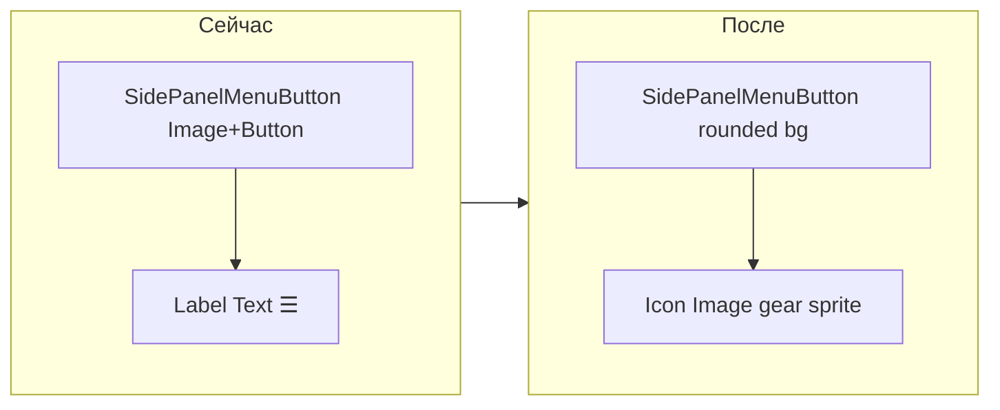

# Иконка шестерёнки для SidePanelMenuButton

## Текущее состояние

Кнопка `SidePanelMenuButton` на `MainScreenCanvas` в сцене [`Assets/_Scenes/Level1.unity`](Assets/_Scenes/Level1.unity) содержит дочерний объект `Label` с компонентом `Text` и символом `\u2630` (☰):

```114:118:Assets/Editor/SidePanelSceneSetup.cs
        var label = labelGo.GetComponent<Text>();
        label.text = "\u2630";
        label.fontSize = 24;
        label.alignment = TextAnchor.MiddleCenter;
        label.color = new Color(0.85f, 0.92f, 1f, 1f);
```

Кнопка создаётся/настраивается через [`Assets/Editor/SidePanelSceneSetup.cs`](Assets/Editor/SidePanelSceneSetup.cs). При уже существующей кнопке метод `EnsureMenuButton` сразу возвращает её **без обновления** — это нужно исправить, иначе изменения не попадут в текущую сцену.

В проекте уже есть папка [`Assets/Icons/`](Assets/Icons/) с иконками в стиле icons8 (`icons8-menu-100.png`), но иконки шестерёнки пока нет.

## Предлагаемое решение

### 1. Добавить спрайт шестерёнки

- Добавить `Assets/Icons/icons8-settings-100.png` — белая/светлая шестерёнка на прозрачном фоне, в том же стиле и размере (~100×100), что и `icons8-menu-100.png`.
- Настроить import settings: **Texture Type = Sprite (2D and UI)**, **Single Sprite**, **Alpha Is Transparency = on** (аналогично [`Assets/Icons/icons8-menu-100.png.meta`](Assets/Icons/icons8-menu-100.png.meta)).

### 2. Заменить Text на Image-иконку в editor setup

Обновить [`Assets/Editor/SidePanelSceneSetup.cs`](Assets/Editor/SidePanelSceneSetup.cs):

**Новая кнопка** — вместо `Text` создавать дочерний объект `Icon` с `Image`:
- `sprite` = gear icon
- `color` = `(0.85, 0.92, 1, 1)` — тот же голубой акцент, что у панели
- `preserveAspect = true`, `raycastTarget = false`
- отступы ~8 px от краёв кнопки (44×44)

**Существующая кнопка** — добавить метод `UpgradeMenuButtonIcon(Transform button)` и вызывать его из `EnsureMenuButton` перед `return`:
- удалить/заменить старый `Label` (Text с ☰)
- создать `Icon` (Image), если его ещё нет
- применить спрайт и стиль

**Визуальная полировка кнопки** (минимально, в духе UI симуляции):
- фон: rounded sprite [`UIButtonDefault`](Assets/Unity UI Samples/Textures and Sprites/Rounded UI/UIButtonDefault.png) (Image Type = **Sliced**), цвет `(0.02, 0.05, 0.12, 0.88)` — как у боковой панели
- `Button` ColorBlock: Normal = белый, Highlighted = `(0.78, 0.88, 1, 1)`, Pressed = `(0.65, 0.78, 0.95, 1)` — лёгкая подсветка при наведении
- размер кнопки: **44×44**, позиция anchor top-right `(−16, −16)` — как в setup-скрипте



### 3. Применить изменения к сцене Level1

После правок в editor-скрипте:
- открыть `Level1.unity` в Unity и выполнить **Solar System → Setup SidePanel UI** (или дождаться auto-setup при открытии сцены)
- это вызовет `UpgradeMenuButtonIcon` и сохранит обновлённую кнопку в сцене

Runtime-код ([`SimulationSidePanelController.cs`](Assets/Scripts/SimulationSidePanelController.cs), [`CleanViewController.cs`](Assets/Scripts/CleanViewController.cs)) **не требует изменений** — они работают с именем `SidePanelMenuButton`, а не с содержимым Label.

## Файлы для изменения

| Файл | Действие |
|------|----------|
| `Assets/Icons/icons8-settings-100.png` (+ `.meta`) | Добавить спрайт шестерёнки |
| `Assets/Editor/SidePanelSceneSetup.cs` | Icon вместо Text + upgrade + стилизация |
| `Assets/_Scenes/Level1.unity` | Обновится через Setup SidePanel UI |

## Проверка

1. Play Mode: кнопка в правом верхнем углу показывает шестерёнку, а не ☰
2. Hover/click: лёгкая подсветка фона
3. Клик открывает/закрывает панель настроек симуляции
4. Clean View (UI off): кнопка остаётся видимой (исключена в `CleanViewController`)
