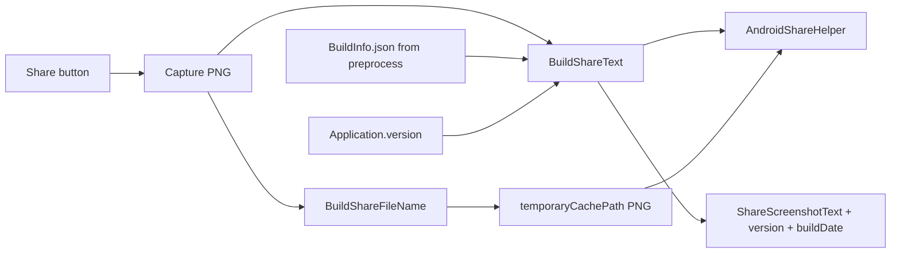

# Локализованный текст при Android Share

## Контекст

Сейчас [`BuildShareText()`](Assets/Scripts/SimulationShareController.cs) возвращает `SolarSystem3D_yyyyMMddHHmmss` и это значение используется **и** как текст share intent, **и** как имя PNG — многострочная кириллица сломает путь к файлу.

```177:180:Assets/Scripts/SimulationShareController.cs
    static string BuildShareText()
    {
        return "SolarSystem3D_" + DateTime.Now.ToString("yyyyMMddHHmmss");
    }
```

**Решение по формату:** префикс `rustore:` в текст share **не** включать (это пометка канала). Тело:

```
Солнечная Система 3D от разработчика Kolesoff Den (densappstudio)
Версия: 8.2.5
Дата билда: 2026-07-12
```

Версия — `Application.version` ([`bundleVersion: 8.2.5`](ProjectSettings/ProjectSettings.asset)). Дата — `yyyy-MM-dd`, запечённая при Unity Build.

## Изменения

### 1. Разделить имя файла и текст share

В [`SimulationShareController.cs`](Assets/Scripts/SimulationShareController.cs):

- `BuildShareFileName()` — безопасное имя: `SolarSystem3D_yyyyMMddHHmmss.png` (как сейчас)
- `BuildShareText()` — локализованная строка для `AndroidShareHelper.TryShareImageWithText`
- В `CaptureAndShareRoutine` писать PNG через `BuildShareFileName()`, в intent — через `BuildShareText()`

### 2. Шаблон в 5 языковых JSON

Добавить ключ `ShareScreenshotText` во все файлы в [`Assets/Resources/Languages/`](Assets/Resources/Languages/):

| Язык | Шаблон (плейсхолдеры `{0}` = версия, `{1}` = дата) |
|------|-----------------------------------------------------|
| ru | `Солнечная Система 3D от разработчика Kolesoff Den (densappstudio)\nВерсия: {0}\nДата билда: {1}` |
| en | `Solar System 3D by developer Kolesoff Den (densappstudio)\nVersion: {0}\nBuild date: {1}` |
| zh / vi / uz | те же смысл и структура (название + разработчик + Version/Build date) |

Формирование по образцу [`CpuLoadMonitor`](Assets/Scripts/CpuLoadMonitor.cs): `LocalizationManager.GetTranslation` + `string.Format`, с English fallback в коде.

### 3. Дата билда релизной APK

Сейчас механизма даты билда нет. Добавить:

- [`Assets/Editor/BuildInfoGenerator.cs`](Assets/Editor/BuildInfoGenerator.cs) — `IPreprocessBuildWithReport`: при любом Player Build писать [`Assets/Resources/BuildInfo.json`](Assets/Resources/BuildInfo.json) с полем `"buildDate": "yyyy-MM-dd"` (дата старта билда, UTC+0 или локальная машины сборки — зафиксировать **локальную дату машины билдера** в `yyyy-MM-dd`)
- Runtime-хелпер (метод в `SimulationShareController` или маленький `BuildInfo`): читать `Resources.Load<TextAsset>("BuildInfo")`; если файла нет (Play Mode в Editor без билда) — подставлять `DateTime.Now.ToString("yyyy-MM-dd")`

`BuildInfo.json` можно добавить в `.gitignore`, если не хотите коммитить артефакт; либо коммитить последний — для воспроизводимости share-текста в Editor удобнее генерировать при билде и иметь fallback.

**Выбор:** генерировать при билде + fallback `DateTime.Now` в Editor; файл `BuildInfo.json` **не** коммитить в git (добавить в `.gitignore`), чтобы дата всегда отражала фактический APK-билд.

### 4. Поток данных



## Файлы

- [`Assets/Scripts/SimulationShareController.cs`](Assets/Scripts/SimulationShareController.cs) — разделить filename/text, собрать локализованную строку
- [`Assets/Editor/BuildInfoGenerator.cs`](Assets/Editor/BuildInfoGenerator.cs) — новый preprocess
- 5× `Assets/Resources/Languages/*.json` — ключ `ShareScreenshotText`
- `.gitignore` — `Assets/Resources/BuildInfo.json` (+ `.meta` при наличии)

## Проверка

1. Сменить язык на русский → Share → в chooser/получателе текст с «Солнечная Система 3D…», версией и датой
2. English / Chinese — соответствующие шаблоны
3. После Release APK build дата в тексте = день сборки из `BuildInfo.json`
4. Имя файла на диске остаётся ASCII `SolarSystem3D_*.png`
