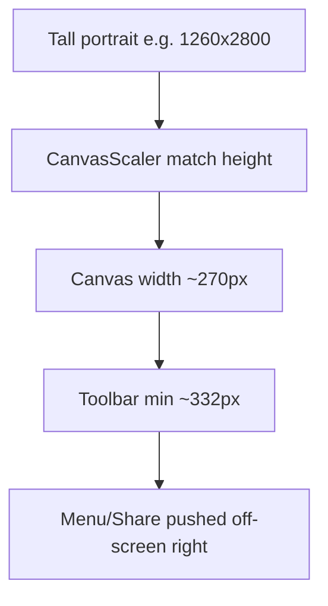
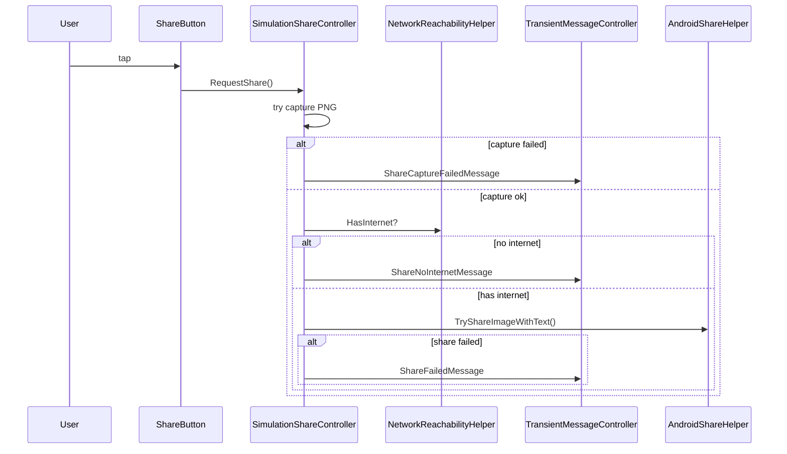

# Адаптивная панель навигации и безопасный Share

## Диагноз: почему 1260×2800 ломается, а 1080×1920 — нет

[`MainScreenCanvas`](Assets/_Scenes/Level1.unity) использует `CanvasScaler` с `ReferenceResolution 800×600` и **`MatchWidthOrHeight = 1`** (match height).

На portrait-экранах эффективная ширина canvas = `Screen.width / (Screen.height / 600)`:

| Разрешение | Canvas width | Мин. ширина toolbar |
|------------|--------------|---------------------|
| 1080×1920 | ~337 px | ~332 px (едва помещается) |
| 1260×2800 | ~**270 px** | ~332 px (**переполнение**) |

Минимальная ширина toolbar (6 кнопок + spacing + padding из [`BodyNavigationController`](Assets/Scripts/BodyNavigationController.cs)):
`Prev(44) + Name(48) + Next(44) + Menu(44) + Share(44) + SimControl(72) + spacing/padding ≈ 332 px`

При переполнении `HorizontalLayoutGroup` (`childAlignment = MiddleCenter`) центрирует группу — правая часть (Menu, Share, SimControl) уезжает за край экрана.



---

## 1. Адаптивный compact-layout для BodyNavigationBar

**Файл:** [`BodyNavigationController.cs`](Assets/Scripts/BodyNavigationController.cs)

Добавить метод `ApplyAdaptiveToolbarLayout()`, вызываемый из `ApplySafeAreaInset()` **после** `LayoutRebuilder.ForceRebuildLayoutImmediate(barRect)`.

**Алгоритм:**
1. Получить `availableWidth = barRect.rect.width` минус padding `HorizontalLayoutGroup` (8+8)
2. Посчитать `requiredWidth` только для **активных** дочерних элементов bar (учитывая clean view, когда Prev/Name/Next/SimControl скрыты)
3. Выбрать профиль layout:

| Профиль | Icon buttons | SimControl | Name min | Spacing |
|---------|-------------|------------|----------|---------|
| Normal | 44 / 44 | 88 / 72 min | 48 | 4 |
| Compact | 36 / 36 | 72 / 60 min | 36 | 2 |
| Tight | 32 / 32 | 60 / 52 min | 28 | 2 |

4. Если `requiredWidth > availableWidth` — переключаться Compact → Tight, пока не поместится
5. Применить размеры через существующий `EnsureBarChildButton()` + обновить `ConfigureNameButtonLayout()` с параметром compact
6. Уменьшить `HorizontalLayoutGroup.spacing` и при необходимости `padding` в tight-режиме
7. Вызвать `LayoutRebuilder.ForceRebuildLayoutImmediate(barRect)` повторно

**Clean view (UI off):** когда активны только Menu + Share (~72–80 px), toolbar всегда помещается; дополнительно можно выставить `childAlignment = UpperRight` для пары Menu+Share, чтобы кнопки оставались у правого края (как задумывалось в clean view), а не по центру экрана.

**Вспомогательно:** вынести константы размеров в private struct `ToolbarLayoutProfile` внутри `BodyNavigationController` — без изменения глобального CanvasScaler (это затронуло бы всё UI).

---

## 2. Безопасный Share-flow с try/catch и проверкой сети

### 2.1 Toast-сервис для сообщений пользователю

Новый [`TransientMessageController.cs`](Assets/Scripts/TransientMessageController.cs):
- Singleton на `SimulationViewSystems` (подключить в [`SimulationViewBootstrap.cs`](Assets/Scripts/SimulationViewBootstrap.cs))
- Метод `ShowLocalized(string key, string fallback, float duration = 3f)`
- Runtime UI по образцу [`CpuLoadMonitor.cs`](Assets/Scripts/CpuLoadMonitor.cs): полупрозрачная панель + `TextMeshProUGUI`, anchor bottom-center, `raycastTarget = false`
- Подписка на `LocalizationManager.OnLanguageChanged` для обновления шрифта через `LocalizationFontHelper`
- Coroutine автоскрытия; повторный вызов заменяет предыдущее сообщение

### 2.2 Проверка сети

Новый helper (можно static class в том же файле или отдельный [`NetworkReachabilityHelper.cs`](Assets/Scripts/NetworkReachabilityHelper.cs)):

```csharp
public static bool HasInternet =>
    Application.internetReachability != NetworkReachability.NotReachable;
```

Перед открытием share sheet: если `!HasInternet` → показать `ShareNoInternetMessage`, **не** вызывать intent (по вашему запросу).

### 2.3 Обновить share-цепочку

**[`SimulationShareController.cs`](Assets/Scripts/SimulationShareController.cs):**
- Обернуть весь `CaptureAndShareRoutine` в try/catch/finally
- Перед share: проверка сети → toast при отсутствии
- При ошибке capture → `ShareCaptureFailedMessage`
- При `pngPath == null` → toast, не вызывать Android
- Вызов `AndroidShareHelper.TryShareImageWithText(...)` → bool

**[`AndroidShareHelper.cs`](Assets/Scripts/AndroidShareHelper.cs):**
- Переименовать/добавить `TryShareImageWithText(string path, string text) : bool`
- Существующий try/catch сохранить; при exception → `return false`
- При успешном `startActivity` → `return true`
- Editor: `return true` (PNG уже сохранён, share пропускается как сейчас)

**[`ShareButtonController.cs`](Assets/Scripts/ShareButtonController.cs):**
- При `SimulationShareController.Instance == null` → toast `ShareFailedMessage`

---

## 3. Локализация (5 языков)

Добавить ключи в начало JSON (рядом с `CpuLoad*`) во все файлы [`Assets/Resources/Languages/`](Assets/Resources/Languages/):

| Key | EN | RU | ZH | VI | UZ |
|-----|----|----|----|----|-----|
| `ShareNoInternetMessage` | No internet connection. Sharing is unavailable. | Нет подключения к интернету. Отправка недоступна. | 无网络连接，无法分享。 | Không có kết nối internet. Không thể chia sẻ. | Internet aloqasi yo'q. Ulashish mumkin emas. |
| `ShareFailedMessage` | Unable to share. Please try again. | Не удалось отправить. Попробуйте ещё раз. | 无法分享，请重试。 | Không thể chia sẻ. Vui lòng thử lại. | Ulashib bo'lmadi. Qayta urinib ko'ring. |
| `ShareCaptureFailedMessage` | Failed to capture screenshot. | Не удалось создать снимок экрана. | 截图失败。 | Không thể chụp ảnh màn hình. | Skrinshot olish muvaffaqiyatsiz tugadi. |

Файлы: `english.json`, `russian.json`, `chinese.json`, `vietnamese.json`, `uzbek.json`.

Паттерн перевода — как в `CpuLoadMonitor.Translate()`.

---

## 4. Схема изменений



---

## 5. Проверка

1. **1260×2800 portrait, UI on:** все 6 кнопок видны, Menu не обрезана
2. **1080×1920 portrait:** layout без регрессий (normal или compact, но всё видно)
3. **Clean view, 1260×2800:** Menu + Share видны (желательно у правого края)
4. **Share без интернета (Android):** toast с локализованным текстом, chooser не открывается
5. **Share с интернетом:** chooser открывается как раньше
6. **Ошибка capture / intent:** toast `ShareFailedMessage` / `ShareCaptureFailedMessage`, без crash
7. **Смена языка:** toast показывает перевод на текущем языке

## Ключевые файлы

- [`BodyNavigationController.cs`](Assets/Scripts/BodyNavigationController.cs) — adaptive toolbar
- [`SimulationShareController.cs`](Assets/Scripts/SimulationShareController.cs) — safe share flow
- [`AndroidShareHelper.cs`](Assets/Scripts/AndroidShareHelper.cs) — bool return
- [`TransientMessageController.cs`](Assets/Scripts/TransientMessageController.cs) — новый toast
- [`SimulationViewBootstrap.cs`](Assets/Scripts/SimulationViewBootstrap.cs) — bootstrap toast
- 5× [`Assets/Resources/Languages/*.json`](Assets/Resources/Languages/) — переводы
