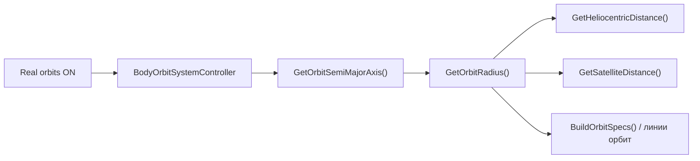

# Совместимость «Real orbits» со всеми телами

## Результат проверки

### Что уже работает (в т.ч. после fix Jupiter TrueScale)

Режим **Real orbits** (`OrbitSettings.UseRealOrbits`) не использует отдельные расстояния — он берёт их из того же источника, что и круговые орбиты:



- [`BodyOrbitSystemController.cs`](Assets/Scripts/SolarSystemGraphics/BodyOrbitSystemController.cs) — `ConfigureOrbitController()` → `GetOrbitSemiMajorAxis()`
- [`SolarSystemScaleController.cs`](Assets/Scripts/SolarSystemGraphics/SolarSystemScaleController.cs) — при Real orbits `ApplyDistances()` пропускается (стр. 173–174), позиции задаёт `BodyOrbitController`
- **Галилеевы спутники в TrueScale + Real orbits** — получают те же увеличенные орбиты (~3.9–17.1), что и в круговом TrueScale, через `GetSatelliteDistance()` — **дополнительных правок для Юпитера не нужно**
- **Schematic + Real orbits** — semi-major axis из `SolarSystemLayout` (0.79–3.5) — без изменений
- **Эксcentricity / inclination** — из [`SolarSystemCatalog.cs`](Assets/Scripts/SolarSystemGraphics/SolarSystemCatalog.cs) для всех 8 планет + 9 спутников

| Группа тел | Schematic + Real orbits | TrueScale + Real orbits |
|---|---|---|
| Планеты | edu-расстояния + e, i из каталога | scene/AU baseline + e, i |
| Луна | edu 1.39 | ~1.39 (Earth–Moon clearance) |
| Io–Callisto | edu 0.79–3.5 | ~3.9–17.1 (недавний fix) |
| Titan, Triton, Фобос, Дейmos | edu/scene baseline | auto-scale через тот же clearance |

---

## Найденные проблемы

### 1. (Критично) Солнце/планета в центре эллипса, а не в фокусе

[`OrbitLineUtility.EllipsePoint()`](Assets/Scripts/SolarSystemGraphics/OrbitLineUtility.cs) использует параметрический эллипс с **геометрическим центром** в `(0,0,0)`:

```35:46:Assets/Scripts/SolarSystemGraphics/OrbitLineUtility.cs
    public static Vector3 EllipsePoint(float angleRad, float semiMajorAxis, float eccentricity, float inclinationDeg)
    {
        float b = SemiMinorAxis(semiMajorAxis, eccentricity);
        // ...
        float x = Mathf.Cos(angleRad) * semiMajorAxis;  // perihelion distance = a (неверно)
        float zFlat = Mathf.Sin(angleRad) * b;
```

Для настоящей орбиты родитель должен быть в **фокусе**:
- перигелий = `a(1−e)` (Меркурий: e=0.205 → ошибка ~20%)
- afelий = `a(1+e)`

Кометы уже знают правильную формулу для расстояния, но **не используют её для позиции**:

```21:28:Assets/Scripts/SolarSystemGraphics/CometOrbitController.cs
    public float GetHeliocentricDistanceAu()
    {
        // ...
        return a * (1f - e * e) / (1f + e * Mathf.Cos(_angle));  // focus-correct
    }
```

```105:106:Assets/Scripts/SolarSystemGraphics/CometOrbitController.cs
        float x = Mathf.Cos(_angle) * _definition.semiMajorAxis;  // center-correct (неверно)
        float zFlat = Mathf.Sin(_angle) * _semiMinorAxis;
```

Затронуты: все планеты, все спутники, линии орбит, кометы.

### 2. (Минор) Переключение Real orbits ON без предварительной синхронизации позиций

При включении Real orbits [`ApplyOrbitMode()`](Assets/Scripts/SolarSystemGraphics/BodyOrbitSystemController.cs) сразу захватывает фазу с текущей позиции. Если тело ещё не прошло через `ApplyDistancesOnly()` (редкий edge case при старте/переключениях), фаза может быть некорректной.

### 3. (Не баг) `satelliteOrbitKm` не используется напрямую

Физические km-расстояния (~0.056 для Луны) намеренно заменены на видимые (1.39 / scaled Jupiter moons) — это согласовано с уже одобренным TrueScale. Real orbits должны использовать **тот же** `GetOrbitRadius`, а не raw km.

---

## План исправления

### 1. Focus-based эллипс в `OrbitLineUtility.cs`

Заменить `EllipsePoint` на полярную форму с фокусом в начале координат:

```
r = a(1 − e²) / (1 + e·cos(θ))
x = r·cos(θ),  zFlat = r·sin(θ)
→ затем наклон orbitalInclinationDeg (как сейчас)
```

Обновить `ComputePhaseFromOffset`:
- снять наклон → получить `(x, zFlat)` в орбитальной плоскости
- `θ = Atan2(zFlat, x)` (true anomaly от фокуса)

Обновить `BuildEllipse` — автоматически подхватит новый `EllipsePoint`.

**Проверить e→0:** при e=0 формула даёт `r=a` — круг без регрессии.

### 2. Унифицировать кометы

В [`CometOrbitController.cs`](Assets/Scripts/SolarSystemGraphics/CometOrbitController.cs) заменить `UpdateEllipticalPosition()` на вызов `OrbitLineUtility.EllipsePoint()` — одна реализация для планет и комет.

### 3. Синхронизация при включении Real orbits

В [`BodyOrbitSystemController.ApplyOrbitMode()`](Assets/Scripts/SolarSystemGraphics/BodyOrbitSystemController.cs), в ветке `UseRealOrbits == true`:

```csharp
if (_scaleController != null)
    _scaleController.ApplyDistancesOnly();  // sync circular layout before phase capture
```

Затем — как сейчас — `ConfigureOrbitController(..., capturePhaseFromPosition: true)`.

Это гарантирует согласованность Schematic/TrueScale перед переходом на эллипсы для **всех** тел.

### 4. Файлы без изменений

- [`SolarSystemLayout.cs`](Assets/Scripts/SolarSystemGraphics/SolarSystemLayout.cs) — Schematic layout
- [`Level1.unity`](Assets/_Scenes/Level1.unity) — scene baseline
- [`SolarSystemCatalog.cs`](Assets/Scripts/SolarSystemGraphics/SolarSystemCatalog.cs) — e, i, AU уже корректны
- Логика `GetSatelliteDistance()` для TrueScale — оставить как есть

---

## Матрица проверки (в Unity)

Комбинации для каждой группы тел (планеты, Луна, галилеевы, Titan, Triton, Фobos/Deimos):

| # | Schematic / TrueScale | Real orbits | Что проверить |
|---|---|---|---|
| 1 | Schematic | OFF | базовая линия (без регрессии) |
| 2 | Schematic | ON | эллипс с фокусом на Солнце/планете; Io–Callisto на edu-расстояниях |
| 3 | TrueScale | OFF | Jupiter moons снаружи диска (недавний fix) |
| 4 | TrueScale | ON | Jupiter moons ~3.9–17.1; Mеркурий заметно вытянут; линия = траектория |
| 5 | TrueScale | ON→OFF | возврат на круг без скачков |
| 6 | Schematic→TrueScale | ON | semi-major пересчитывается, фаза сохраняется |

Дополнительно:
- **Меркурий** (e=0.205) — перигелий ближе к Солнцу, чем aphelion; Солнце **не** в центре эллипса
- **Луна** (e=0.055, i=5.15°) — лёгкий наклон и эллипс
- **Комета** с Real orbits + Comet movement — траектория совпадает с линией
- Переключение «Орбиты» (show/hide lines) — линии совпадают с телами

---

## Ограничения (не в scope)

- **Тriton** — ретроградная орбита (~157°) не моделируется знаком наклона; в каталоге prograde 0.67°
- **Физические km-орбиты спутников** в TrueScale — намеренно масштабированы для видимости; это не баг Real orbits
