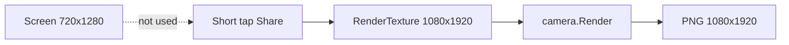

# Короткий Share: 1080×1920 вместо 720×1280

## Ответ: да, это возможно

**Короткое нажатие уже должно отдавать 1080×1920**, независимо от того, в каком разрешении работает игра на экране смартфона.

В [`SimulationShareController.cs`](Assets/Scripts/SimulationShareController.cs) задано:

```17:18:Assets/Scripts/SimulationShareController.cs
    const int CaptureWidth = 1080;
    const int CaptureHeight = 1920;
```

Короткий share **не** снимает экран. Он:
1. Создаёт offscreen `RenderTexture` 1080×1920
2. Рендерит игровую камеру в этот буфер (`camera.targetTexture` + `camera.Render()`)
3. Читает пиксели в `Texture2D(1080, 1920)` и сохраняет PNG

Разрешение **экрана** (`Screen.width` × `Screen.height`, часто 720×1280 на budget-устройствах) на размер PNG **не влияет**. Камера перерисовывается в целевом разрешении.



## Почему вы можете видеть 720×1280

| Причина | Пояснение |
|---------|-----------|
| Разрешение игры ≠ размер PNG | В галерее/свойствах файла смотрите именно PNG, не размер окна Unity |
| Старая APK | На устройстве может быть сборка до текущих констант 1080×1920 |
| Сжатие мессенджера | Telegram/WhatsApp показывают превью меньшего размера; исходный файл может быть 1080×1920 |
| Long press vs short | Long press берёт framebuffer экрана и **масштабирует** до 1080×1920; short — сразу рендерит 1080×1920 |

`AndroidShareHelper` и share-intent **не меняют** разрешение файла.

## Нужны ли изменения в коде?

Базовая логика уже корректна. Для уверенности и явного «если смартфон позволяет» стоит добавить **верификацию и защиту**, а не менять подход.

### 1. Проверка фактического размера RT после аллокации

В `CaptureAndShareRoutine()` после `RenderTexture.GetTemporary(...)` проверить:

```csharp
if (renderTexture.width != CaptureWidth || renderTexture.height != CaptureHeight)
    Debug.LogWarning(...);
```

Если размеры не совпали — это сигнал проблемы на конкретном GPU; сейчас такой проверки нет.

### 2. Лог размеров перед сохранением

В `FinalizeShare()` добавить:

```csharp
Debug.Log($"SimulationShareController: sharing {texture.width}x{texture.height}");
```

После Release APK на Tecno: `adb logcat -s Unity` → убедиться, что в логе `1080x1920`.

### 3. Адаптивный fallback «если смартфон не позволяет»

Добавить `ResolveCaptureDimensions(out int width, out int height)`:

- **Цель:** 1080×1920 (9:16)
- **Условие для цели:** `SystemInfo.maxTextureSize >= 1920` (на практике выполняется на всех целевых Android-устройствах; лимит обычно 4096+)
- **Fallback:** 720×1280 (сохранить 9:16), если `maxTextureSize < 1920` или `GetTemporary`/`ReadPixels` падает

Это формализует требование «1080×1920, если позволяет смартфон» без риска OOM на экзотически слабых GPU.

### 4. Файлы

| Файл | Изменение |
|------|-----------|
| [`SimulationShareController.cs`](Assets/Scripts/SimulationShareController.cs) | `ResolveCaptureDimensions`, проверка RT, лог размеров, fallback 720×1280 |

Локализация, `ShareButtonController`, `AndroidShareHelper` — без изменений.

## Проверка на устройстве

1. Собрать Release APK с логом размеров
2. Короткий tap Share → в logcat: `sharing 1080x1920`
3. Открыть PNG в файловом менеджере (не превью мессенджера) → свойства: 1080×1920
4. Если в логе 720×1280 — прислать строку logcat; тогда разбираем конкретный GPU/путь

## Вывод

**Да, отправка 1080×1920 при коротком share возможна и уже реализована архитектурно.** Разрешение экрана 720×1280 не мешает. Если фактический файл меньше — сначала верифицируем через лог и свойства PNG; при необходимости добавляем проверку RT и явный device-capability fallback из п.3.
