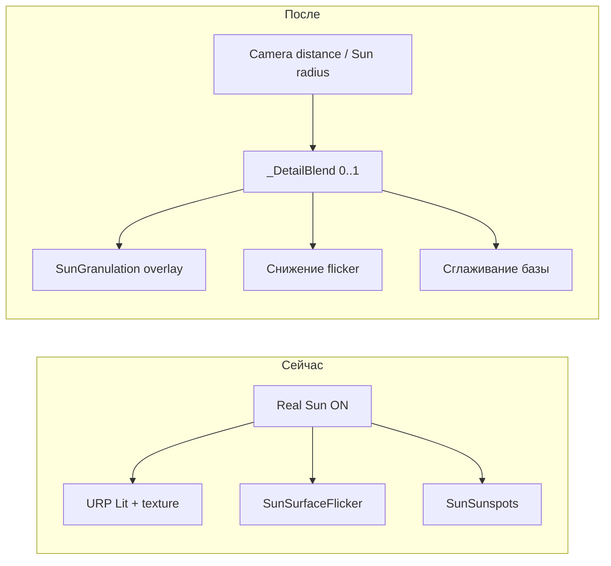

# Грануляция поверхности Солнца по зуму

## Текущее состояние

Режим **«Реальное Солнце»** управляется [`SunAppearanceSettings.cs`](Assets/Scripts/SunAppearanceSettings.cs) и визуализируется двумя системами:

- [`PlanetTextureManager.cs`](Assets/Scripts/SolarSystemGraphics/PlanetTextureManager.cs) — базовая сфера URP Lit + `SunTexture.jpg`, оранжевая эмиссия, bloom-оболочка
- [`SunCoronalVfxController.cs`](Assets/Scripts/SolarSystemGraphics/SunCoronalVfxController.cs) — оверлеи:
  - `Custom/SunSunspots` — тёмные пятна
  - `Custom/SunSurfaceFlicker` — мягкий процедурный мерцательный шум (не клеточная грануляция)
  - CME-частицы (протуберанцы)

**Проблема:** эффекты не зависят от расстояния камеры. При максимальном зуме поверхность остаётся «сглаженной» текстурой + слабым flicker, а не клеточной грануляцией как на референсе.

Зум камеры: [`MobileOrbitCamera.distance`](Assets/Scripts/MobileOrbitCamera.cs) (public), лимиты — [`SolarSystemScaleController`](Assets/Scripts/SolarSystemGraphics/SolarSystemScaleController.cs):
- min ≈ `2.5 × radius`
- default ≈ `6.5 × radius`



## Целевое поведение

| Расстояние | Вид |
|---|---|
| **Максимальный зум** (`distance / radius ≈ 2.5`) | Яркие «пузырьки» гранул с тёмными межгранулярными полосами, постоянное медленное смещение и пульсация яркости |
| **Средняя дистанция** | Плавный crossfade между грануляцией и текущим видом |
| **Далеко** (`distance / radius ≥ ~5.5`) | Текущая реализация «Реальное Солнце» без изменений |

Эффект активен только когда:
- `SunAppearanceSettings.UseRealSun == true`
- камера сфокусирована на Солнце (`LookAtTarget.currentTarget.name == "Sun"`)

## Архитектура решения

### 1. Новый шейдер `Custom/SunGranulation`

Файл: [`Assets/Shaders/SunGranulation.shader`](Assets/Shaders/SunGranulation.shader) (новый)

Процедурная грануляция на нормалях сферы (без текстур):

- **Worley / Voronoi F2−F1** в 3D-пространстве (`worldNormal * _GranuleScale`) — клеточная структура
- **Анимация:** дрейф seed-точек по сфере (`_DriftSpeed`), медленная смена «жизненного цикла» клеток (период ~30–90 с визуально)
- **Пульсация:** `sin(time + cellHash) * _PulseAmount` на яркости центров гранул
- **Палитра** (по референсу):
  - центры: жёлто-оранжевый HDR `(1.0, 0.85, 0.2)`
  - полосы: тёмно-коричневый `(0.15, 0.06, 0.02)`
- **Параметр `_DetailBlend`** (0–1): управляет альфой оверлея и силой контраста; при 0 шейдер полностью прозрачен
- **Blend:** `SrcAlpha OneMinusSrcAlpha`, queue `Transparent+12` (поверх flicker)
- **Мобильная оптимизация:** `#if defined(SHADER_API_MOBILE)` — меньше октав FBM, чуть крупнее клетки (меньше соседей Worley не трогаем — 3×3×3 достаточно)

### 2. Оверлей в `SunCoronalVfxController`

Файл: [`Assets/Scripts/SolarSystemGraphics/SunCoronalVfxController.cs`](Assets/Scripts/SolarSystemGraphics/SunCoronalVfxController.cs)

Добавить child-сферу `ExtraGraphicsSunGranulation` (scale ~1.022, как у flicker):

- `CreateGranulationOverlay()` по аналогии с `CreateFlickerOverlay()`
- Кэш `Renderer _granulationRenderer`, `MaterialPropertyBlock` (чтобы не инстанцировать material каждый кадр)

**Расчёт `_DetailBlend` в `Update()`:**

```csharp
float normDist = camDistance / sunWorldRadius;
// 2.5 = полная грануляция, 5.5 = текущий дальний вид
float detailBlend = isSunFocused
    ? 1f - Mathf.SmoothStep(2.5f, 5.5f, normDist)
    : 0f;
```

Источники данных:
- `Camera.main` + `MobileOrbitCamera.distance`
- `GetSunWorldRadius(_sunTransform)` (уже есть в контроллере)
- `LookAtTarget.currentTarget` для проверки фокуса

**LOD-смешивание существующих слоёв** (через `MaterialPropertyBlock`):

| Параметр | При `detailBlend=0` | При `detailBlend=1` |
|---|---|---|
| Granulation alpha | 0 | ~0.9 |
| Flicker `_FlickerIntensity` | 0.6 (текущий Real Sun) | ~0.15 |
| Sunspots `_SpotStrength` | 1.0 | ~0.35 (мелкий масштаб — пятна менее заметны) |
| Base emission pulse (Perlin в Update) | текущая амплитуда | усиленная пульсация (~1.4×) |

При `detailBlend < 0.02` — `granulationRenderer.enabled = false` (экономия на GPU).

### 3. Базовая сфера при крупном плане

В том же `Update()` слегка «приглушить» статичную текстуру при высоком `detailBlend`:

- Lerp `_BaseColor` к равномерному оранжевому `(1, 0.55, 0.12)`
- Снизить контраст эмиссии от Perlin-анимации, чтобы процедурная грануляция доминировала визуально

Это предотвращает конфликт между `SunTexture.jpg` и клеточным паттерном.

### 4. Константы зума

Вынести пороги в константы рядом с CME-настройками в `SunCoronalVfxController`:

```csharp
const float GranulationFullZoomNorm = 2.5f;   // = MainCamMinDistanceScale
const float GranulationFadeEndNorm = 5.5f;    // между min и default (6.5)
```

Не дублировать логику в `SolarSystemScaleController` — нормализация через `distance / radius` автоматически работает при смене «Реальный масштаб».

## Файлы для изменения

| Файл | Действие |
|---|---|
| `Assets/Shaders/SunGranulation.shader` | **Создать** — процедурная грануляция |
| `Assets/Scripts/SolarSystemGraphics/SunCoronalVfxController.cs` | **Изменить** — оверлей, LOD-blend, Update |
| `Assets/Materials/SunGranulation.mat` | **Опционально** — пресет для редактора; runtime создаёт material в коде |

**Не менять:** `SunAppearanceSettings`, UI, `PlanetTextureManager` (кроме возможного minor tweak base color), `SunSurfaceFlicker.shader` (сохраняем обратную совместимость — LOD через uniform'ы).

## Визуальная проверка

1. Level1 → включить «Реальное Солнце»
2. Выбрать Солнце, приблизить до упора (pinch/scroll)
   - ожидается: контрастная клеточная мозаика, видимое движение и пульсация
3. Отдалить до обычного вида Солнца
   - ожидается: плавный переход к текущему виду (flicker + sunspots + CME)
4. Переключить «Реальный масштаб» / «Реальные расстояния» — blend должен оставаться корректным
5. Сфокусироваться на Земле при том же зуме — грануляция не должна появляться
6. Проверить на Android/iOS (если доступно) — FPS не должен просесть заметно

## Риски и митигация

- **Z-fighting / мерцание оверлеев:** scale 1.022 > flicker 1.018 > sunspots 1.006 — порядок сохранён
- **Производительность Worley:** один fullscreen sphere pass; отключение при `detailBlend≈0`; mobile-ветка в шейдере
- **Второй референс (протуберанец):** уже частично покрыт CME; в этой задаче — только **поверхность (грануляция)**, не переработка CME
