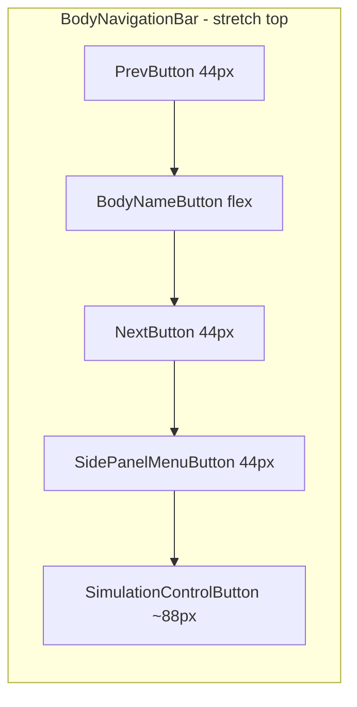

# Единая верхняя панель BodyNavigationBar

## Текущее состояние

Сейчас элементы разнесены и конфликтуют:

| Элемент | Родитель | Позиция |
|---------|----------|---------|
| `BodyNavigationBar` | `MainScreenCanvas` | центр сверху, но `y ≈ -62` (съехала вниз), ширина ~218px |
| `SidePanelMenuButton` | `MainScreenCanvas` | правый верхний угол, **под** `SimulationControlButton` |
| `SimulationControlButton` | `MainScreenCanvas` | правый верхний угол |

`BodyNavigationBar` уже содержит `HorizontalLayoutGroup` и детей: `PrevButton` → `BodyNameButton` → `NextButton` ([`Level1.unity`](Assets/_Scenes/Level1.unity)).

Проблемы:
- [`SimulationSidePanelController.cs`](Assets/Scripts/SimulationSidePanelController.cs) в `LayoutMenuButton()` каждый кадр (при смене safe area) **вручную** ставит меню под SimControl — это ломает горизонтальный ряд.
- [`BodyNavigationController.cs`](Assets/Scripts/BodyNavigationController.cs) задаёт фиксированную ширину 320px и центрирование — недостаточно для 5 кнопок.
- `canvas.transform.Find("SidePanelMenuButton")` ищет только прямых детей canvas — после reparent сломается.
- [`CleanViewController.cs`](Assets/Scripts/CleanViewController.cs) исключает `SidePanelMenuButton` только на уровне canvas — после переноса внутрь бара меню скроется вместе с баром.

## Целевая структура



Порядок слева направо: **PrevButton | BodyNameButton | NextButton | SidePanelMenuButton | SimulationControlButton**

Панель: anchor stretch по ширине сверху, небольшой отступ от верха (~12–14px + safe area top), высота ~48px.

## Изменения по файлам

### 1. Сцена [`Assets/_Scenes/Level1.unity`](Assets/_Scenes/Level1.unity)

- Перенести `SidePanelMenuButton` и `SimulationControlButton` в дети `BodyNavigationBar` (sibling index после `NextButton`).
- `BodyNavigationBar` RectTransform:
  - `anchorMin (0,1)`, `anchorMax (1,1)`, `pivot (0.5,1)`
  - горизонтальные отступы через `offsetMin.x / offsetMax.x` (safe area + 8px)
  - `sizeDelta.y = 48`
- Добавить `LayoutElement` на `SidePanelMenuButton` и `SimulationControlButton`:
  - Menu: `preferred 44×44`, `flexibleWidth 0`
  - SimControl: `preferredWidth ~88`, `minWidth 72`, `preferredHeight 44`, `flexibleWidth 0`
- Сбросить anchors дочерних кнопок под layout group (как у `PrevButton`/`NextButton`: stretch в layout).
- У `BodyNameButton` оставить `flexibleWidth = 1` — сжимается в portrait.
- Включить `enableAutoSizing` на TMP-лейбле имени тела для узких экранов (min ~12px).
- Поднять `BodyNavigationBar` в конце списка детей canvas (уже последний — сохранить для raycast-приоритета).

### 2. [`Assets/Scripts/BodyNavigationController.cs`](Assets/Scripts/BodyNavigationController.cs)

Заменить `EnsureTopCenterLayout()` на полноширинный top-bar layout:

```csharp
// anchor stretch top; apply left/right/top safe area insets
barRect.anchorMin = new Vector2(0f, 1f);
barRect.anchorMax = new Vector2(1f, 1f);
barRect.pivot = new Vector2(0.5f, 1f);
barRect.sizeDelta = new Vector2(0f, 48f);
// offsetMin.x = left + HMargin; offsetMax.x = -(right + HMargin)
// offsetMax.y = BaseTopOffset - top
```

- Добавить `const float HorizontalMargin = 8f`.
- В `ApplySafeAreaInset()` учитывать **left, right, top** (сейчас только top).
- После изменения insets вызывать `LayoutRebuilder.ForceRebuildLayoutImmediate(barRect)` — важно для Android после поворота.
- В `Update()` отслеживать смену ориентации (`Screen.width > Screen.height`) и пересобирать layout.

### 3. [`Assets/Scripts/SimulationSidePanelController.cs`](Assets/Scripts/SimulationSidePanelController.cs)

- **Удалить** ручное позиционирование в `LayoutMenuButton()` — позиция теперь у `HorizontalLayoutGroup`.
- Оставить в `LayoutMenuButton()` только сброс anchor/pivot если нужно, либо убрать вызов из `RefreshSafeAreaLayout()`.
- `LayoutPanelBelowMenuButton()` — оставить: боковая панель по-прежнему открывается под кнопкой меню (берёт `menuButtonRect.anchoredPosition` после layout).
- Обновить поиск кнопок:

```csharp
canvas.transform.Find("BodyNavigationBar/SidePanelMenuButton")
// или общий helper FindUi(canvas, "SidePanelMenuButton")
```

- Убрать зависимость от позиции `SimulationControlButton` для layout меню.

### 4. [`Assets/Editor/SidePanelSceneSetup.cs`](Assets/Editor/SidePanelSceneSetup.cs)

- При создании/апгрейде `SidePanelMenuButton` — parent = `BodyNavigationBar`, не canvas.
- Убрать `LayoutMenuButtonRelativeToSimControl()`.
- Добавить `EnsureLayoutElement()` для menu и sim-кнопок.
- Добавить шаг `EnsureBodyNavigationBarLayout()` — вызывать при открытии Level1 (как сейчас side panel setup).
- Reparent существующего `SimulationControlButton` под бар, если он ещё на canvas.

### 5. [`Assets/Scripts/CleanViewController.cs`](Assets/Scripts/CleanViewController.cs)

Обновить логику clean view (режим «без UI»):

- Вместо исключения `SidePanelMenuButton` на уровне canvas — исключить `BodyNavigationBar` из полного скрытия.
- Внутри бара скрывать: `PrevButton`, `BodyNameButton`, `NextButton`, `SimulationControlButton`, фон (опционально прозрачный).
- Оставлять видимым только `SidePanelMenuButton` (как сейчас отдельная кнопка настроек).
- При восстановлении UI — вернуть всех детей бара в исходное состояние.

### 6. Надёжность нажатий (Editor + Android)

- У всех кнопок: `Button.interactable = true`, `Image.raycastTarget = true` на hit-area, иконки — `raycastTarget = false`.
- `SimulationControlButton`: `Animator` не блокирует — `targetGraphic` на видимом Image.
- После reparent проверить, что serialized `menuButton` в `SimulationSidePanelController` на сцене указывает на тот же `Button` component (fileID сохранится при reparent).
- Проверить отсутствие перекрытия: `BodyNavigationBar` Image не должен перекрывать детей (дети рисуются поверх — OK при корректном layout).

## Визуальная полировка

- Единый стиль: прозрачный фон кнопок + иконки цвета `(0.85, 0.92, 1)` — как у menu/prev/next.
- `HorizontalLayoutGroup`: padding 8/8/4/4, spacing 4, `childAlignment = MiddleCenter`.
- Фон бара: существующий тёмный rounded sprite, alpha 0.92.
- В portrait: `BodyNameButton` сжимается, текст auto-size; правые кнопки остаются фиксированного размера.

## Проверка

1. **Editor Play Mode** — Level1: бар сверху с отступом; порядок кнопок корректный; все 5 кнопок кликаются.
2. **Поворот** Game view portrait ↔ landscape — бар остаётся сверху, ничего не обрезается.
3. **Side panel** — шестерёнка открывает/закрывает панель; панель появляется под кнопкой меню справа.
4. **SimControl** — анимация + переход в MainMenu работает.
5. **Body nav** — prev/next/name переключают тела.
6. **Clean view toggle** (в side panel) — меню остаётся, остальная навигация скрывается.
7. **Android APK** — повторить пункты 1–6 на устройстве с notch/safe area.

## Затрагиваемые файлы

- [`Assets/_Scenes/Level1.unity`](Assets/_Scenes/Level1.unity) — основная правка иерархии
- [`Assets/Scripts/BodyNavigationController.cs`](Assets/Scripts/BodyNavigationController.cs) — top stretch + safe area
- [`Assets/Scripts/SimulationSidePanelController.cs`](Assets/Scripts/SimulationSidePanelController.cs) — убрать конфликт layout
- [`Assets/Editor/SidePanelSceneSetup.cs`](Assets/Editor/SidePanelSceneSetup.cs) — editor bootstrap
- [`Assets/Scripts/CleanViewController.cs`](Assets/Scripts/CleanViewController.cs) — clean view с вложенным меню
