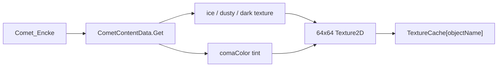

# Уникальные миниатюры комет в списке навигации

## Причина

В [`BodyNavigationThumbnailCatalog.cs`](Assets/Scripts/SolarSystemGraphics/BodyNavigationThumbnailCatalog.cs) для любого `Comet_*` вызывается `GetCometFallback()`, который всегда грузит `CometTextures/CometNucleus_Dusty_2k` — поэтому все 10 строк одинаковые.

В [`CometContentData`](Assets/Scripts/SolarSystemGraphics/CometContentData.cs) уже есть per-comet данные:
- `nucleusMaterialVariant`: `"ice"` / `"dusty"` (сейчас `"dark"` ни у кого не назначен)
- `comaColor`: уникальный цвет комы на каждую комету

## Подход

В `ResolveThumbnail` для `Comet_*` строить **кэшированную** миниатюру на комету (по `objectName`), а не одну общую.

### Изменения в [`BodyNavigationThumbnailCatalog.cs`](Assets/Scripts/SolarSystemGraphics/BodyNavigationThumbnailCatalog.cs)

1. Заменить `GetCometFallback()` на `GetCometThumbnail(string objectName)`.
2. Читать профиль: `CometContentData.Get(objectName)`.
3. Базовая текстура ядра из Resources:
   - `ice` → `CometTextures/CometNucleus_Ice_2k`
   - `dusty` → `CometTextures/CometNucleus_Dusty_2k`
   - иначе → `CometTextures/CometNucleus_Dark_2k`
4. Сгенерировать маленькую (64×64) иконку:
   - круг ядра с семплами/усреднением из базовой текстуры (или solid tint, если текстуры нет);
   - лёгкий ореол/хвост цветом `comaColor`, чтобы кометы с одним вариантом ядра всё равно отличались;
   - слабый эллипс по `nucleusScale` (вытянутость), чтобы Encke/Borrelly отличались формой.
5. Кэшировать в существующем `TextureCache[objectName]` (уже есть в `GetThumbnail`).

Процедурный синий fallback оставить только если нет ни текстуры, ни профиля.

## Проверка

- Long-press на `BodyNameButton` → в списке у комет разные миниатюры (цвет/тон/форма).
- Кометы с `ice` vs `dusty` заметно отличаются базой; пары с одним вариантом отличаются оттенком комы.
- Планеты/луны без регрессии.
